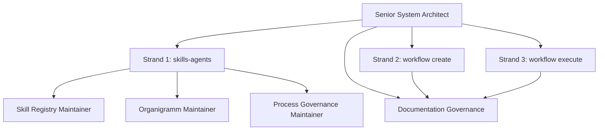
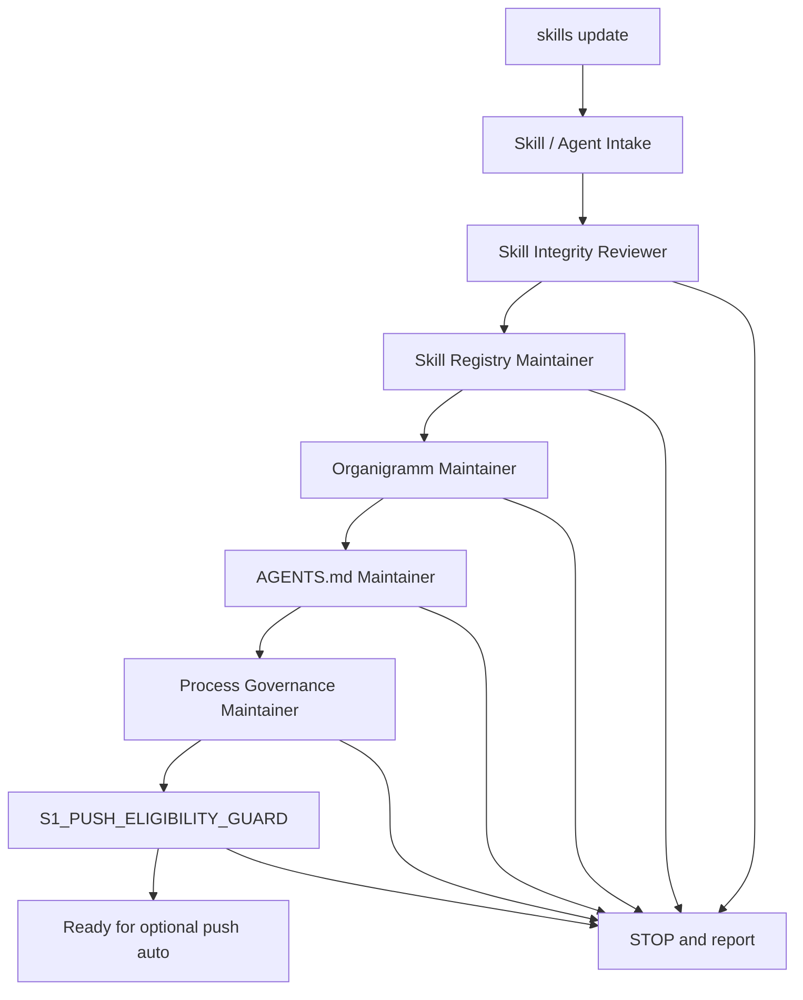
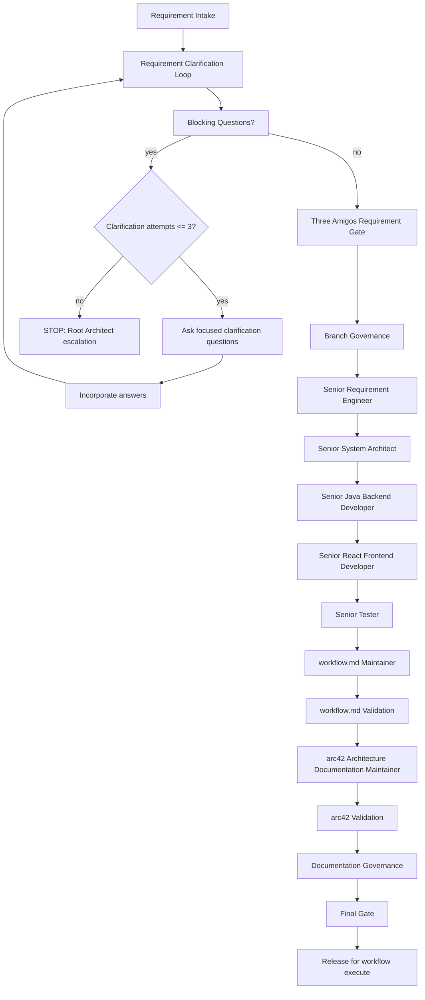
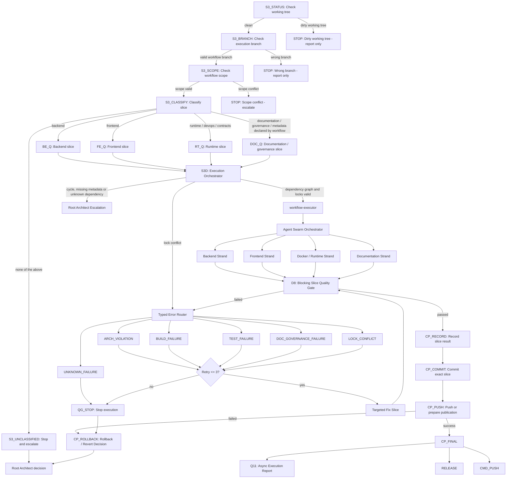
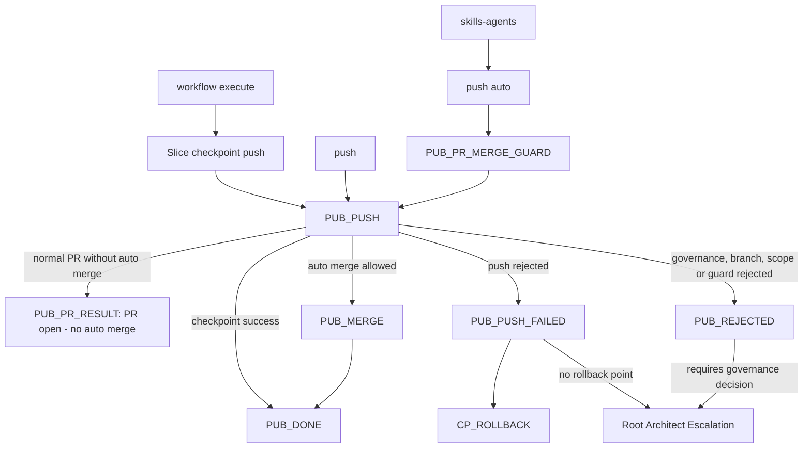

# Agent Governance

## Purpose

This documentation describes the agent and skill governance model for forensic_analytics.

The model is part of architecture governance because repository agents can create, change, validate, commit and publish architecture-sensitive artifacts. Agent work must therefore stay traceable to explicit commands, process strands, role ownership, quality gates and publication rules.

Root `AGENTS.md` remains authoritative for mandatory agent behavior. `QUALITY.md` remains authoritative for verification commands and quality-gate expectations.

## Process Strands

There are exactly three process strands:

1. `skills-agents`
2. `workflow create`
3. `workflow execute`

These strands must not be mixed.

Documentation Governance is not a fourth strand. Documentation Governance runs inside the active strand and applies that strand's file scope, quality gate and publication rules.

## Command Mapping

| Command or mode | Process strand | Meaning |
|---|---|---|
| `skills update` | `skills-agents` | Activates skill, agent, role, prompt, routing-rule, organigramm, skill-registry and process-documentation maintenance. |
| `workflow create` | `workflow create` | Activates requirement clarification, workflow authoring, workflow validation and arc42 synchronization. |
| `workflow execute` | `workflow execute` | Activates checked slice execution, quality gates, documentation synchronization and slice checkpoint push. |
| `push` | publication mode | Runs the normal branch push and pull-request process without automatic merge. |
| `push auto` | `skills-agents` only | Runs the guarded skills-agents PR lifecycle after `S1_PUSH_ELIGIBILITY_GUARD` and `PUB_PR_MERGE_GUARD` pass. |
| Slice checkpoint push | `workflow execute` only | Commits and pushes a successfully completed workflow slice after the slice quality gate passes. |

Slice checkpoint push is not `push auto`.
`push` is not `push auto`.
`skills update` is not `push auto`.

## Overall Governance

```text
Senior System Architect
|-- skills-agents
|-- workflow create
|-- workflow execute
`-- Documentation Governance inside all active strands
```



## Strand 1: skills-agents

`skills-agents` maintains the virtual development team and its governance artifacts:

- skills
- agents
- roles
- prompts
- Codex agent definitions
- routing rules
- organigramm
- skill registry
- process documentation
- governance-limited arc42 or ADR notes



`push auto` belongs only to this strand. It must never publish backend, frontend, Docker/runtime, contracts, persistence, analysis-engine, Joern, JavaParser, BTM generator or product implementation changes.

## Strand 2: workflow create

`workflow create` turns a user request into a clarified, checked and executable workflow. It owns requirement clarification, branch governance before workflow artifact mutation, role review, workflow validation and arc42 synchronization.



The clarification loop is capped at `maxRetries = 3`. After retry exhaustion, `workflow create` stops and escalates to the Root Architect instead of continuing automatically.

The workflow create end state is:

1. no blocking requirement questions remain,
2. the workflow is checked,
3. arc42 is checked or updated,
4. Documentation Governance passes,
5. the result is explicitly released for `workflow execute`.

## Strand 3: workflow execute

`workflow execute` runs only checked workflow slices. It separates backend, frontend, runtime and documentation work, routes each slice to the required roles or subagents, runs quality gates and creates recoverable checkpoints.



Slice checkpoint push belongs to `workflow execute`. It commits only the completed slice and pushes the current workflow branch to `origin`; it does not create or merge a PR, run branch cleanup or run `push auto`.

Quality-gate and validation failures in `workflow execute` use the Typed Error
Router before retry or escalation. Retry attempts stay inside the active S3
execution scope, are capped at `maxRetries = 3` and must not jump back to
`workflow create`.

Unrecovered quality-gate failures reach `QG_STOP` and then `CP_ROLLBACK`.
`CP_FINAL` continues only to explicit `CMD_PUSH`, `RELEASE` or non-blocking
`Q11` reporting paths.

`D8` is the synchronous blocking gate for commit, checkpoint push and release
readiness. `Q11` is asynchronous and non-blocking by default. Regulatory or
compliance reporting blocks only when the active workflow explicitly declares
that report as part of D8.

## Publication Modes



Publication modes are deliberately separate:

1. Slice checkpoint push belongs to `workflow execute`.
2. `push` is the normal branch push and pull-request process.
3. `push auto` belongs only to `skills-agents`.

`PUB_PR_RESULT` is the normal `push` terminal for an open PR without automatic
merge. `PUB_PUSH_FAILED` routes to rollback or escalation, and `PUB_REJECTED`
stops publication when governance, branch, scope or guard rules block it. This
separation prevents a documentation, workflow or implementation slice from
accidentally gaining guarded auto-merge authority.

## Architecture-Governance Role

The agent governance model is architecture governance because it protects:

- requirement clarification before workflow authoring,
- architecture-aware role routing,
- arc42 synchronization,
- ADR coverage for governance decisions,
- quality-gate selection,
- evidence-first documentation,
- controlled commit and push behavior,
- separation between planned behavior and implemented behavior.

`S1_PUSH_ELIGIBILITY_GUARD` checks whether skill, agent and governance changes
are pushable through `push auto`. `PUB_PR_MERGE_GUARD` decides whether a PR may
merge, stay open, be blocked or be rejected.

The Senior System Architect owns the top-level governance boundary. Shared roles such as Documentation Governance, Skill Registry Maintainer, Organigramm Maintainer, Process Governance Maintainer and `S1_PUSH_ELIGIBILITY_GUARD` run inside the active strand rather than creating a fourth strand.
