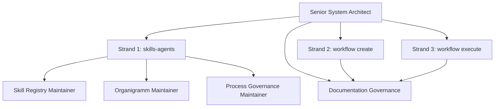
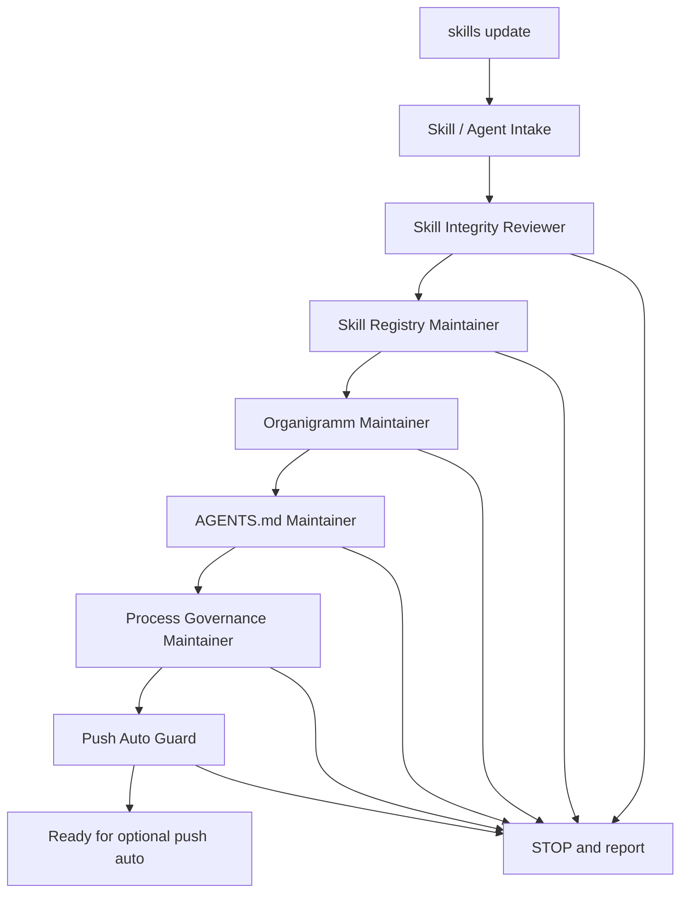
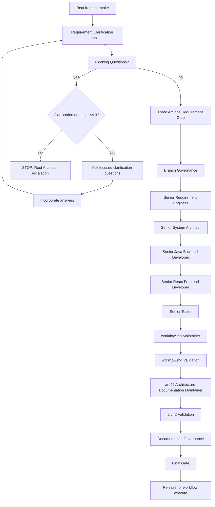
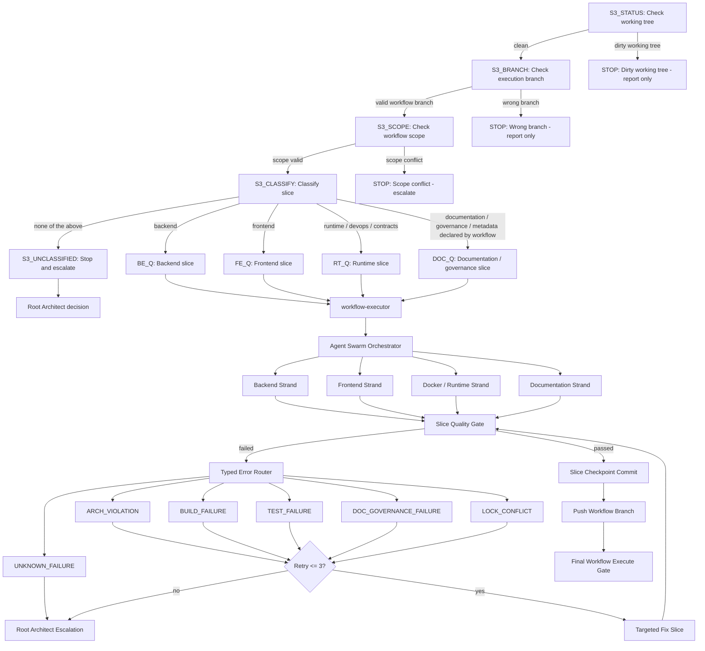
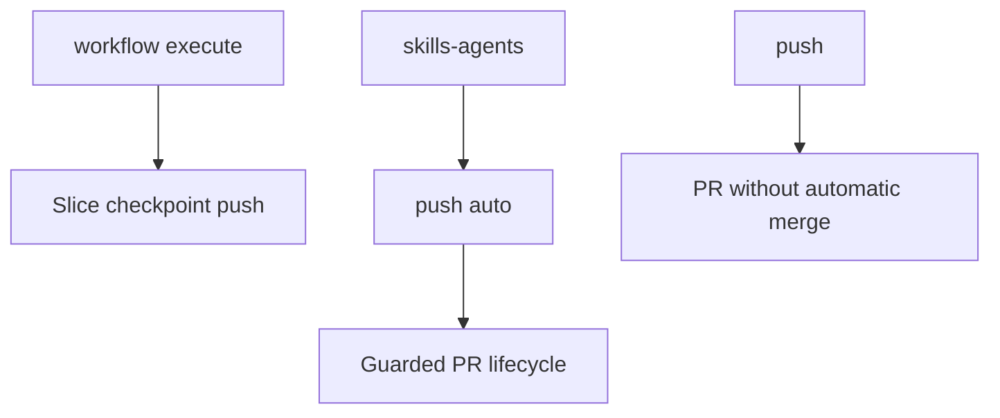

# Agent Organigramm

This document maps repository governance roles to the three process strands.

Root `AGENTS.md` remains authoritative. `QUALITY.md` remains authoritative for quality gates.

## Overall Governance

```text
Senior System Architect
|-- skills-agents
|-- workflow create
|-- workflow execute
`-- Documentation Governance inside all active strands
```



## Strand 1: skills-agents



## Strand 2: workflow create



## Strand 3: workflow execute



## Publication Modes



Slice checkpoint push is not `push auto`.
`push` is not `push auto`.
`skills update` is not `push auto`.
