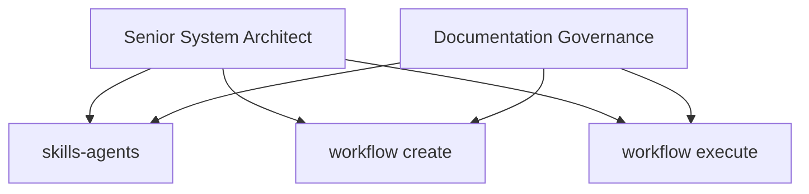
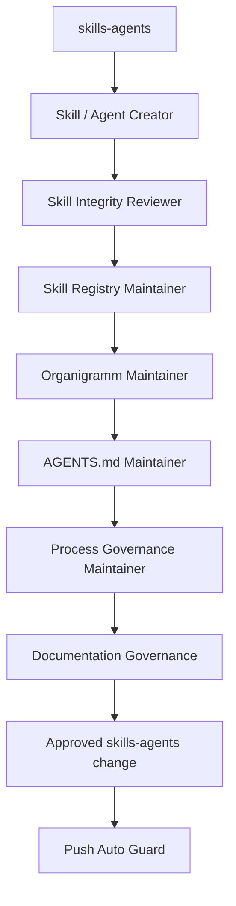
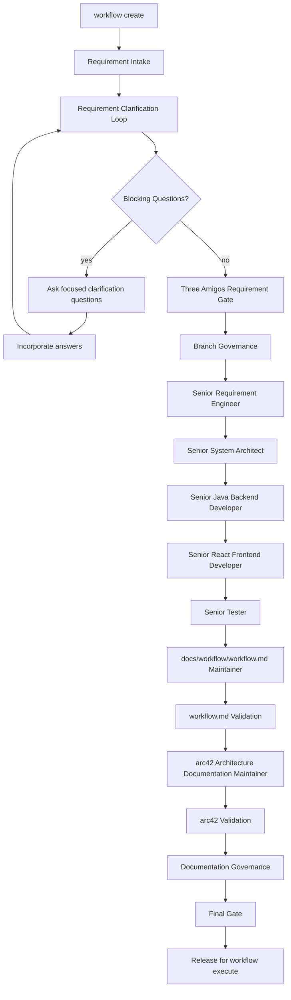
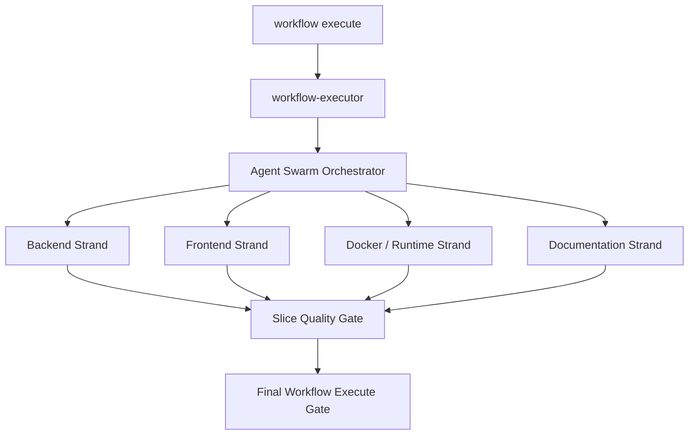

# Agent And Skill Organigramm

This organigramm documents the three governed process strands for Codex work in
Forensic Analytics.

The Senior System Architect owns the top-level governance boundary. Documentation
Governance is mandatory in every strand, but it executes inside the active
strand and does not create a fourth strand.

## Overall Governance

## Strand 1: skills-agents

Required checks:

- Integrity review.
- Linkage and owner review.
- Duplicate, contradiction and dead-reference review.
- Organigramm review.
- Skill registry review.
- Documentation review.
- `push auto` guard when publication is requested.

## Strand 2: workflow create

Mandatory gate responsibilities:

- Senior Requirement Engineer: goal, scope, non-goals, acceptance criteria,
  assumptions and open questions.
- Senior System Architect: architecture boundaries, arc42, service boundaries,
  plugin-vs-analytics boundary and risks.
- Senior Java Backend Developer: backend impact, ports, adapters, domain,
  JUnit 6 testability, Spring and microservice consequences.
- Senior React Frontend Developer: frontend impact, UX flows, React components,
  state, API adapters and build/test consequences.
- Senior Tester: testability, regression, quality gates, acceptance criteria
  and slice acceptance.

Required end artifacts:

- Checked `docs/workflow/workflow.md`.
- Checked or updated arc42 documentation.

Final Gate requires no blocking questions, complete executable and testable
`docs/workflow/workflow.md`, checked or updated arc42 documentation,
Documentation Governance and explicit release for `workflow execute`.

## Strand 3: workflow execute

Backend strand roles:

- Senior Java Backend Developer
- Microservice Senior Expert
- `architecture-hexagonal`
- `spring-core` when Spring wiring is affected
- `testing-junit6`
- Senior DevOps with `devops-docker` when container readiness is affected

Frontend strand roles:

- Senior React Frontend Developer
- Senior UX Designer
- Senior DevOps with `devops-docker` when container readiness is affected

Documentation strand roles:

- Senior Documentation Engineer
- docs/workflow/workflow.md Maintainer
- arc42 Architecture Documentation Maintainer
- Testing Documentation Maintainer
- Execution Report Maintainer

## Boundary Rule

A role may participate in more than one strand only as a strand-scoped role.
It must use the active strand's inputs, outputs, allowed files and quality gate.
It must not move unfinished work or changed files between strands.
