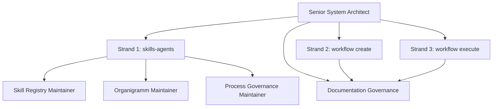
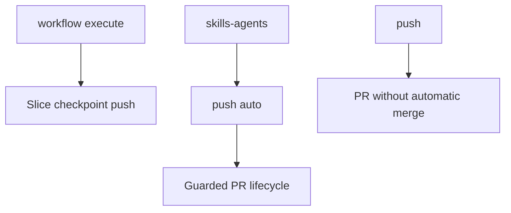

# 5. Building Block View

## 5.1 Level 1 - System Overview

```text
Forensics Platform
├── Spring Boot Server Boundary
├── Application Core
├── Canonical Analysis Model
├── gRPC Ingestion Adapter
├── Analysis Import
├── Rule Planning
├── Runtime Event Processing
├── Incident Management
├── Replay Engine
├── Graph Projection
├── Vector Context Builder
├── LLM Diagnosis
├── Observability Boundary
├── Cross-cutting Logging Module
├── Repair Orchestration
└── Adapters
    ├── Gradle Plugin Request Adapter
    ├── Maven Plugin Request Adapter
    ├── Joern Adapter
    ├── Server-side Byteman/BTM Adapter
    ├── Runtime Collector Adapter
    ├── Relational Store Adapter
    ├── Graph DB Adapter
    ├── Vector DB Adapter
    └── LLM Provider Adapter
```

## 5.2 Level 2 - Core Building Blocks

| Building Block | Responsibility |
|---|---|
| Spring Boot Server Boundary | Owns Spring Boot startup, profile configuration and outer adapter lifecycle wiring for verified adapters |
| Canonical Analysis Model | Owns stable IDs and normalized facts |
| gRPC Ingestion Adapter | Receives plugin-triggered server analysis requests and maps transport DTOs to application commands |
| Static Fact Import | Imports server-side AST, build and dependency facts |
| Joern Semantic Import | Runs and maps server-side Joern semantic facts |
| Rule Planner | Plans instrumentation rules based on facts and policies |
| Byteman Generator | Generates server-side BTM files with stable rule IDs |
| Runtime Event Processor | Validates, redacts and stores runtime events |
| Incident Service | Creates and groups exception-based incidents |
| Replay Engine | Reconstructs timelines and call trees |
| Graph Projection Service | Builds graph projections from canonical facts |
| Vector Context Builder | Builds semantic context for retrieval and LLM use |
| LLM Diagnosis Service | Creates evidence-based root-cause analysis |
| Observability Boundary | Provides adapter-level correlation scopes and sanitized operation logging without becoming evidence storage |
| Cross-cutting Logging Module | Provides injectable logger wrappers and Boot-scoped method interception for sanitized operational diagnostics |
| Repair Orchestrator | Prepares future gated repair flows |

## 5.3 Hexagonal Architecture Mapping

| Layer | Examples |
|---|---|
| Domain | IDs, analysis model, incident model, replay model, rule plan |
| Application | Import use cases, replay use cases, diagnosis use cases |
| Ports | Fact import port, event store port, graph port, LLM port, rule generation port |
| Infrastructure | Adapter-facing observability, correlation support and outer server bootstrap configuration |
| Adapters | gRPC ingestion, REST API, CLI, Gradle/Maven request and runtime-binding adapters, server-side Joern, server-side Byteman/BTM, relational DB, graph DB, vector DB, LLM provider |

## 5.4 Important Boundary

Gradle and Maven plugins must not become the central platform. They trigger server-side analysis with repository, branch, commit, build and execution context. When debugging requires instrumentation, they may receive server-generated BTM files and bind them through the runtime agent. Parser execution, Joern execution, BTM generation, normalization, persistence, replay and graph projection stay in Analytics.

## 5.5 gRPC Ingestion Boundary

`forensic-analytics-ingestion-grpc` is an inbound adapter. It may depend on generated Protobuf/gRPC classes and the application layer. It must not depend on persistence adapters, Joern, replay, LLM providers or plugin internals.

The adapter maps:

```text
Proto DTO
  -> Application Command
    -> Application Use Case
```

## 5.6 Observability Boundary

`forensic-analytics-observability` is an infrastructure module for operational diagnostics. Adapter, engine, ingestion-request, persistence and bootstrap code may use it to create sanitized operation logs and correlation scopes where a request or command boundary exists.

The observability module must not depend on domain, application, persistence, REST, gRPC, generated protobuf classes, Spring AOP, AspectJ, SLF4J or concrete logging providers. Domain and application code must not depend on observability.

## 5.7 Spring Boot Server Boundary

ADR-0006 accepts Spring Boot as the outer server boundary. The implemented module is `forensic-analytics-boot-app`, which owns the Spring Boot application entrypoint, typed configuration and Spring bean wiring for verified adapters.

The existing `forensic-analytics-bootstrap` module remains available while parity is phased in. Spring Boot adoption must not add Spring dependencies or annotations to `forensic-analytics-domain` or `forensic-analytics-application`.

ADR-0007 keeps the existing JDK REST adapter behind Boot lifecycle wiring. Spring MVC, WebFlux and Actuator endpoints are not part of the current Boot boundary.

ADR-0019 extends the Spring Boot boundary to service-local bootstrap packages
under `de.burger.forensics.analytics.services..bootstrap..`. Service domain and
application packages remain framework-free; service-local bootstrap code may
own the Spring Boot entrypoint, configuration and lifecycle wiring for an
independent service.

## 5.8 Cross-cutting Logging Module

ADR-0008 accepts `forensic-analytics-logging` as a cross-cutting infrastructure module. It provides `ForensicLoggerFactory` for explicit logger injection and optional Spring method interception in the Boot runtime.

The logging module may depend on `forensic-analytics-observability` for correlation context and on Spring AOP/Context for the accepted method-interception exception. It may publish Boot auto-configuration metadata. It must not depend on domain, application, adapters, persistence, REST, gRPC, generated Protobuf, AspectJ, SLF4J or concrete logging providers.

Automatic logging records operation name, phase, duration, correlation ID and exception category only. It must not log method arguments, return values, raw exception messages, stack frames, payloads, source content, credentials or LLM prompt content.

## 5.9 Target Microservices Ecosystem

ADR-0017 defines the active target service landscape for future service-split
work. The target landscape is planned, not implemented:

```text
frontend-web-app
  -> forensic-gateway-service
    -> forensic-ingestion-service
    -> repository-analysis-service
    -> analysis-store-service
    -> graph-replay-service
    -> report-generation-service

repository-analysis-service
  -> java-ast-analysis-service
  -> joern-cpg-analysis-service

analysis-store-service
  <- java-ast-analysis-service
  <- joern-cpg-analysis-service
  <- btm-generation-service

graph-replay-service
  -> analysis-store-service

report-generation-service
  -> analysis-store-service
  -> graph-replay-service
```

Every future service owns its internal domain, application, adapters,
configuration, tests, health checks and Dockerfile. Service communication is
limited to REST/OpenAPI, gRPC/protobuf or approved event contracts. Shared Java
implementation modules between independently deployable services are forbidden.

ADR-0018 accepts initial logical contracts for target service communication.
Contracts marked as planned are design artifacts only; they do not prove that a
Gateway endpoint, gRPC method, event publisher or event consumer is implemented.
Generated transport classes must remain service-local implementation details.

Slice 05 implements the first `analysis-store-service` boundary for the
`AnalysisJobService` job lifecycle and artifact metadata subset. The service has
its own domain, application, gRPC adapter, in-memory repository, Spring Boot
bootstrap, tests and Dockerfile. It does not depend on monolith domain,
application or persistence modules and does not yet implement durable normalized
facts, incident records, correlation indexes or database migrations.

## 5.10 Agent Governance Building Blocks

The complete agent governance diagrams are maintained in
`docs/agents/organigramm.md` and explained in
`docs/agents/agent-governance.md`. The arc42 building-block view embeds the
architecture-relevant governance overview and publication-mode separation
directly because they define ownership boundaries for repository changes.



| Building Block | Responsibility |
|---|---|
| Senior System Architect | Owns architecture and process-strand governance. |
| Documentation Governance | Keeps AGENTS.md, process docs, workflow docs, arc42, ADRs and skill-audit material synchronized. |
| Skill Registry Maintainer | Maintains the skills-agents registry and ownership map. |
| Organigramm Maintainer | Maintains agent role hierarchy and process-strand diagrams. |
| Process Governance Maintainer | Maintains command and publication-mode documentation. |
| Push Auto Guard | Blocks `push auto` outside `skills-agents` and blocks product implementation changes from `push auto`. |
| docs/workflow/workflow.md Maintainer | Maintains the checked active workflow produced by `workflow create`. |
| arc42 Architecture Documentation Maintainer | Checks or updates arc42 before workflow execute is released. |
| Testing Documentation Maintainer | Maintains workflow test strategy and quality-gate evidence. |
| Execution Report Maintainer | Records slice checkpoint commit SHA, push result and blockers during `workflow execute`. |

### Senior System Architect

Top-level architecture and process governance authority.

### skills-agents Strand

Maintains skills, agents, roles, prompts, routing rules, organigramm, skill registry and process documentation.

Triggered by:

```text
skills update
```

### workflow create Strand

Turns a user request into a clarified, checked and executable workflow.

Produces:

1. checked `docs/workflow/workflow.md`
2. checked or updated arc42 documentation

### workflow execute Strand

Executes checked workflow slices through the agent workflow.

Responsibilities:

- load checked workflow
- load checked arc42 documentation
- check `S3_STATUS` working-tree safety before routing slices
- check `S3_BRANCH` execution branch safety before routing slices
- check `S3_SCOPE` workflow scope safety before classifying slices
- classify backend, frontend, runtime and documentation work
- route to roles or subagents
- run Slice Quality Gates
- create Slice Checkpoint Commit
- push workflow branch to origin
- update execution report and arc42 consistency

### Documentation Governance

Runs inside every active strand. It is mandatory but not a fourth strand.

### Publication Modes



Slice checkpoint push, `push` and `push auto` are separate publication
mechanisms. `push auto` is restricted to `skills-agents`; slice checkpoint push
belongs to `workflow execute`.
