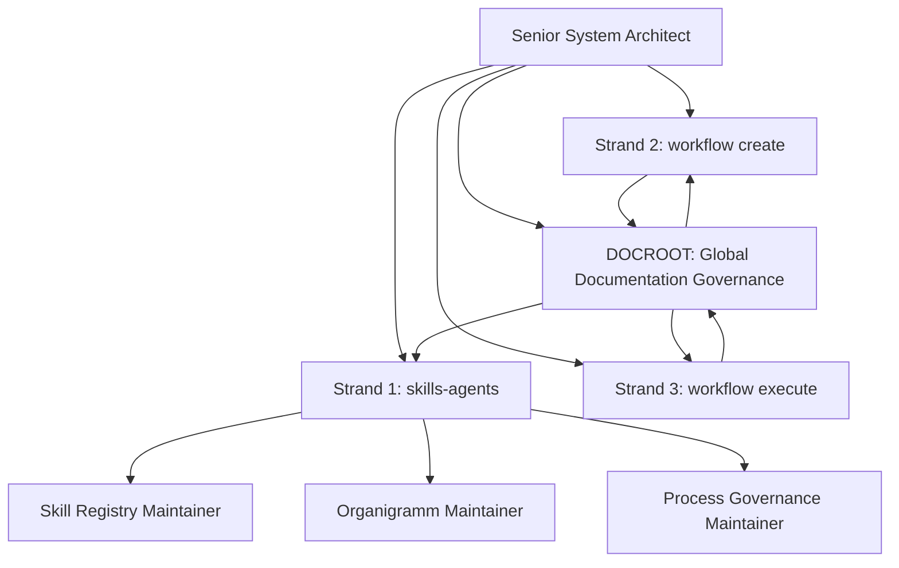
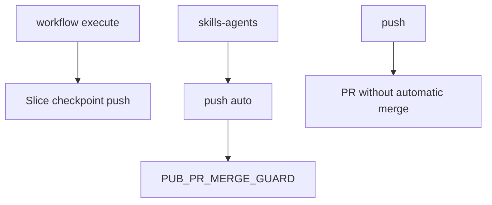

# 5. Building Block View

## 5.1 Level 1 - System Overview

```text
Forensics Platform
├── Spring Boot Server Boundary
├── Application Core
├── Canonical Analysis Model
├── gRPC Ingestion Adapter
├── Analysis Import
├── Rule Planning
├── Runtime Event Processing
├── Incident Management
├── Replay Engine
├── Graph Projection
├── Vector Context Builder
├── LLM Diagnosis
├── Observability Boundary
├── Cross-cutting Logging Module
├── Repair Orchestration
└── Adapters
    ├── Gradle Plugin Request Adapter
    ├── Maven Plugin Request Adapter
    ├── Joern Adapter
    ├── Server-side Byteman/BTM Adapter
    ├── Runtime Collector Adapter
    ├── Relational Store Adapter
    ├── Graph DB Adapter
    ├── Vector DB Adapter
    └── LLM Provider Adapter
```

## 5.2 Level 2 - Core Building Blocks

| Building Block | Responsibility |
|---|---|
| Spring Boot Server Boundary | Owns Spring Boot startup, profile configuration and outer adapter lifecycle wiring for verified adapters |
| Canonical Analysis Model | Owns stable IDs and normalized facts |
| gRPC Ingestion Adapter | Receives plugin-triggered server analysis requests and maps transport DTOs to application commands |
| Static Fact Import | Imports server-side AST, build and dependency facts |
| Joern Semantic Import | Runs and maps server-side Joern semantic facts |
| Rule Planner | Plans instrumentation rules based on facts and policies |
| Byteman Generator | Generates server-side BTM files with stable rule IDs |
| Runtime Event Processor | Validates, redacts and stores runtime events |
| Incident Service | Creates and groups exception-based incidents |
| Replay Engine | Reconstructs timelines and call trees |
| Graph Projection Service | Builds graph projections from canonical facts |
| Vector Context Builder | Builds semantic context for retrieval and LLM use |
| LLM Diagnosis Service | Creates evidence-based root-cause analysis |
| Observability Boundary | Provides adapter-level correlation scopes and sanitized operation logging without becoming evidence storage |
| Cross-cutting Logging Module | Provides injectable logger wrappers and Boot-scoped method interception for sanitized operational diagnostics |
| Repair Orchestrator | Prepares future gated repair flows |

## 5.3 Hexagonal Architecture Mapping

| Layer | Examples |
|---|---|
| Domain | IDs, analysis model, incident model, replay model, rule plan |
| Application | Import use cases, replay use cases, diagnosis use cases |
| Ports | Fact import port, event store port, graph port, LLM port, rule generation port |
| Infrastructure | Adapter-facing observability, correlation support and outer server bootstrap configuration |
| Adapters | gRPC ingestion, REST API, CLI, Gradle/Maven request and runtime-binding adapters, server-side Joern, server-side Byteman/BTM, relational DB, graph DB, vector DB, LLM provider |

## 5.4 Important Boundary

Gradle and Maven plugins must not become the central platform. They trigger server-side analysis with repository, branch, commit, build and execution context. When debugging requires instrumentation, they may receive server-generated BTM files and bind them through the runtime agent. Parser execution, Joern execution, BTM generation, normalization, persistence, replay and graph projection stay in Analytics.

## 5.5 gRPC Ingestion Boundary

`forensic-analytics-ingestion-grpc` is an inbound adapter. It may depend on generated Protobuf/gRPC classes and the application layer. It must not depend on persistence adapters, Joern, replay, LLM providers or plugin internals.

The adapter maps:

```text
Proto DTO
  -> Application Command
    -> Application Use Case
```

## 5.6 Observability Boundary

`forensic-analytics-observability` is an infrastructure module for operational diagnostics. Adapter, engine, ingestion-request, persistence and bootstrap code may use it to create sanitized operation logs and correlation scopes where a request or command boundary exists.

The observability module must not depend on domain, application, persistence, REST, gRPC, generated protobuf classes, Spring AOP, AspectJ, SLF4J or concrete logging providers. Domain and application code must not depend on observability.

## 5.7 Spring Boot Server Boundary

ADR-0006 accepts Spring Boot as the outer server boundary. The implemented module is `forensic-analytics-boot-app`, which owns the Spring Boot application entrypoint, typed configuration and Spring bean wiring for verified adapters.

The existing `forensic-analytics-bootstrap` module remains available while parity is phased in. Spring Boot adoption must not add Spring dependencies or annotations to `forensic-analytics-domain` or `forensic-analytics-application`.

ADR-0007 keeps the existing JDK REST adapter behind Boot lifecycle wiring. Spring MVC, WebFlux and Actuator endpoints are not part of the current Boot boundary.

ADR-0019 extends the Spring Boot boundary to service-local bootstrap packages
under `de.burger.forensics.analytics.services..bootstrap..`. Service domain and
application packages remain framework-free; service-local bootstrap code may
own the Spring Boot entrypoint, configuration and lifecycle wiring for an
independent service.

## 5.8 Cross-cutting Logging Module

ADR-0008 accepts `forensic-analytics-logging` as a cross-cutting infrastructure module. It provides `ForensicLoggerFactory` for explicit logger injection and optional Spring method interception in the Boot runtime.

The logging module may depend on `forensic-analytics-observability` for correlation context and on Spring AOP/Context for the accepted method-interception exception. It may publish Boot auto-configuration metadata. It must not depend on domain, application, adapters, persistence, REST, gRPC, generated Protobuf, AspectJ, SLF4J or concrete logging providers.

Automatic logging records operation name, phase, duration, correlation ID and exception category only. It must not log method arguments, return values, raw exception messages, stack frames, payloads, source content, credentials or LLM prompt content.

## 5.9 Target Microservices Ecosystem

ADR-0017 defines the FA-MSA-001 target service landscape for service-split
work. The current service directories are transitional implementation evidence
and migration inputs. They are not compatibility aliases and do not prove
production readiness.

```text
cli-client / UI / external client
  -> query-report-api-service
  -> analysis-orchestrator-service
  -> repository-source-service
  -> java-parser-analysis-service
  -> joern-analysis-service
  -> analysis-orchestrator-service
  -> query-report-api-service

producer / scanner / runtime collector
  -> ingestion-service
  -> analysis-orchestrator-service or a service-owned storage path after S04

observability-stack
  observes services through deployment and configuration, not shared Java code

testbed
  starts and verifies services without becoming a production dependency
```

Mandatory FA-MSA-001 service roots:

```text
services/repository-source-service
services/ingestion-service
services/java-parser-analysis-service
services/joern-analysis-service
services/analysis-orchestrator-service
services/query-report-api-service
services/cli-client
services/observability-stack
services/testbed
```

S11 adds `services/cli-client` as a public API client boundary with a
service-local Gradle project, CLI bootstrap, HTTP/OpenAPI adapter and tests. It
is not a backend service and must not own forensic evidence, analysis execution,
parser behavior, Joern control or persistence. The predecessor
`forensic-analytics-cli` local `analyze` and `ingest-request` commands remain
current-state evidence until a later parity or deprecation slice.

Every productive service must own its internal domain, application, adapters,
bootstrap, configuration, tests, health checks and Dockerfile before production
readiness is claimed. Service communication is limited to REST/OpenAPI,
gRPC/protobuf, approved message contracts or documented file contracts. Shared
Java implementation modules between independently deployable services are
forbidden.

Slice S05 adds `services/repository-source-service` as the first target-service
implementation evidence for FA-MSA-001. It is registered as its own Gradle
project and owns service-local domain, application ports, inbound gRPC adapter,
outbound Git/workspace adapters, bootstrap, configuration, tests, README and
Dockerfile. It keeps the predecessor `repository-analysis.proto` filename and
wire service name as a transitional external contract only; generated transport
classes remain inside the service build.

`services/repository-analysis-service` remains current-state predecessor
evidence and rollback input. It is not a compatibility alias for
`repository-source-service` and is not removed by S05.

Slice S06 adds `services/ingestion-service` as target-service implementation
evidence for the FA-MSA-001 ingestion boundary. It is registered as its own
Gradle project and owns service-local domain, application ports, inbound gRPC
adapter, file-based engine request adapter, in-memory session store,
bootstrap, configuration, tests, README and Dockerfile. The predecessor
`forensic-ingestion.proto` wire shape remains unchanged and generated
transport classes stay inside the service build.

`services/forensic-ingestion-service`, `forensic-analytics-ingestion-grpc` and
`forensic-analytics-ingestion-request` remain current-state predecessor and
rollback evidence. They are not compatibility aliases for `ingestion-service`
and are not removed by S06.

Slice S07 adds `services/java-parser-analysis-service` as target-service
implementation evidence for the FA-MSA-001 JavaParser analysis boundary. It is
registered as its own Gradle project and owns service-local domain,
application ports, inbound gRPC adapter, outbound JavaParser adapter,
filesystem artifact adapter, bootstrap, configuration, tests, README and
Dockerfile. The predecessor `java-ast-analysis.proto` wire shape remains
unchanged and generated transport classes stay inside the service build.

`services/java-ast-analysis-service` and
`forensic-analytics-adapter-javaparser` remain current-state predecessor and
rollback evidence. They are not compatibility aliases for
`java-parser-analysis-service` and are not removed by S05.

Slice S06 adds `services/joern-analysis-service` as target-service
implementation evidence for the FA-MSA-001 Joern semantic analysis boundary.
It is registered as its own Gradle project and owns service-local domain,
application ports, inbound gRPC adapter, outbound filesystem, Joern runtime
and artifact-registry adapters, bootstrap, configuration, tests, README and
Dockerfile. The `joern-cpg-analysis.proto` transport contract remains
service-local generated code and now includes the service-owned
`GetSemanticArtifactBytes` retrieval RPC so artifact bytes are not exposed
through an Analysis Store byte alias.

`services/joern-cpg-analysis-service` and
`forensic-analytics-adapter-joern-docker` remain current-state predecessor and
rollback evidence. They are not compatibility aliases for
`joern-analysis-service` and are not removed by S06.

Slice S07 adds `services/analysis-orchestrator-service` as target-service
implementation evidence for the FA-MSA-001 orchestration boundary. It is
registered as its own Gradle project and owns service-local domain,
application ports, inbound gRPC adapter, in-memory orchestration repository,
repository-to-BTM pending readiness state, bootstrap, configuration, tests,
README and Dockerfile. The service uses `analysis-job.proto` as a
service-local generated transport input and maps it to service-owned job
lifecycle, lease, retry, failure, dead-letter, correlation,
job-to-artifact-reference and repository-to-BTM status models.

`forensic-analytics-engine`, orchestration portions of
`forensic-analytics-application` and `services/analysis-store-service` remain
current-state predecessor and rollback evidence. They are not compatibility
aliases for `analysis-orchestrator-service` and are not removed by S07.

The orchestrator coordinates workflow state only. It must not own repository
checkout, JavaParser scanning, Joern execution, report rendering, artifact byte
custody, producer-local artifact catalogs, canonical analysis facts or private
persistence owned by another service. S07 `StartRepositoryToBtm` and
`GetRepositoryToBtmStatus` behavior is acceptance/status-only and deliberately
reports incomplete repository handoff, not-ready BTM delivery and skipped Joern
execution until later slices wire verified owner services.

The query/report API service is the public facade for status, query and report
responses. It must use owner APIs and must not perform analysis execution or
read private service databases.

Slice S08 adds `services/query-report-api-service` as target-service
implementation evidence for the FA-MSA-001 public API facade boundary. It is
registered as its own Gradle project and owns service-local domain,
application port, inbound HTTP adapter, outbound Analysis Orchestrator gRPC
adapter, bootstrap, configuration, tests, README and Dockerfile. The service
keeps the transitional `gateway-api.yaml` filename and `analysis-job.proto`
transport input as external contract evidence only; generated transport
classes remain inside the service build.

`forensic-analytics-rest` and public API portions of
`services/forensic-gateway-service` remain current-state predecessor and
rollback evidence. They are not compatibility aliases for
`query-report-api-service` and are not removed by S08.

Optional later service candidates such as `btm-generation-service`,
`graph-replay-service` and `incident-analysis-service` remain outside
mandatory FA-MSA-001 closure unless a later requirement makes them mandatory.

Slice S14 is a retirement-readiness decision, not a direct deletion slice.
Current caller evidence keeps the central `forensic-analytics-*` modules as
legacy in-process and rollback building blocks until later follow-up slices
prove caller-free evidence, replacement parity and rollback or explicit
deprecation. Retaining those modules is not a microservice-readiness claim.

ADR-0018 accepts initial logical contracts for target service communication.
Contracts marked as planned are design artifacts only; they do not prove that
an endpoint, RPC, event publisher or event consumer is implemented. Generated
transport classes must remain service-local implementation details.

## 5.10 Agent Governance Building Blocks

ADR-0021 accepts Governance Flowchart V2 as the active repository governance
model. The canonical Governance Flowchart V2 diagrams are maintained in
`docs/governance/workflow/`. Agent governance explanations remain in
`docs/agents/agent-governance.md`, and the role organigramm remains in
`docs/agents/organigramm.md`. The arc42 building-block view embeds the
architecture-relevant governance overview and publication-mode separation
directly because they define ownership boundaries for repository changes.



| Building Block | Responsibility |
|---|---|
| Senior System Architect | Owns architecture and process-strand governance. |
| `DOCROOT` | Checks global consistency for process documentation, role model, organigramm, arc42 structure, governance rules, workflow conventions and hard boundaries. |
| `S1_DOC` | Updates concrete skills-agents documentation artifacts. |
| `S2_DOC` | Updates concrete workflow-create documentation artifacts. |
| `S3_DOC` | Updates concrete workflow-execute documentation artifacts. |
| Skill Registry Maintainer | Maintains the skills-agents registry and ownership map. |
| Organigramm Maintainer | Maintains agent role hierarchy and process-strand diagrams. |
| Process Governance Maintainer | Maintains command and publication-mode documentation. |
| `S1_PUSH_ELIGIBILITY_GUARD` | Blocks `push auto` outside `skills-agents` and blocks product implementation changes from `push auto`. |
| `PUB_PR_MERGE_GUARD` | Decides whether a PR may merge, stay open, be blocked or be rejected. |
| docs/workflow/workflow.md Maintainer | Maintains the checked active workflow produced by `workflow create`. |
| arc42 Architecture Documentation Maintainer | Checks or updates arc42 before workflow execute is released. |
| S3D Execution Orchestrator | Extracts slice metadata, builds the dependency graph, runs topological sort and enforces file, contract, module and architecture-boundary locks. |
| Typed Error Router | Classifies workflow-execute validation failures before retry, targeted fix or escalation. |
| `CP_ROLLBACK` | Decides between file revert, slice-commit revert, fix slice, branch discard, workflow recut or Root Architect escalation. |
| Testing Documentation Maintainer | Maintains workflow test strategy and quality-gate evidence. |
| Execution Report Maintainer | Records slice checkpoint commit SHA, push result and blockers during `workflow execute`. |
| Governance Flowchart V2 diagram package | Maintains the Level 1 overview and Level 2 subgraphs used for flowchart integrity review. |

### Senior System Architect

Top-level architecture and process governance authority.

### skills-agents Strand

Maintains skills, agents, roles, prompts, routing rules, organigramm, skill registry and process documentation.

Triggered by:

```text
skills update
```

### workflow create Strand

Turns a user request into a clarified, checked and executable workflow.

Produces:

1. checked `docs/workflow/workflow.md`
2. checked or updated arc42 documentation

### workflow execute Strand

Executes checked workflow slices through the agent workflow.

Responsibilities:

- load checked workflow
- load checked arc42 documentation
- check `S3_STATUS` working-tree safety before routing slices
- check `S3_BRANCH` execution branch safety before routing slices
- check `S3_SCOPE` workflow scope safety before classifying slices
- classify backend, frontend, runtime and documentation work
- run S3D dependency, topological-order and lock checks
- route explicitly declared governance, metadata and documentation-only slices through `S3_DOC` only when the checked workflow declares that scope
- stop and escalate unclassifiable slices through `S3_UNCLASSIFIED` instead of executing them automatically
- route to roles or subagents
- run Slice Quality Gates
- route quality-gate or validation failures through the Typed Error Router
- create a one-slice Slice Checkpoint Commit
- push workflow branch to origin
- update execution report and arc42 consistency

### Documentation Governance

Local documentation nodes update concrete artifacts in the active strand:
`S1_DOC` for skills-agents, `S2_DOC` for workflow create and `S3_DOC` for
workflow execute.

`DOCROOT` checks that workflow, process, agent, arc42 and ADR artifacts remain
synchronized with the global governance model. `DOCROOT` is not a fourth
process strand and does not replace local documentation nodes.

### Publication Modes



Slice checkpoint push, `push` and `push auto` are separate publication
mechanisms. `push auto` is restricted to `skills-agents`; slice checkpoint push
belongs to `workflow execute`.
