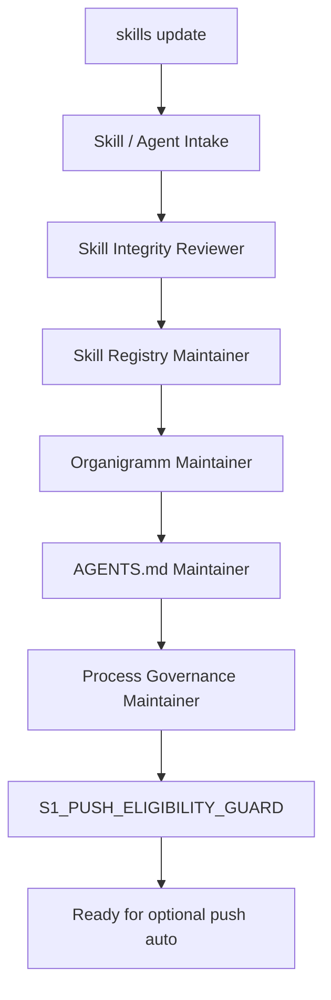
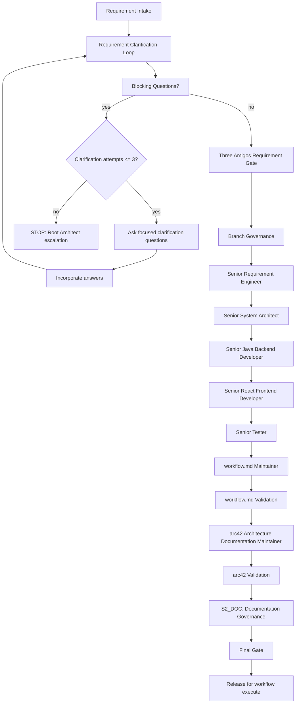
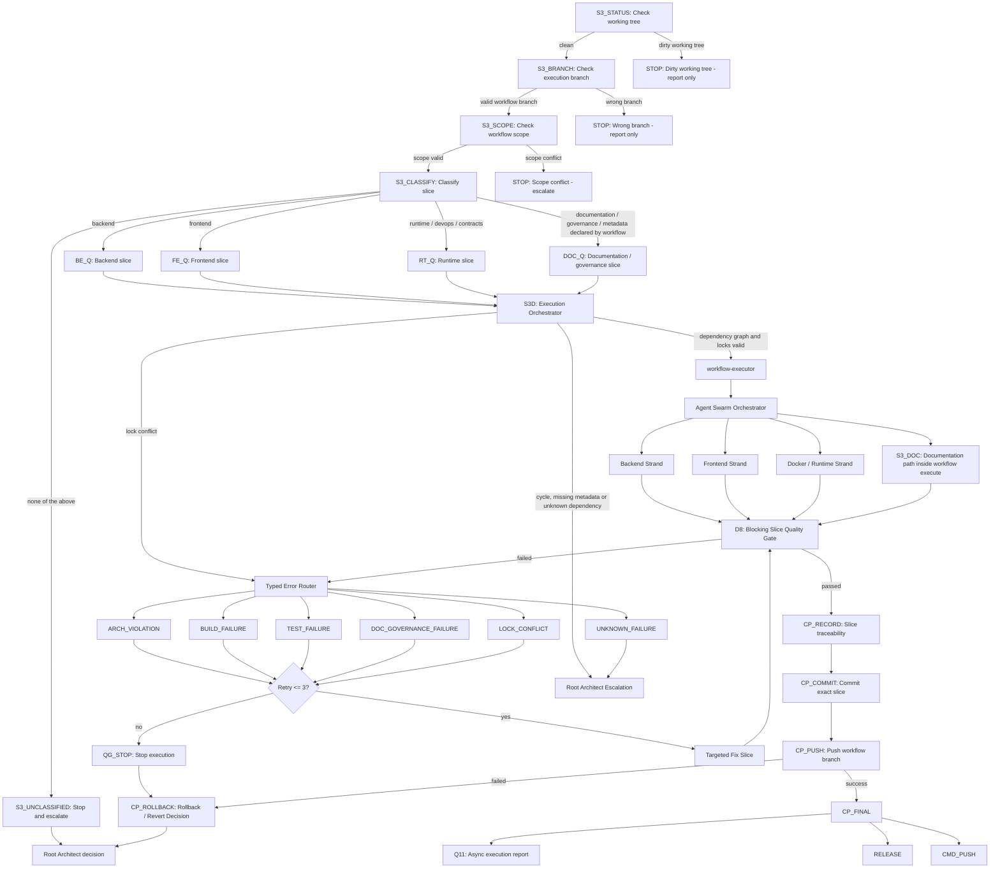

# 6. Runtime View

## 6.1 Server-Side Analysis Request Flow

```text
Build Tool
  -> Gradle/Maven Plugin
  -> gRPC Analysis Request
  -> Forensics Server
  -> Workspace Checkout
  -> Server-side Static Analysis
  -> Server-side Joern Analysis
  -> Canonical Analysis Model
```

## 6.2 Rule Generation Flow

```text
Canonical Analysis Model
  -> Rule Planner
  -> Instrumentation Plan
  -> Server-side Byteman/BTM Generator
  -> Versioned BTM Files
  -> Plugin Runtime Binding
  -> Runtime Session With Agent
```

## 6.3 Runtime Event Flow

```text
Runtime Application
  -> Byteman Agent
  -> Server-generated BTM File
  -> Runtime Event
  -> JSONL / Collector
  -> Runtime Event Importer
  -> Redaction
  -> Event Store
```

## 6.4 Exception Replay Flow

```text
Exception Event
  -> Incident Creation
  -> CorrelationID Event Lookup
  -> Timeline Reconstruction
  -> Call Tree Reconstruction
  -> Source-Code Mapping
  -> Graph Context Loading
  -> Replay View
```

## 6.5 LLM Diagnosis Flow

```text
Incident
  -> Replay Timeline
  -> Source Slices
  -> Graph Context
  -> Joern Findings
  -> Redacted Runtime Values
  -> Incident Context Package
  -> LLM Diagnosis
  -> Root-Cause Explanation
  -> Fix Plan
```

## 6.6 Missing Event Handling

The Replay Engine must explicitly show uncertainty if events are missing, incomplete or ambiguous. It must not pretend that a reconstructed path is complete when the evidence is incomplete.

## 6.7 Operational Logging Flow

```text
REST / gRPC / CLI / Bootstrap boundary
  -> Correlation scope
  -> Sanitized operation event
  -> JDK System.Logger
```

Operational logs record request, command and server lifecycle categories. They do not contain raw runtime payloads, source content, method arguments, method return values, LLM prompts or raw exception messages.

Operational correlation IDs help connect adapter logs for diagnostics. They are not canonical evidence and must not be used as proof of runtime execution.

## 6.8 Target Microservice Runtime Flow

The target runtime flow for service-split work is defined by ADR-0017 and
FA-MSA-001. The flow below is a target and is not yet implemented end to end:

```text
UI / cli-client / external client
  -> query-report-api-service
  -> analysis-orchestrator-service
  -> repository-source-service
  -> java-parser-analysis-service
  -> joern-analysis-service
  -> analysis-orchestrator-service
  -> query-report-api-service
  -> client
```

Producer, scanner and runtime evidence enters through `ingestion-service`.
Canonical evidence and one-writer analysis state require the S04 data-ownership
decision before persistence is split. Graph, replay, reports and LLM packages
are projections or generated artifacts that must remain traceable to owner
evidence APIs.

Slice S06 verifies a local ingestion runtime boundary:

```text
producer / scanner / runtime collector
  -> ForensicIngestionService gRPC request or stream
  -> services/ingestion-service inbound adapter
  -> service-local ingestion application service
  -> service-local raw intake session state
  -> accepted raw payload handoff port
```

The S06 service also supports service-local engine request manifest import:

```text
engine-request.json
  -> service-local request reader
  -> verified build, module, plugin and payload descriptors
  -> payload file bytes
  -> service-local ingestion application service
```

The manifest importer uses only verified fields from the request file. Missing
fields, malformed JSON, unsupported payload kinds and missing payload files are
reported as ingestion request errors. The importer does not write canonical
static, semantic, runtime, report or orchestration facts.

Slice S07 verifies a local JavaParser runtime boundary:

```text
repository-source-service source snapshot contract
  -> JavaAstAnalysisService.AnalyzeSourceSnapshot
  -> services/java-parser-analysis-service inbound adapter
  -> service-local JavaParser analysis application service
  -> service-local JavaParser outbound adapter
  -> service-local source-fact artifact writer
  -> source-fact metadata plus retrievable artifact bytes
```

The S07 service emits static Java source facts only. Parse errors are reported
as diagnostics, not canonical facts, and `SYMBOL_RESOLUTION_NOT_CONFIGURED` is
reported as a completeness-affecting limitation until real symbol solving is
implemented. Source-fact JSON artifacts carry explicit `sourceRoot` context.

`query-report-api-service` remains a public facade in this flow. It must not
sequence worker business logic directly, run analysis or read private service
databases. `analysis-orchestrator-service` coordinates state, retry and
failure handling only; it must not absorb repository, JavaParser, Joern,
reporting or persistence internals.

The repository analysis delivery path must be verified as:

```text
client
  -> query-report-api-service request
  -> analysis-orchestrator-service owner API
  -> repository-source-service source snapshot
  -> java-parser-analysis-service source facts
  -> joern-analysis-service semantic artifacts when inputs are complete
  -> S04-approved accepted metadata or canonical fact owner
  -> query-report-api-service public status/report response
```

`cli-client` is a public API client only. Legacy local CLI commands remain
in-process current-state evidence until a later slice provides parity or
explicit deprecation tests.

Optional services such as `btm-generation-service`, `graph-replay-service` and
`incident-analysis-service` may be added only after later slices define
contracts, owner-query access, projection rebuild rules, storage ownership and
tests that keep projections and generated output separate from evidence.

`repository-source-service` resolves branch input to a concrete commit SHA
before analysis handoff. Joern consumes only validated source/build package
descriptors or materialized Joern-owned workspaces; it must not receive
Repository Source private workspace IDs.

Slice S05 verifies a local repository-source runtime boundary:

```text
RepositoryAnalysisService gRPC request
  -> services/repository-source-service inbound adapter
  -> service-local repository source application service
  -> service-local Git checkout and workspace adapters
  -> opaque workspace ID and source snapshot descriptor
```

The S05 service does not run JavaParser, Joern, repository build scripts,
repository hooks, BTM generation or report logic. Public responses expose
snapshot IDs, relative source roots, artifact references, completeness markers
and diagnostics, not private filesystem paths. The inherited Java AST handoff
RPC from the transitional predecessor contract is intentionally not implemented
in this service slice; a later contract migration must replace or retire that
predecessor wire shape explicitly.

ADR-0018 allows the initial runtime communication contracts to describe planned
API, worker, replay, report and event flows before each runtime path exists.
Those flows remain contract design until a slice implements and verifies
corresponding runtime behavior.

The current implementation verifies transitional service paths such as:

```text
worker or current public facade
  -> AnalysisJobService gRPC
  -> current analysis-store-service application service
  -> service-local analysis job repository
```

This path supports job submission, leasing, progress, completion, failure,
listing and artifact metadata registration. It does not yet ingest normalized
fact bodies, runtime trace facts, incidents or correlation indexes.

## 6.9 Agent Governance Runtime Flows

These are repository governance flows, not product runtime flows.

### skills update Flow



### workflow create Flow



### workflow execute Flow



`CP_FINAL` does not end workflow governance by itself. It hands off to normal
push, release preparation or the non-blocking Q11 execution report path.
`CP_ROLLBACK` is a decision node and must not be interpreted as blind history
rewriting.

Publication-mode details remain separate from workflow execution. Normal
publication outcomes are `PUB_DONE`, `PUB_PR_RESULT`, `PUB_PUSH_FAILED` and
`PUB_REJECTED`; failed publication routes to `CP_ROLLBACK` when a rollback
point exists or to Root Architect escalation when it does not.
