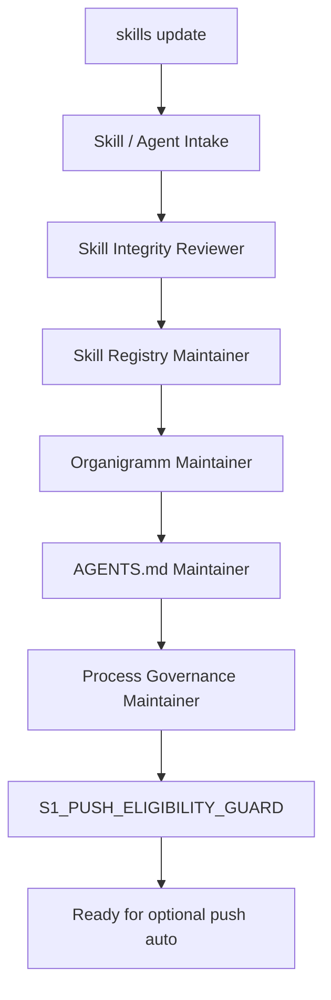
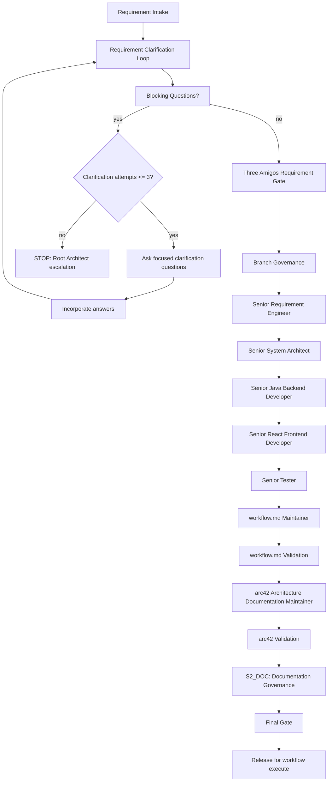
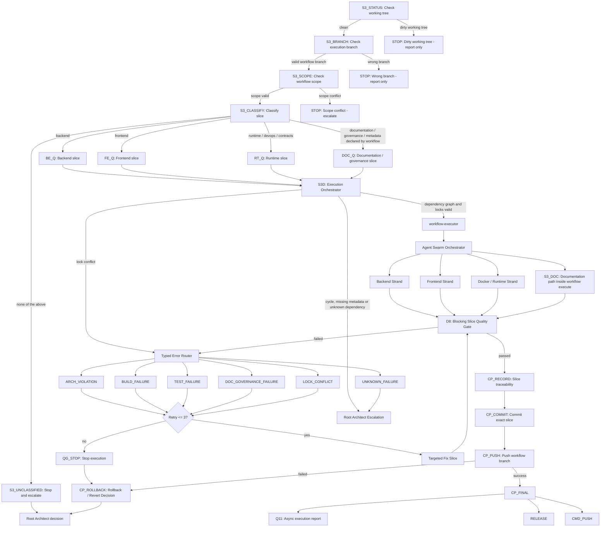

# 6. Runtime View

## 6.1 Server-Side Analysis Request Flow

```text
Build Tool
  -> Gradle/Maven Plugin
  -> gRPC Analysis Request
  -> Forensics Server
  -> Workspace Checkout
  -> Server-side Static Analysis
  -> Server-side Joern Analysis
  -> Canonical Analysis Model
```

## 6.2 Rule Generation Flow

```text
Canonical Analysis Model
  -> Rule Planner
  -> Instrumentation Plan
  -> Server-side Byteman/BTM Generator
  -> Versioned BTM Files
  -> Plugin Runtime Binding
  -> Runtime Session With Agent
```

## 6.3 Runtime Event Flow

```text
Runtime Application
  -> Byteman Agent
  -> Server-generated BTM File
  -> Runtime Event
  -> JSONL / Collector
  -> Runtime Event Importer
  -> Redaction
  -> Event Store
```

## 6.4 Exception Replay Flow

```text
Exception Event
  -> Incident Creation
  -> CorrelationID Event Lookup
  -> Timeline Reconstruction
  -> Call Tree Reconstruction
  -> Source-Code Mapping
  -> Graph Context Loading
  -> Replay View
```

## 6.5 LLM Diagnosis Flow

```text
Incident
  -> Replay Timeline
  -> Source Slices
  -> Graph Context
  -> Joern Findings
  -> Redacted Runtime Values
  -> Incident Context Package
  -> LLM Diagnosis
  -> Root-Cause Explanation
  -> Fix Plan
```

## 6.6 Missing Event Handling

The Replay Engine must explicitly show uncertainty if events are missing, incomplete or ambiguous. It must not pretend that a reconstructed path is complete when the evidence is incomplete.

## 6.7 Operational Logging Flow

```text
REST / gRPC / CLI / Bootstrap boundary
  -> Correlation scope
  -> Sanitized operation event
  -> JDK System.Logger
```

Operational logs record request, command and server lifecycle categories. They do not contain raw runtime payloads, source content, method arguments, method return values, LLM prompts or raw exception messages.

Operational correlation IDs help connect adapter logs for diagnostics. They are not canonical evidence and must not be used as proof of runtime execution.

## 6.8 Target Microservice Runtime Flow

The target runtime flow for service-split work is defined by ADR-0017 and is
partially implemented. The full evidence-review flow remains planned until
graph-replay and report-generation runtime paths are implemented and verified:

```text
Frontend / CLI / external client
  -> Gateway
  -> Analysis Store orchestration owner API
  -> Repository Analysis
  -> Source Snapshot And Build Artifact Resolution
  -> Java AST Analysis
  -> Java AST Source-Fact Byte Retrieval
  -> Joern CPG Analysis
  -> Analysis Store
  -> Graph Replay
  -> Report Generation
  -> Gateway
  -> Frontend / client
```

Plugin, scanner and runtime evidence enters through the ingestion service.
Canonical evidence and one-writer analysis state belong to the analysis store.
Graph, replay, reports and LLM packages are projections or generated artifacts
that must remain traceable to owner evidence APIs.

Gateway remains a public facade in this flow. Repository-to-BTM worker
dispatch, retry and job-graph readiness state is owned by Analysis Store
through the Slice 11 owner API. Gateway must not sequence worker business logic
directly.

Slice 12 verifies the Java AST source-fact byte retrieval owner API, the
Repository Analysis to Java AST handoff signal and deterministic local
repository-to-BTM fixtures. The default readiness path uses fakes, in-process
gRPC and service-local fixtures rather than external Git network access,
Docker, Jenkins, Artifactory or credentials.

The repository-to-BTM delivery path must be verified as:

```text
Plugin / external client
  -> Gateway HTTP repository-to-BTM request
  -> Analysis Store orchestration owner API
  -> Repository Analysis source snapshot
  -> Java AST source-fact bytes through owner API
  -> optional Joern worker outputs
  -> Analysis Store accepted metadata and target selection
  -> BTM Generation
  -> Gateway public BTM delivery facade
  -> Plugin / external client receives completed BTM files or unavailable state
```

Slice 16 defers graph-replay and report-generation service implementation from
repository-to-BTM acceptance. The accepted BTM pipeline does not require replay
views, graph projections, reports, incident packages, LLM-ready packages or
live LLM output. Those services may be added only after a later slice defines
contracts, owner-query access, projection rebuild rules, storage ownership and
tests that keep projections and generated output separate from evidence.

Repository Analysis resolves branch input to a concrete commit SHA before
analysis handoff. The source snapshot may reference a complete build-output
package from a verified Artifact Store/Artifactory artifact, an optional
Jenkins pipeline for the pinned snapshot, or a future sandboxed
`build-artifact-worker-service` fallback. Joern consumes only validated
source/build package descriptors or materialized Joern-owned workspaces; it
must not receive Repository Analysis private workspace IDs.

ADR-0018 allows the initial runtime communication contracts to describe planned
Gateway, worker, replay, report and event flows before each runtime path exists.
Those flows remain contract design until a slice implements and verifies the
corresponding runtime behavior.

The current implementation verifies a narrow Analysis Store runtime path:

```text
worker or future Gateway
  -> AnalysisJobService gRPC
  -> analysis-store-service application service
  -> service-local analysis job repository
```

This path supports job submission, leasing, progress, completion, failure,
listing and artifact metadata registration. It does not yet ingest normalized
fact bodies, runtime trace facts, incidents or correlation indexes.

## 6.9 Agent Governance Runtime Flows

These are repository governance flows, not product runtime flows.

### skills update Flow



### workflow create Flow



### workflow execute Flow



`CP_FINAL` does not end workflow governance by itself. It hands off to normal
push, release preparation or the non-blocking Q11 execution report path.
`CP_ROLLBACK` is a decision node and must not be interpreted as blind history
rewriting.

Publication-mode details remain separate from workflow execution. Normal
publication outcomes are `PUB_DONE`, `PUB_PR_RESULT`, `PUB_PUSH_FAILED` and
`PUB_REJECTED`; failed publication routes to `CP_ROLLBACK` when a rollback
point exists or to Root Architect escalation when it does not.
