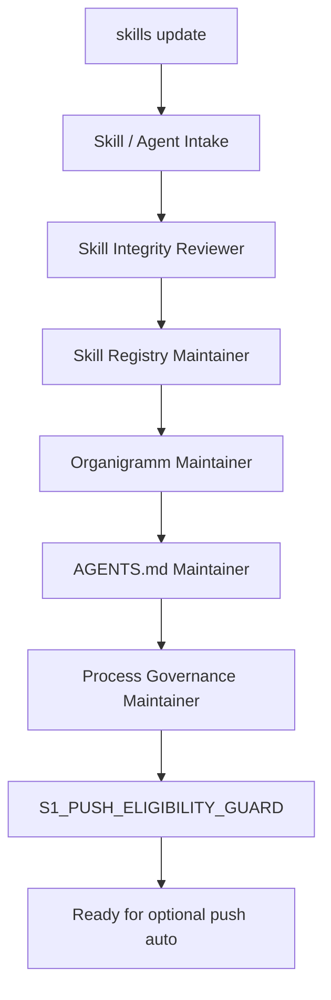
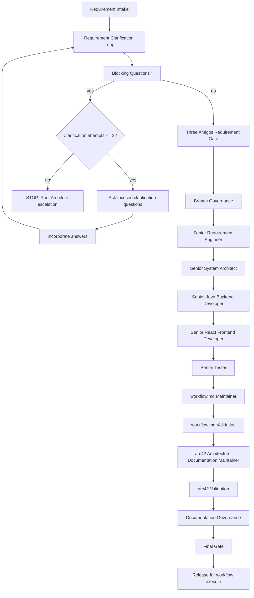
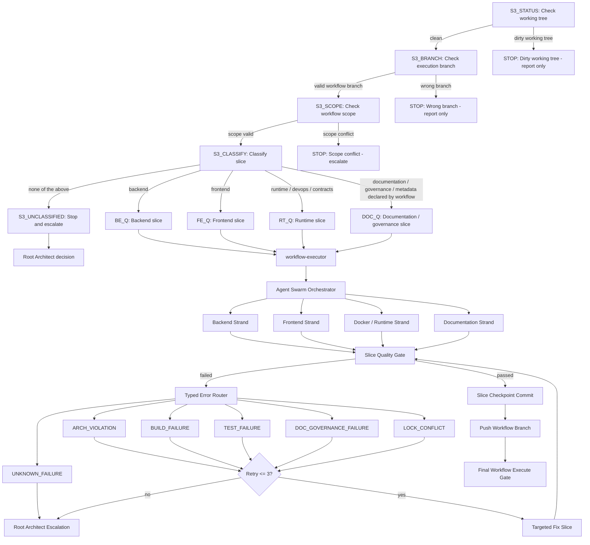

# 6. Runtime View

## 6.1 Server-Side Analysis Request Flow

```text
Build Tool
  -> Gradle/Maven Plugin
  -> gRPC Analysis Request
  -> Forensics Server
  -> Workspace Checkout
  -> Server-side Static Analysis
  -> Server-side Joern Analysis
  -> Canonical Analysis Model
```

## 6.2 Rule Generation Flow

```text
Canonical Analysis Model
  -> Rule Planner
  -> Instrumentation Plan
  -> Server-side Byteman/BTM Generator
  -> Versioned BTM Files
  -> Plugin Runtime Binding
  -> Runtime Session With Agent
```

## 6.3 Runtime Event Flow

```text
Runtime Application
  -> Byteman Agent
  -> Server-generated BTM File
  -> Runtime Event
  -> JSONL / Collector
  -> Runtime Event Importer
  -> Redaction
  -> Event Store
```

## 6.4 Exception Replay Flow

```text
Exception Event
  -> Incident Creation
  -> CorrelationID Event Lookup
  -> Timeline Reconstruction
  -> Call Tree Reconstruction
  -> Source-Code Mapping
  -> Graph Context Loading
  -> Replay View
```

## 6.5 LLM Diagnosis Flow

```text
Incident
  -> Replay Timeline
  -> Source Slices
  -> Graph Context
  -> Joern Findings
  -> Redacted Runtime Values
  -> Incident Context Package
  -> LLM Diagnosis
  -> Root-Cause Explanation
  -> Fix Plan
```

## 6.6 Missing Event Handling

The Replay Engine must explicitly show uncertainty if events are missing, incomplete or ambiguous. It must not pretend that a reconstructed path is complete when the evidence is incomplete.

## 6.7 Operational Logging Flow

```text
REST / gRPC / CLI / Bootstrap boundary
  -> Correlation scope
  -> Sanitized operation event
  -> JDK System.Logger
```

Operational logs record request, command and server lifecycle categories. They do not contain raw runtime payloads, source content, method arguments, method return values, LLM prompts or raw exception messages.

Operational correlation IDs help connect adapter logs for diagnostics. They are not canonical evidence and must not be used as proof of runtime execution.

## 6.8 Target Microservice Runtime Flow

The target runtime flow for service-split work is planned by ADR-0017. It is
not implemented yet:

```text
Frontend / CLI / external client
  -> Gateway
  -> Ingestion or analysis job APIs
  -> Repository Analysis
  -> Java AST Analysis
  -> Joern CPG Analysis
  -> Analysis Store
  -> Graph Replay
  -> Report Generation
  -> Gateway
  -> Frontend / client
```

Plugin, scanner and runtime evidence enters through the ingestion service.
Canonical evidence and one-writer analysis state belong to the analysis store.
Graph, replay, reports and LLM packages are projections or generated artifacts
that must remain traceable to owner evidence APIs.

ADR-0018 allows the initial runtime communication contracts to describe planned
Gateway, worker, replay, report and event flows before the services exist.
Those flows remain contract design until a later slice implements and verifies
the corresponding runtime behavior.

Slice 05 verifies a narrow Analysis Store runtime path:

```text
worker or future Gateway
  -> AnalysisJobService gRPC
  -> analysis-store-service application service
  -> service-local analysis job repository
```

This path supports job submission, leasing, progress, completion, failure,
listing and artifact metadata registration. It does not yet ingest normalized
fact bodies, runtime trace facts, incidents or correlation indexes.

## 6.9 Agent Governance Runtime Flows

These are repository governance flows, not product runtime flows.

### skills update Flow



### workflow create Flow



### workflow execute Flow


