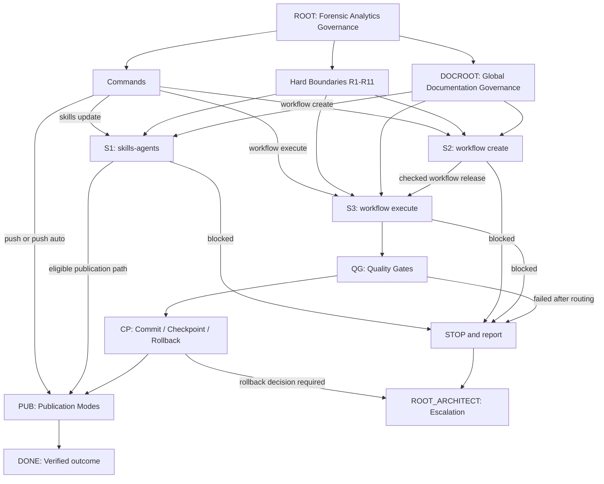

# Level 1 Governance Overview

This overview shows the global command and governance flow. It intentionally
keeps S1, S2 and S3 separate and shows only the high-level paths that decide
whether work can continue, stop, publish or escalate.

## Level 1 Checks

- Flowchart integrity is audited through
  `.agents/skills/flowchart-integrity-auditor/SKILL.md`.
- ROOT, commands, S1, S2, S3, hard boundaries, publication modes and global
  governance nodes are visible.
- S1, S2 and S3 remain separate process strands.
- `workflow execute` does not jump back to `workflow create`.
- Publication is a governed outcome path, not a hidden side effect.
- STOP paths end in report or Root Architect escalation.
