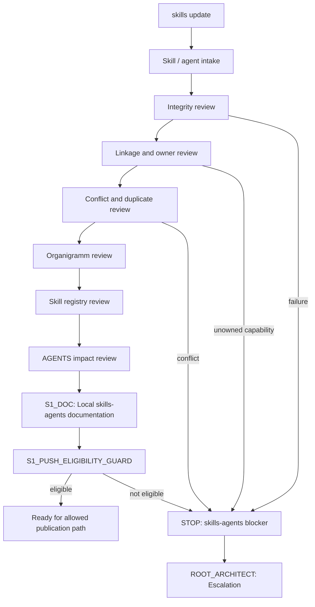
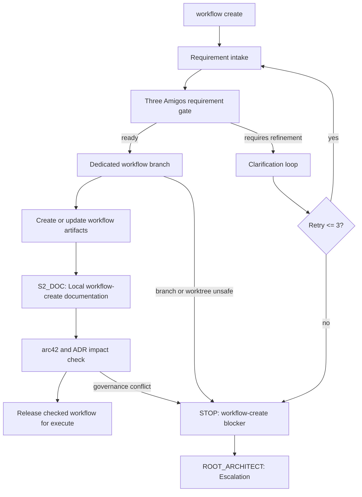
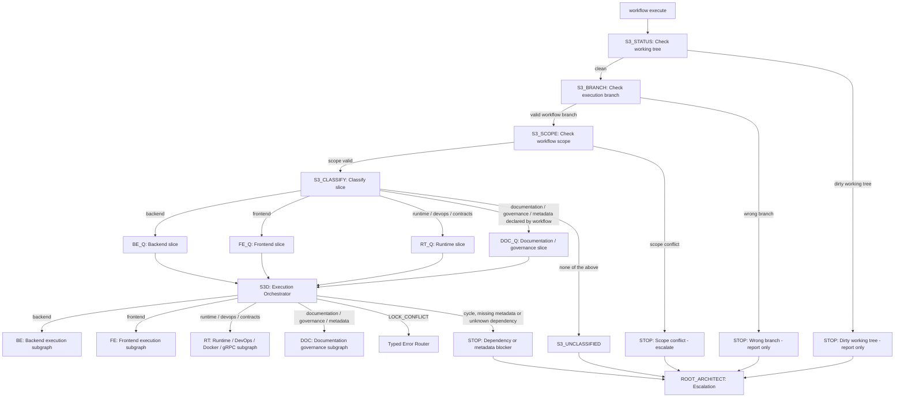
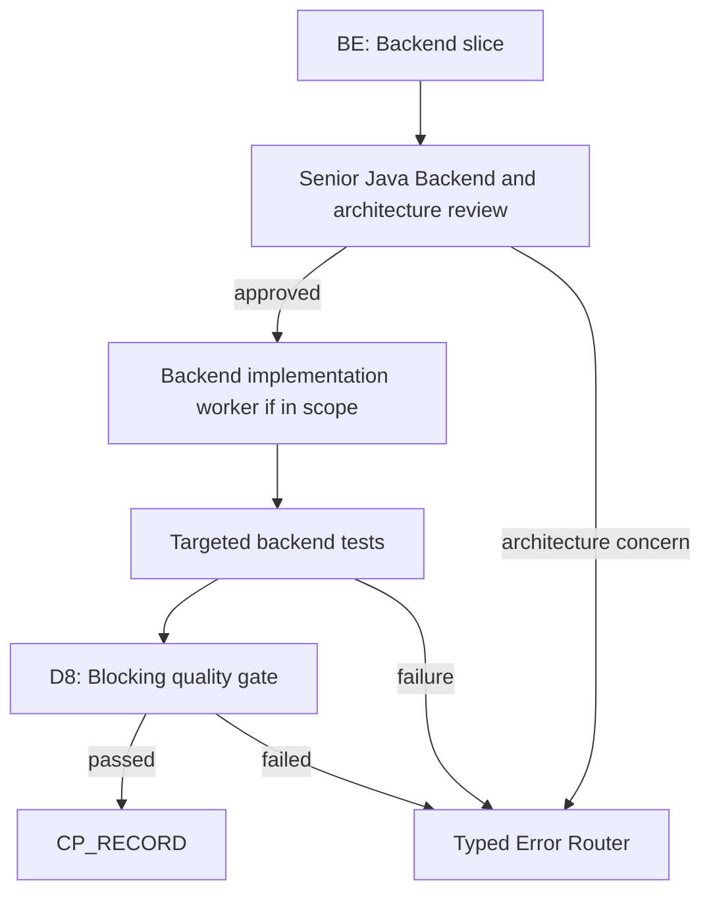
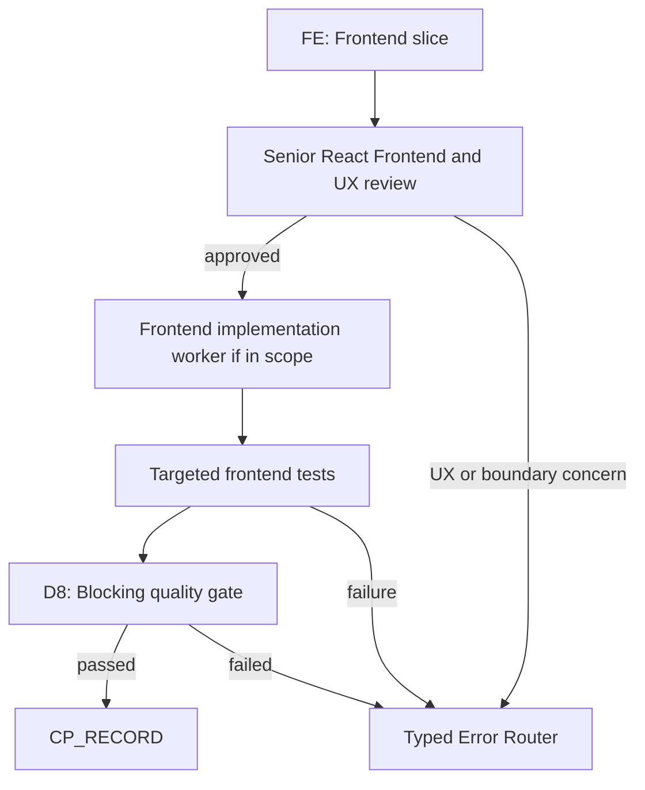
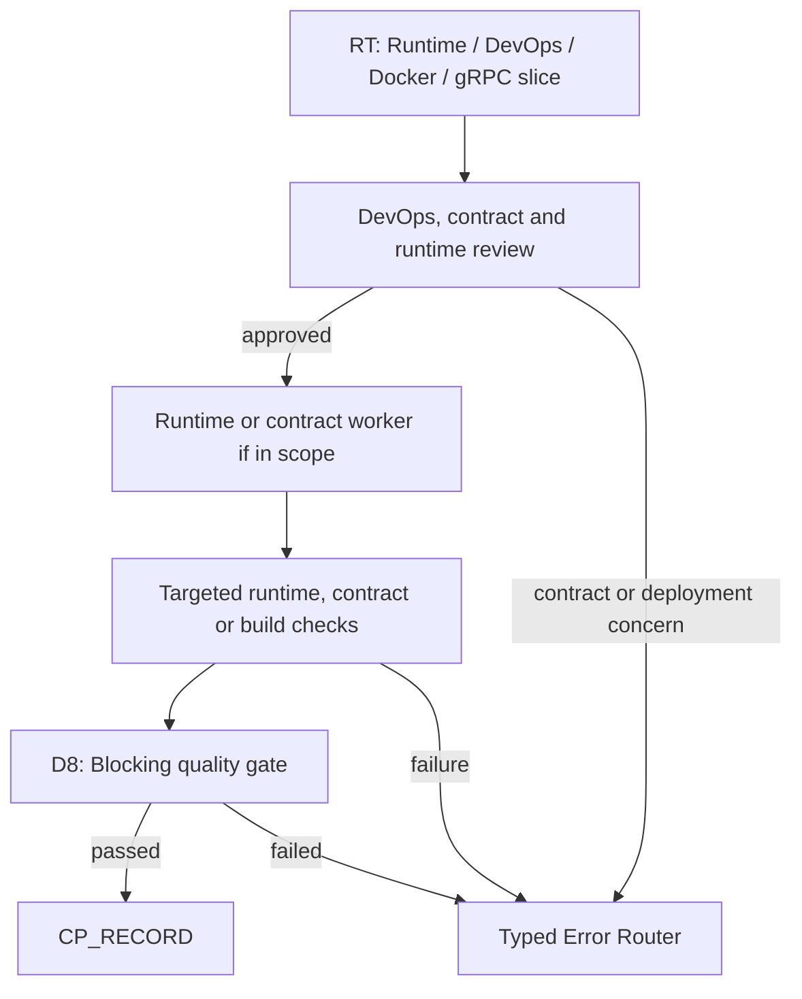
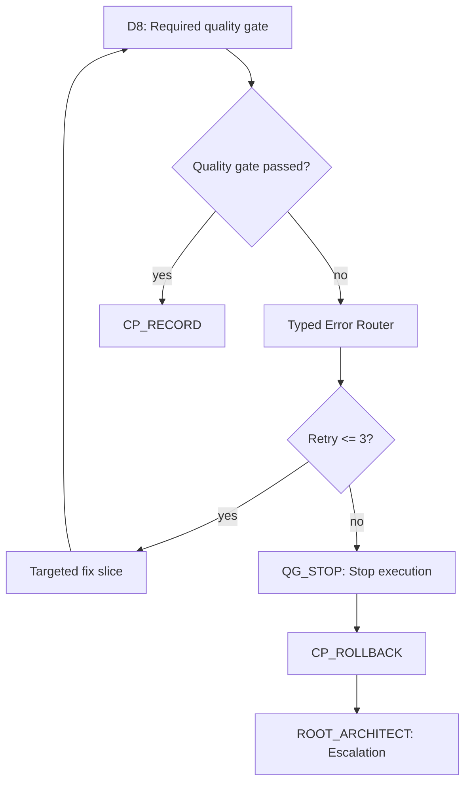
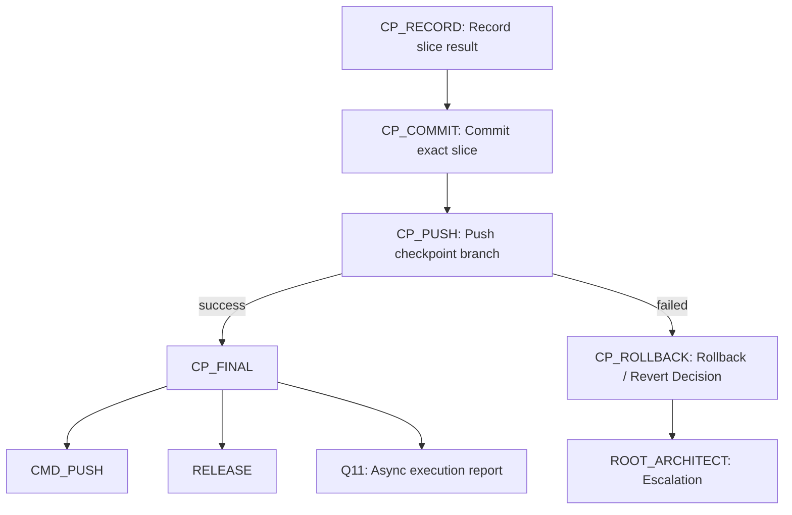
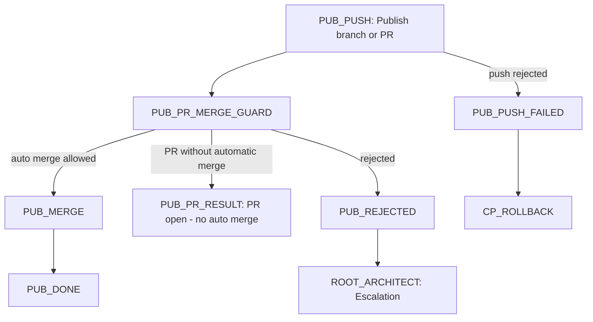
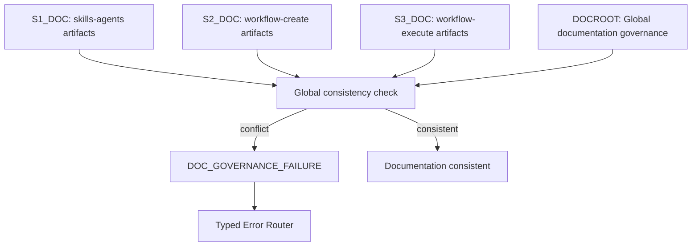

# Level 2 Governance Subgraphs

Each subgraph is small enough to review independently. The diagrams describe
governance flow only; they do not authorize product implementation or invent
repository behavior outside the referenced process documents.

Flowchart integrity for these subgraphs is audited through
`.agents/skills/flowchart-integrity-auditor/SKILL.md`. The audit checks
decision labels, STOP paths, fallback paths, terminal nodes, accidental
self-loops, forbidden `workflow execute` to `workflow create` jumps and Level 1
/ Level 2 consistency.

## S1 Skills And Agents

## S2 Workflow Create

## S3 Workflow Execute

## BE Backend Execution

## FE Frontend Execution

## RT Runtime DevOps Docker GRPC

## QG Quality Gates

## CP Commit Checkpoint Rollback

## PUB Publication Modes

`PUB_PR_RESULT` is the terminal for an open PR without automatic merge.
`PUB_DONE` is reserved for a verified checkpoint publication completion,
automatic merge, or explicitly completed publication path.

## DOC Documentation Governance

