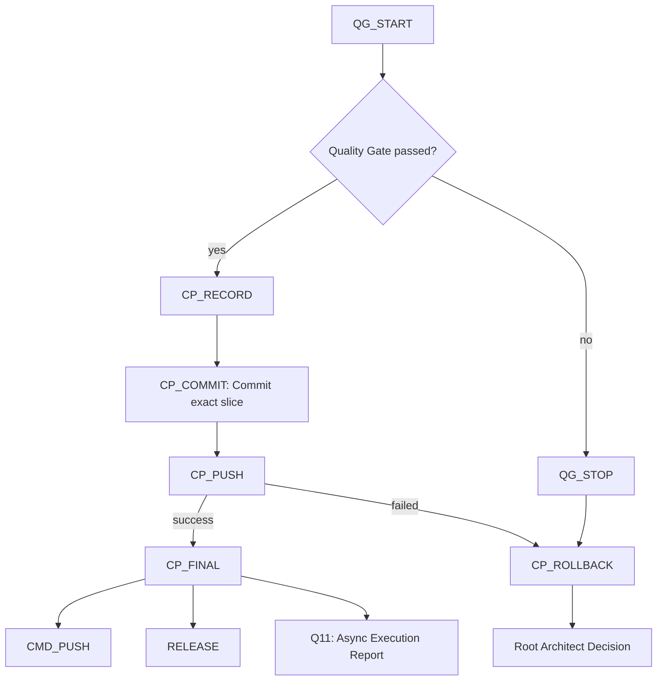

# Branch Governance

Branch governance keeps workflow and skills-agent changes isolated from shared branches.

Root `AGENTS.md` remains authoritative for exact command handling. This document summarizes the branch and publication boundaries used by the process strands.

## Branch Rules

- Do not modify workflow or skills-agent artifacts on `main`, `master`, `develop` or another shared branch.
- Use a dedicated branch for workflow or governance changes.
- Verify the active branch before staging, committing or pushing.
- Stop when local changes are unclear.
- Do not force-push.
- Do not push directly to `main`.

## Process Strand Branch Expectations

`skills-agents`:

- may prepare `push auto` only after explicit user request
- must stay inside skills, agents, prompts, routing, process and governance documentation
- must not include product implementation files

`workflow create`:

- creates or sharpens workflow planning artifacts
- does not implement product changes
- ends with checked `docs/workflow/workflow.md` and checked or updated arc42 documentation

`workflow execute`:

- executes approved workflow slices
- runs the slice quality gate
- creates a slice-scoped checkpoint commit after each successful slice
- pushes the current workflow branch to `origin`

## Slice Checkpoint Push

A slice checkpoint push belongs only to `workflow execute`.

It must:

1. run the slice quality gate
2. inspect the slice diff
3. stage only files changed by the current slice
4. run `git diff --cached --check`
5. create a slice-scoped checkpoint commit
6. push the current workflow branch to `origin`
7. record the commit SHA and push result in the execution report

A successful checkpoint branch push is `PUB_DONE`. A failed checkpoint branch
push is `PUB_PUSH_FAILED` and must route to `CP_ROLLBACK` when a rollback point
exists, otherwise to Root Architect escalation.

Checkpoint governance uses this control flow:



`CP_ROLLBACK` chooses between current-slice file revert, one slice-commit
revert, a new fix slice, branch discard with explicit approval, manual workflow
recut or Root Architect escalation. It is not blind `git reset --hard`, a
force-push, branch cleanup or hidden history rewrite.

Each checkpoint commit must map to exactly one slice and one active workflow
version. `CP_RECORD` must capture:

```text
workflowVersion
sliceId
sliceTitle
responsibleAgent
changedFiles
qualityGateCommands
qualityGateResult
commitHash
rollbackReference
arc42Updated
adrUpdated
```

`commitHash` is filled after `CP_COMMIT` succeeds. Until then it is recorded as
`pending`; the post-commit checkpoint report must replace or supplement it with
the actual hash and push result.

`D8` is the blocking gate for checkpoint commit and release readiness. It blocks
commit or release when build, tests, architecture validation, required
documentation, workflow versioning or any required quality gate fails or is
missing.

`Q11` is the asynchronous execution report after `CP_FINAL`. It is
non-blocking by default and must not block checkpoint push, normal PR creation
or release preparation unless the active workflow explicitly promotes a
regulatory or compliance report to a `D8` requirement.

It must not:

- create or merge a PR
- clean up branches
- run `push auto`
- force-push
- push to `main`

## Publication Outcomes

`push` and `push auto` use the same outcome names without sharing authority:

- `PUB_PR_RESULT`: normal `push` opened or updated a PR and performed no automatic merge.
- `PUB_DONE`: publication completed and was verified.
- `PUB_PUSH_FAILED`: push failed and requires rollback or escalation.
- `PUB_REJECTED`: governance, scope, branch or guard rules blocked publication.

`PUB_PUSH` must not point to itself.
