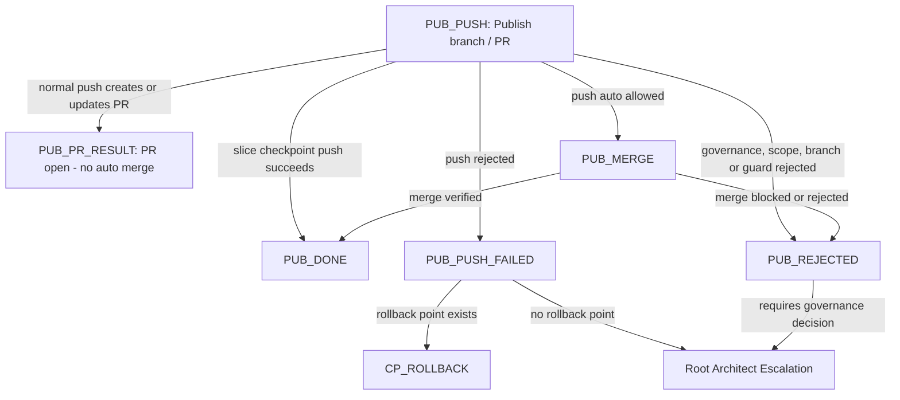

# Push Auto Governance

`push auto` is restricted to the `skills-agents` process strand.

It may create, verify and merge a pull request only after the skills-agents guard passes. It must never publish backend, frontend, Docker/runtime, contracts, persistence, analysis engine, Joern, JavaParser, BTM generator or analytics implementation changes.

## Publication Separation

Slice checkpoint push is not `push auto`.

`push` is not `push auto`.

`skills update` is not `push auto`.

## Three Publication Modes

1. Slice checkpoint push
   - belongs to `workflow execute`
   - runs after a successful slice quality gate
   - commits and pushes the current workflow branch to `origin`
   - ends in `PUB_DONE` when the branch push succeeds
   - ends in `PUB_PUSH_FAILED` when the branch push fails
   - does not create or merge a PR
   - does not run branch cleanup
   - is not `push auto`
2. `push`
   - normal publication after explicit user approval
   - pushes the branch and creates or updates a PR
   - ends in `PUB_PR_RESULT`
   - does not automatically merge
3. `push auto`
   - belongs only to `skills-agents`
   - uses a guarded PR lifecycle
   - may be rejected as `PUB_REJECTED` when guard checks fail
   - may merge and clean up only after guard checks pass

## Publication Outcomes

Outcome meanings:

- `PUB_DONE`: publication completed and verified.
- `PUB_PR_RESULT`: normal `push` left a PR open or updated; no automatic merge happened.
- `PUB_PUSH_FAILED`: a branch push failed after a checkpoint or publication action.
- `PUB_REJECTED`: governance, scope, branch or guard rules blocked publication.

`PUB_PUSH` must not point to itself. `PUB_PUSH_FAILED` is a controlled
publication outcome with a rollback or escalation handoff.

## CP_ROLLBACK Boundary

`CP_ROLLBACK` is a rollback or revert decision node for the active workflow
branch. It may select a current-slice file revert, one slice-commit revert, a
new fix slice, branch discard with explicit approval, manual workflow recut or
Root Architect escalation.

`CP_ROLLBACK` is not `push auto`, does not authorize force-push, does not run
branch cleanup, does not create or merge a PR and must not be implemented as
blind `git reset --hard`.

## Allowed Review Scope

`push auto` may consider only these areas:

- `AGENTS.md`
- `.agents/**`
- `.codex/agents/**`
- `.codex/skills/**`
- `.codex/subagents/**`
- `.codex/workflow/**`
- `docs/agents/**`
- `docs/README.md`
- `docs/process/**`
- `docs/governance/**`
- `docs/skill-audit/**`
- `docs/arc42/**`
- `docs/adr/**`

## Blocked Review Scope

`push auto` is blocked when any of these areas changed:

- `src/**`
- `*/src/**`
- `forensic-ui/**`
- `docker/**`
- `docker-compose*.yml`
- `build.gradle*`
- `settings.gradle*`
- `gradle/**`
- `proto/**`
- `contracts/**`
- `services/**`

## Guard Checks

Before `push auto`, confirm:

1. The active branch is not `main`, `master`, `develop` or another shared branch.
2. `AGENTS.md` and `QUALITY.md` were read.
3. The change belongs to `skills-agents`.
4. No blocked review-scope files changed.
5. `git diff --check` passes.
6. Required documentation references are consistent.
7. The PR target is `main`.
8. No push to `main`, force-push or GitHub auto-merge is used.

The PR may be merged only after mergeability and required checks are verified.
