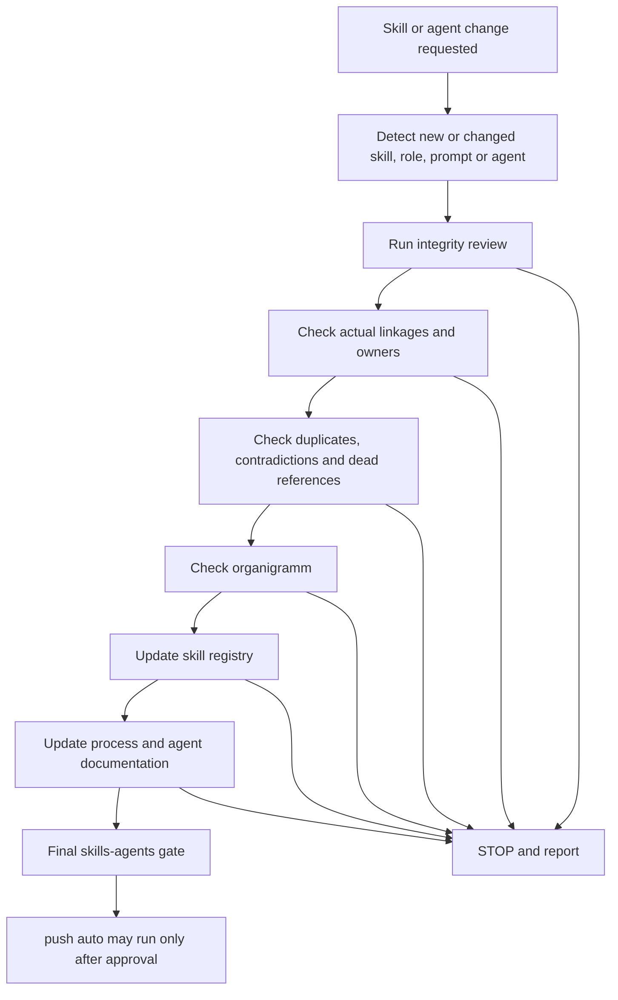

# Skills And Agents Creation Strand

The `skills-agents` strand governs creation, modification, audit,
classification, documentation and release readiness for skills, roles, prompts,
Codex agent definitions and their process documentation.

It is the only strand that `push auto` may consider.

## Scope

Allowed work:

- Skill instructions under `.agents/skills/**` and `.codex/skills/**`.
- Role instructions under `.agents/roles/**` and `.codex/subagents/**`.
- Codex agent TOML definitions under `.codex/agents/**`.
- Agent prompts under `.agents/prompts/**`.
- Agent governance, organigramm, registry and process documentation.
- Root `AGENTS.md` changes when they are limited to agent governance.
- arc42 and ADR references when they document agent-governance consequences.

Forbidden work:

- Backend feature implementation.
- Frontend feature implementation.
- Docker or runtime implementation.
- gRPC, REST, persistence, Joern, JavaParser, BTM generator or analytics engine
  implementation.
- Gradle build logic changes unless the requested governance task explicitly
  changes validation tooling and `QUALITY.md` verifies the command impact.

## Required Flow

## Roles

| Role | Responsibility | Existing repository anchor |
|---|---|---|
| Senior System Architect | Owns architecture-sensitive governance and unresolved process conflicts | `.agents/roles/senior-system-architect.md` |
| Skill / Agent Creator | Creates or updates skills, roles, prompts and agent definitions after verification | `.agents/skills/skill-registry-conflict-auditor/SKILL.md`, system `skill-creator` |
| Skill Integrity Reviewer | Reviews frontmatter, scope, STOP rules, ownership and contradictions | `.agents/skills/skill-registry-conflict-auditor/SKILL.md` |
| Skill Registry Maintainer | Keeps the registry current | `docs/agents/skill-registry.md` |
| Organigramm Maintainer | Keeps the role hierarchy and strand diagrams current | `docs/agents/organigramm.md` |
| AGENTS.md Maintainer | Updates root agent rules only for verified governance changes | `AGENTS.md` |
| Process Governance Maintainer | Keeps process documents aligned | `docs/process/**` |
| Push Auto Guard | Blocks non-skills-agents changes from `push auto` | `.agents/skills/git-commit-preparation/SKILL.md` |
| Documentation Governance | Ensures documentation is updated before completion | `.agents/roles/senior-documentation-engineer.md` |

## Release Gate

The strand is release-ready only when all of these checks pass:

- Changed files are limited to the allowed `skills-agents` scope.
- No backend, frontend, Docker/runtime or analytics implementation files are
  changed.
- The skill registry is updated or explicitly checked as unchanged.
- The organigramm is updated or explicitly checked as unchanged.
- `AGENTS.md` impact is reviewed.
- Process documentation is updated.
- The diff is inspected.
- `git diff --check` passes.
- Any available Markdown or documentation checks pass, or their absence is
  reported.
