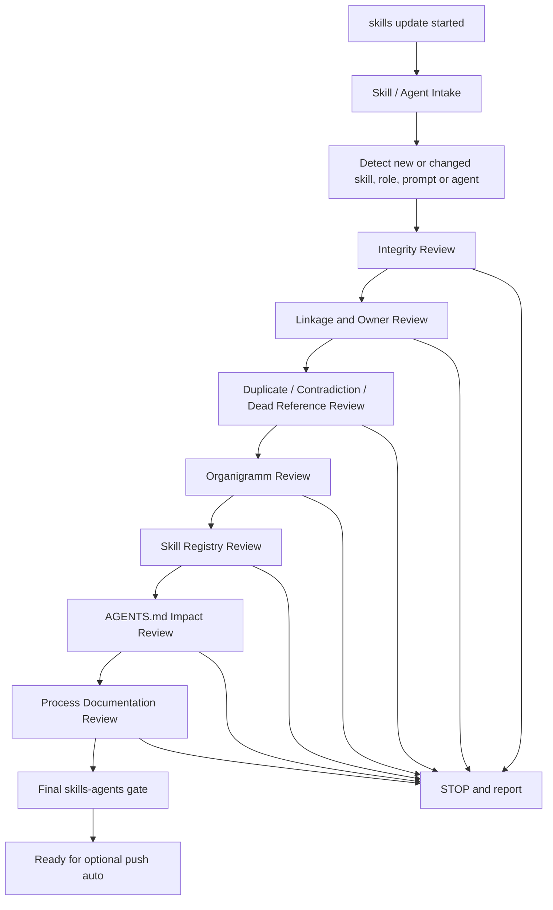

# Skills Update Command

`skills update` activates the `skills-agents` process strand.

It is used to create, update, audit, reconnect or refactor:

- skills
- agents
- roles
- prompts
- Codex agent definitions
- routing rules
- organigramm
- skill registry
- process documentation
- AGENTS.md governance sections
- arc42 or ADR notes when they document agent-governance consequences

## Required Flow

## Allowed Files

- `AGENTS.md`
- `.agents/**`
- `.codex/**`
- `docs/agents/**`
- `docs/process/**`
- `docs/governance/**`
- `docs/skill-audit/**`
- `docs/arc42/**` only for governance consequences
- `docs/adr/**` only for governance consequences

## Forbidden Files

- `src/**`
- `services/**`
- `contracts/**`
- `docker/**`
- `build.gradle*`
- `settings.gradle*`
- `gradle/**`
- `proto/**`
- `forensic-ui/**`

## Relationship To `push auto`

`skills update` may prepare a change for publication, but it does not run `push auto`.

`push auto` remains a separate explicit command and is allowed only after the skills-agents guard passed.

`skills update` is not `workflow create`.
`skills update` is not `workflow execute`.
`skills update` is not `push auto`.
