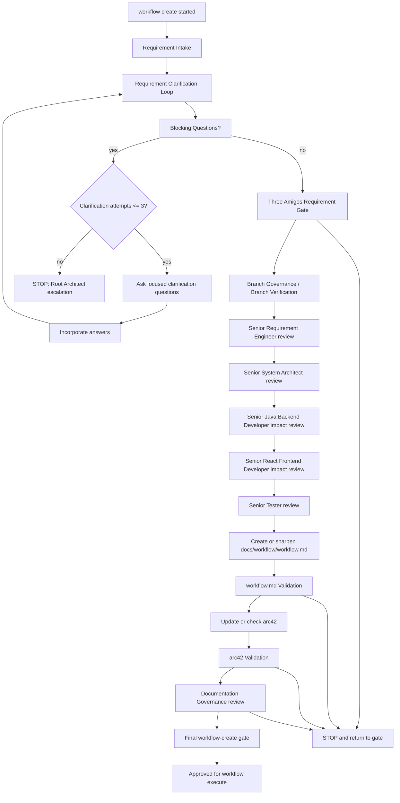

# Workflow Create Command

`workflow create` activates the workflow creation process strand.

This strand sharpens requirements, validates architecture impact, creates or updates `docs/workflow/workflow.md`, checks or updates arc42 documentation and releases the result for `workflow execute`.

`workflow create` must not implement backend code, frontend code, Docker/runtime code, analytics implementation code, contracts implementation or database implementation.

## Required Flow



## Requirement Clarification Loop

Automatic clarification attempts are capped at:

```text
maxRetries = 3
```

After three unresolved attempts, `workflow create` must STOP and escalate to the Root Architect. Validation correction loops use the same cap and must not silently continue.

The loop must record:

- Original Request
- Interpreted Intent
- Change Type
- Affected Process Strand
- Affected Architecture Area
- Explicit Requirements
- Implicit Requirements
- Assumptions
- Non-Goals
- Risks
- Open Questions
- Blocking Questions
- Confidence Level
- Decision:
  - `READY_FOR_WORKFLOW`
  - `PROCEED_WITH_ACCEPTED_ASSUMPTIONS`
  - `REQUIRES_REFINEMENT`

## Confidence Rule

Confidence greater than or equal to 90 percent means `READY_FOR_WORKFLOW` when no blocking questions remain.

Confidence from 70 to 89 percent means `PROCEED_WITH_ACCEPTED_ASSUMPTIONS` only when every assumption is non-blocking and documented.

Confidence below 70 percent means `REQUIRES_REFINEMENT`.

## Blocking Questions

When blocking questions remain:

- do not create a final `docs/workflow/workflow.md`
- do not release the request for `workflow execute`
- ask focused clarification questions
- return `REQUIRES_REFINEMENT`

Non-blocking uncertainty may be documented as an assumption only when it does not affect architecture boundaries, testability, data ownership, service boundaries, APIs, contracts, runtime behavior or scope.

## Five Mandatory Three Amigos Roles

`workflow create` must use these five roles:

- Senior Requirement Engineer: target, scope, non-goals, acceptance criteria, assumptions and open questions
- Senior System Architect: architecture boundaries, arc42, service boundaries, plugin-vs-analytics boundary and risks
- Senior Java Backend Developer: backend impact, ports, adapters, domain, JUnit 6 testability and Spring or microservice consequences
- Senior React Frontend Developer: frontend impact, UX flows, React components, state, API adapters and build or test consequences
- Senior Tester: testability, regression, quality gates, acceptance criteria and slice acceptance

Classic labels such as Requirement Analyst, Architecture Validator and Quality Validator may be additional perspectives. They do not replace the five mandatory roles.

## End Artifacts

`workflow create` is complete only when both artifacts have been checked:

1. complete checked `docs/workflow/workflow.md`
2. checked or updated `docs/arc42/**` documentation

`docs/workflow/workflow.md` must contain:

- Executive Summary
- Target Picture
- Scope
- Non-Goals
- Architecture Boundaries
- Backend Assessment
- Frontend Assessment
- Test Strategy
- Slice Structure
- Subagent Assignment
- Quality Gates
- Definition of Done
- Handoff to workflow execute
- arc42 Check Status
