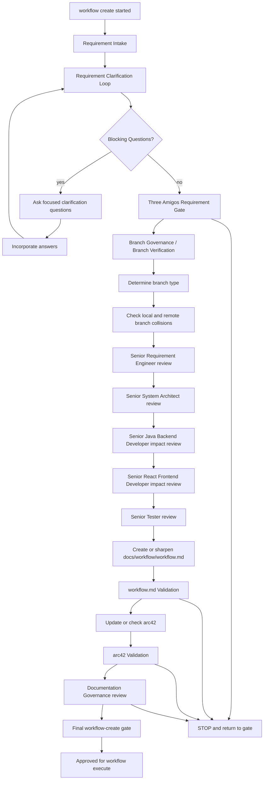

# Workflow Create Strand

`workflow create` is a requirement, architecture, planning and documentation
strand. It does not implement production backend, frontend, Docker/runtime or
analytics code.

## Purpose

The strand turns a user request into an executable, checked workflow and an
arc42 documentation review or update. It defines what `workflow execute` may
later implement.

## Required Flow

Requirement intake, clarification, read-only routing inspection and role
selection may happen before branch creation. Mutating workflow files requires a
verified workflow branch.

## Requirement Clarification Loop

The loop must record:

- Original Request
- Interpreted Intent
- Change Type
- Affected Process Strand
- Affected Architecture Area
- Explicit Requirements
- Implicit Requirements
- Assumptions
- Non-Goals
- Risks
- Open Questions
- Blocking Questions
- Confidence Level
- Decision: `READY_FOR_WORKFLOW`, `PROCEED_WITH_ACCEPTED_ASSUMPTIONS` or
  `REQUIRES_REFINEMENT`

If blocking questions remain open, `workflow create` must not produce a final
checked `docs/workflow/workflow.md`, must not release the workflow for
`workflow execute`, and must return focused questions with
`REQUIRES_REFINEMENT`.

Non-blocking uncertainty may be documented as an accepted assumption only when
it does not affect architecture boundaries, testability, data ownership,
service boundaries, APIs, contracts, runtime behavior or scope.

Confidence decisions:

- Confidence >= 90%: `READY_FOR_WORKFLOW` when no blocking questions remain.
- Confidence 70-89%: `PROCEED_WITH_ACCEPTED_ASSUMPTIONS` only when the
  assumptions are non-blocking and documented.
- Confidence < 70%: `REQUIRES_REFINEMENT`.

## Required Three Amigos Roles

| Role | Mandatory focus |
|---|---|
| Senior Requirement Engineer | Goal, scope, non-goals, acceptance criteria, assumptions and open questions |
| Senior System Architect | Architecture boundaries, arc42, service boundaries, plugin-vs-analytics boundary and risks |
| Senior Java Backend Developer | Backend impact, ports, adapters, domain, JUnit 6 testability, Spring and microservice consequences |
| Senior React Frontend Developer | Frontend impact, UX flows, React components, state, API adapters and build/test consequences |
| Senior Tester | Testability, regression, quality gates, acceptance criteria and slice acceptance |

Classical labels such as Requirement Analyst, Architecture Validator and Quality
Validator may appear only as additional review lenses. They do not replace the
five mandatory roles above.

## Required End Artifacts

`workflow create` is complete only when both checked artifacts exist:

1. A complete checked `docs/workflow/workflow.md`.
2. Checked or updated arc42 documentation.

`docs/workflow/workflow.md` must include at least:

- Executive Summary
- Target Picture
- Scope
- Non-Goals
- Architecture Boundaries
- Backend Assessment
- Frontend Assessment
- Test Strategy
- Slice Structure
- Subagent Assignment
- Quality Gates
- Definition of Done
- Handoff to `workflow execute`

The arc42 review must check the existing arc42 structure and update affected
sections. At minimum, the review records whether these sections are affected:

- Introduction and Goals
- Architecture Constraints
- System Scope and Context
- Solution Strategy
- Building Block View
- Runtime View
- Deployment View
- Crosscutting Concepts
- Architecture Decisions
- Quality Requirements
- Risks and Technical Debt

## Final Gate

`workflow create` is complete only when:

- no blocking questions remain open;
- `docs/workflow/workflow.md` is complete, executable and testable;
- arc42 documentation was checked or updated;
- Documentation Governance passed;
- release for `workflow execute` is recorded.

## Hard Rules

- Create or verify the dedicated workflow branch before mutating workflow
  planning artifacts.
- Do not implement product behavior.
- Do not change backend code.
- Do not change frontend code.
- Do not change Docker/runtime code.
- Do not change analytics implementation code.
- Return to the Three Amigos gate when architecture boundaries or testability
  are unclear.
- Do not create a final checked `docs/workflow/workflow.md` while blocking
  questions remain open.
- Do not mark `workflow create` complete without both required end artifacts.
