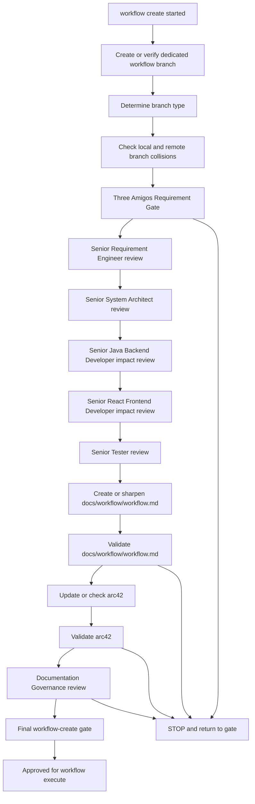

# Workflow Create Strand

`workflow create` is a requirement, architecture, planning and documentation
strand. It does not implement production backend, frontend, Docker/runtime or
analytics code.

## Purpose

The strand turns a user request into an executable, checked workflow and an
arc42 documentation review or update. It defines what `workflow execute` may
later implement.

## Required Flow

## Required Three Amigos Roles

- Senior Requirement Engineer
- Senior System Architect
- Senior Java Backend Developer
- Senior React Frontend Developer
- Senior Tester

## Required End Artifacts

`workflow create` is complete only when both checked artifacts exist:

1. A complete checked `docs/workflow/workflow.md`.
2. Checked or updated arc42 documentation.

`docs/workflow/workflow.md` must include at least:

- Executive Summary
- Target Picture
- Scope
- Non-Goals
- Architecture Boundaries
- Backend Assessment
- Frontend Assessment
- Test Strategy
- Slice Structure
- Subagent Assignment
- Quality Gates
- Definition of Done
- Handoff to `workflow execute`

The arc42 review must check the existing arc42 structure and update affected
sections. At minimum, the review records whether these sections are affected:

- Introduction and Goals
- Architecture Constraints
- System Scope and Context
- Solution Strategy
- Building Block View
- Runtime View
- Deployment View
- Crosscutting Concepts
- Architecture Decisions
- Quality Requirements
- Risks and Technical Debt

## Hard Rules

- Create or verify the dedicated workflow branch before mutating workflow
  planning artifacts.
- Do not implement product behavior.
- Do not change backend code.
- Do not change frontend code.
- Do not change Docker/runtime code.
- Do not change analytics implementation code.
- Return to the Three Amigos gate when architecture boundaries or testability
  are unclear.
- Do not mark `workflow create` complete without both required end artifacts.
