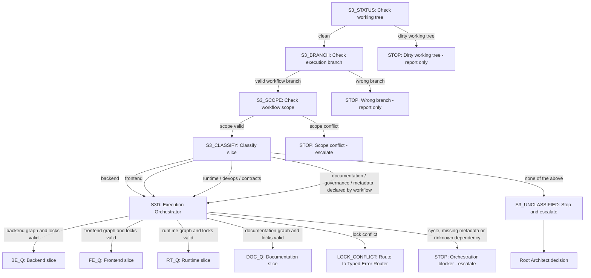
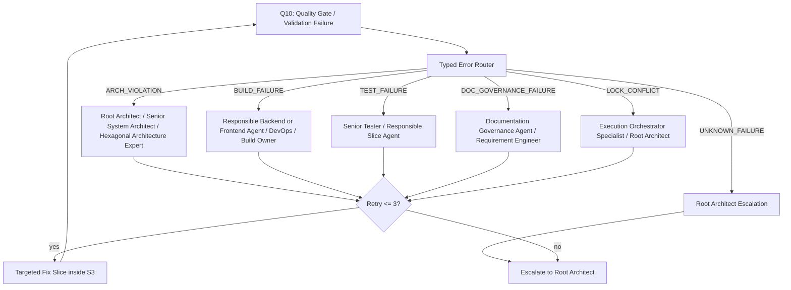

# Workflow Execute Command

`workflow execute` activates the workflow execution process strand.

It executes a checked `docs/workflow/workflow.md` slice by slice through the configured subagent workflow, required role reviews, tests, documentation updates, quality gates and slice checkpoint pushes.

## Start Conditions

`workflow execute` may start only when both are present and checked:

1. complete checked `docs/workflow/workflow.md`
2. checked or updated `docs/arc42/**` documentation

Stop when either artifact is missing or contradicts `AGENTS.md`, `QUALITY.md`, ADRs or verified repository state.

## S3 Safety Preflight

`workflow execute` must pass these safety nodes before any slice is routed or
implemented:



S3 STOP paths report the blocker and do not jump back to `workflow create`.
Scope conflicts escalate to the Root Architect for a decision.
Unclassifiable slices must not execute automatically.

Explicitly declared governance, metadata and documentation-only slices may route
through the Documentation Strand only when the active workflow declares that
scope. Otherwise they are unclassified and must escalate.

## S3D Execution Orchestrator

S3D runs after `S3_CLASSIFY` and before write-capable slice execution. It is the
Execution Orchestrator for `workflow execute`, not a fourth process strand.

S3D reads the checked `docs/workflow/workflow.md` and extracts:

- slice ID
- slice goal
- affected files
- affected modules
- affected contracts
- responsible subagents or roles
- dependencies
- quality gates
- documentation duties

S3D then builds a directed dependency graph, runs topological sort, forms
independent parallelization groups and checks file, contract, module and
architecture-boundary locks before any write-capable agent starts.

Parallel execution is allowed only when all active slices have disjoint write
scopes, no shared contract or architecture boundary is edited by more than one
active slice, quality gates can be attributed independently and documentation
ownership is explicit.

S3D must stop and report when metadata is missing, dependency references are
unknown, dependency ranges are not expanded to concrete slice IDs, the graph has
a cycle, or a lock overlaps. Lock overlaps route as `LOCK_CONFLICT` through the
Typed Error Router. S3D must not call `workflow create`, rewrite the active
workflow during execution or expand scope automatically.

## Typed Error Router

Quality-gate and validation failures in `workflow execute` must route through
typed ownership before any retry or fix attempt starts:



The router categories are:

| Error type | Target role |
|---|---|
| `ARCH_VIOLATION` | Root Architect, Senior System Architect, Hexagonal Architecture Expert |
| `BUILD_FAILURE` | responsible Backend or Frontend Agent, DevOps, Build Owner |
| `TEST_FAILURE` | Senior Tester, responsible Slice Agent |
| `DOC_GOVERNANCE_FAILURE` | Documentation Governance Agent, Requirement Engineer |
| `LOCK_CONFLICT` | Execution Orchestrator Specialist, Root Architect |
| `UNKNOWN_FAILURE` | Root Architect |

Automatic fix attempts are capped at `maxRetries = 3`. Retry exhaustion,
`UNKNOWN_FAILURE`, missing ownership or unclear classification stops execution
and escalates to the Root Architect. Targeted fix slices remain inside
`workflow execute`; the router must not jump back to `workflow create` or expand
the workflow scope automatically.

## Execution Strands

Workflow execution must keep these implementation and documentation strands separate:

- Backend Strand
- Frontend Strand
- Docker / Runtime Strand
- Documentation Strand

## Backend Strand

Required roles and skills when backend work is in scope:

- Senior Java Backend Developer
- Microservice Senior Expert
- `architecture-hexagonal`
- `spring-core` when Spring wiring is affected
- `testing-junit6`
- Senior DevOps with `devops-docker` when container readiness is affected

Required rules:

- JUnit 6 tests or a checked workflow exception
- hexagonal architecture
- domain, ports and adapters separated
- no framework leaks into domain
- Microservice Senior Expert checks service autonomy
- no shared Java implementation modules between microservices
- communication only through REST/OpenAPI, gRPC/protobuf or approved messaging contracts

## Frontend Strand

Required roles when frontend work is in scope:

- Senior React Frontend Developer
- Senior UX Designer
- Senior DevOps with `devops-docker` when container readiness is affected

## Slice Checkpoint Push

After each successfully completed slice:

1. Run the slice quality gate.
2. Inspect the slice diff.
3. Stage only files changed by this slice.
4. Run `git diff --cached --check`.
5. Create a slice-scoped checkpoint commit.
6. Push the current workflow branch to `origin`.
7. Record the commit SHA and push result in the execution report.
8. Continue with the next slice only after the checkpoint push succeeded.

Not allowed:

- no commit when the slice quality gate failed
- no commit when the diff is unclear
- no commit with files from other slices
- no push to `main`
- no PR merge
- no `push auto`
- no branch cleanup
- no force-push

Commit messages use:

```text
<type>(slice-<nn>): <short description>
```

Examples:

```text
docs(slice-01): refine workflow create clarification loop
agent(slice-02): align three amigos gate roles
test(slice-03): add backend regression coverage
feat(slice-04): implement ingestion service boundary
```

## Recovery Rule

If the machine crashes or the local worktree is lost, restore the last successful state from `origin/<workflow-branch>`. The execution report must show the latest completed slice, commit SHA and pushed branch state.

## Relationship To Publication Modes

Slice checkpoint push is not `push auto`.

Slice checkpoint push does not create or merge a PR.

Slice checkpoint push does not run branch cleanup.
