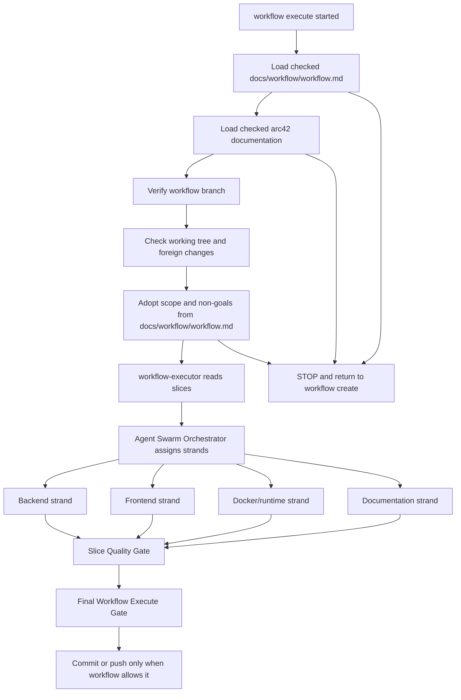

# Workflow Execute Strand

`workflow execute` implements only a previously checked `docs/workflow/workflow.md`.

The strand may start only when both inputs from `workflow create` are present:

1. Checked `docs/workflow/workflow.md`.
2. Checked or updated arc42 documentation.

## Required Flow

## Backend Strand

Required roles:

- Senior Java Backend Developer
- Microservice Senior Expert
- `architecture-hexagonal`
- `spring-core` when Spring wiring is affected
- `testing-junit6`
- Senior DevOps with `devops-docker` when container readiness is affected

Required rules:

- Each backend slice must be implemented only inside its workflow scope.
- Each backend slice must add or update JUnit 6 tests unless the workflow records
  a checked exception.
- Hexagonal architecture must be preserved.
- Domain, ports and adapters must remain separated.
- Framework code must not leak into domain.
- The Microservice Senior Expert checks service autonomy and service boundaries.
- A future microservice may be called a microservice only when it is
  independently buildable, runnable, testable, configurable, observable,
  health-checkable and container-ready.
- Shared Java implementation modules between microservices are forbidden.
- Inter-service communication is allowed only through checked REST/OpenAPI,
  gRPC/protobuf or approved messaging contracts.

## Frontend Strand

Required roles:

- Senior React Frontend Developer
- Senior UX Designer
- Senior DevOps with `devops-docker` when container readiness is affected

Required rules:

- Frontend slices are assessed separately from backend slices.
- UX flows must be reviewed.
- React components, views, API adapters and state structures must be reviewed.
- Frontend build and tests must be checked when a frontend slice changes them.
- Frontend container readiness must be checked when affected.

## Docker And Runtime Strand

Docker and runtime changes are execution work, not workflow creation work. They
must be slice-scoped, reviewed by DevOps and container specialists, and verified
with repository-documented commands.

## Documentation Strand

Required tasks:

- Update the execution report.
- Check arc42 against the actual implementation.
- Add architecture decision references when a new decision is made.
- Update testing documentation.
- Update Docker/runtime documentation when affected.
- Document deviations from `docs/workflow/workflow.md`.

## Quality Gates

The Final Workflow Execute Gate must verify the applicable subset of:

- JUnit 6 tests
- Hexagonal Architecture Check
- Microservice Boundary Check
- Spring Boot Runtime Check
- Docker Build / Container Check
- Frontend Build / React Check
- Regression Check
- Sonar / Quality Gate when configured and available
- arc42 Consistency Check
- Execution Report Check

Failed required gates block commit and push.
