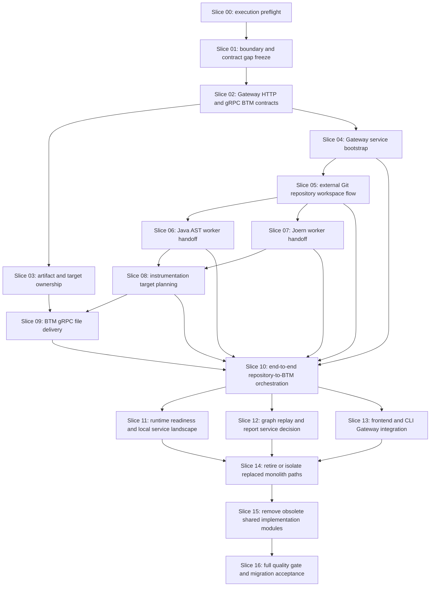

# Slice Dependency Map

## Parallelization Notes

- Slices 00 through 03 are serial because they stabilize contracts and
  ownership.
- Slice 04 can proceed after Slice 02.
- Slices 06 and 07 can run in parallel after Slice 05 if they have disjoint
  write scopes and stable contracts.
- Slice 09 waits for artifact ownership and target planning.
- Slice 11 waits for Gateway behavior from Slice 10 and proves local runtime
  evidence for the implemented service path.
- Slice 12 waits for Slice 10 and either creates graph/report roots or records
  explicit deferral.
- Slice 13 waits for Slice 10 and verifies frontend/CLI calls through
  Gateway/public APIs only.
- Module retirement and removal are serial and late by design.
- Checkpoint commits and pushes are not a separate terminal slice. They run
  after every successful `workflow execute` slice.
