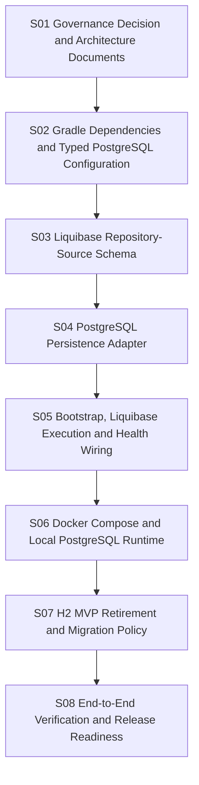

# Slice Dependency Map

## Parallelization Status

No implementation slices are parallel-safe. The persistence decision, build
configuration, Liquibase schema, adapter, bootstrap wiring, Docker runtime and
H2 retirement form one ordered cutover path.

## Critical Path

`S01 -> S02 -> S03 -> S04 -> S05 -> S06 -> S07 -> S08`

## Lock Summary

| Slice | Main Locks |
|---|---|
| S01 | ADR, arc42 and architecture documentation |
| S02 | Gradle dependency metadata and repository-source bootstrap config |
| S03 | Liquibase changelog resources |
| S04 | PostgreSQL outbound adapter and persistence tests |
| S05 | Repository-source bootstrap and health wiring |
| S06 | Docker PostgreSQL and repository-source Compose descriptors |
| S07 | H2 adapter/tests/docs retirement policy |
| S08 | Workflow execution evidence and final quality report |
