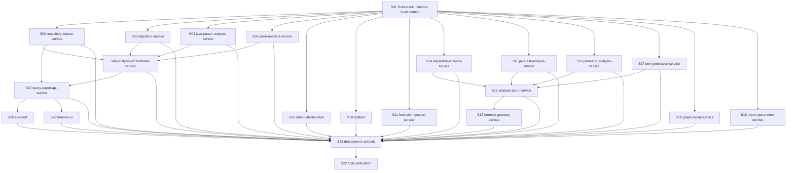

# Slice Dependency Map

## Dependency Graph

## Parallel Groups

| Group | Slices | Rule |
|---|---|---|
| P0 | S01 | Must run first; owns root network strategy and `.dockerignore` build-context guard. |
| P1 | S02, S03, S04, S05 | Target owner/worker service fragments with disjoint files. |
| P2 | S06 | Waits for target owner/worker fragments. |
| P3 | S07 | Waits for repository-source and orchestrator fragments. |
| P4 | S08, S09, S10, S18, S19 | Tool, observability, testbed, and planned-root slices with disjoint files. |
| P5 | S11, S14, S15, S16, S17 | Transitional worker fragments with disjoint files. |
| P6 | S12, S13 | Transitional gateway/store path after worker fragments. |
| P7 | S20 | Waits for public API fragment. |
| P8 | S21 | Waits for all service/root/UI slices. |
| P9 | S22 | Final verification only. |

## Lock Rules

- Each service fragment owns exactly one file under
  `deployment/docker-compose/services/`.
- Root stack, `.dockerignore`, `deployment/README.md`, and shared Compose
  README edits are serialized through S01, S21, and S22.
- Contract files are read-only unless a later slice explicitly discovers a
  verified contract mismatch and stops for a contract governance decision.
- Private owner volumes must not be added to non-owner service fragments.
