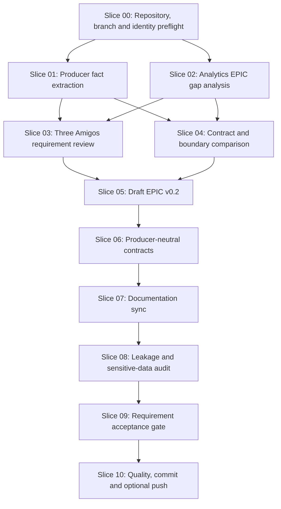

# Slice Dependency Map

## Workflow Version

| Field | Value |
|---|---|
| workflowVersion | `forensics-tracing-analytics-epic-alignment-20260516` |
| workflowTitle | Align Forensics Tracing Description With The Analytics EPIC |
| executionBranch | `docs/workflow-forensics-tracing-analytics-epic-alignment-20260516` |
| sourceWorkflow | `docs/workflow/workflow.md` |

## Dependency Graph

## Execution Rule

The slice table in `docs/workflow/workflow.md` is the source of truth. This
diagram is a human-readable projection and must stay consistent with the slice
metadata.

## Parallelization

Read-only work may be parallelized:

- Slice 01 and Slice 02 after Slice 00.
- Contract file reading for Slice 04 may begin during Slice 02.

Write-capable work is serial because EPIC, arc42, ADR and README files can
overlap during requirement alignment.

## Lock Rules

- `docs/epics/**` is locked by Slice 05 and Slice 06.
- `docs/README.md`, `docs/arc42/**`, `docs/adr/**` and `docs/architecture/**`
  are locked by Slice 07.
- Leakage fixes after Slice 08 must touch only files already changed by prior
  slices unless a reviewer approves the additional documentation path.
- Product code, frontend code, services, contracts, deployment files, examples,
  data and build logic are blocked paths.
