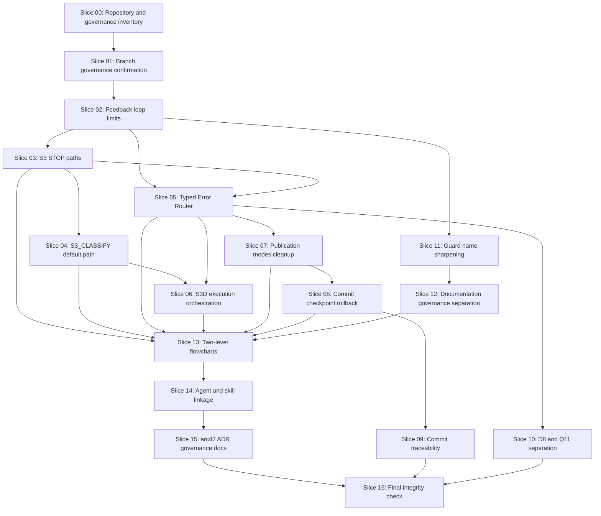

# Slice Dependency Map

## Governance Flowchart V2 Dependencies



## Execution Rule

Each slice must complete its role review, diff review and quality gate before it can be committed.

Each slice checkpoint commit must represent exactly one slice.

The checkpoint push target is:

```text
origin/architecture/workflow-governance-flowchart-v2-20260517
```

Slice checkpoint push must not:

- push to `main`
- create or merge a PR
- run `push auto`
- clean up branches
- force-push

## Parallelization Candidates

Parallel execution is allowed only when S3D proves file, contract and architecture-boundary locks are disjoint.

Candidate groups:

- Slice 07 and Slice 11 after Slice 05, if publication and guard-name files are disjoint.
- Slice 09 and Slice 10 after Slice 08, if traceability and reporting files are disjoint.
- Slice 14 read-only inventory may start during Slice 13, but write activity must wait until Slice 13 is complete.
