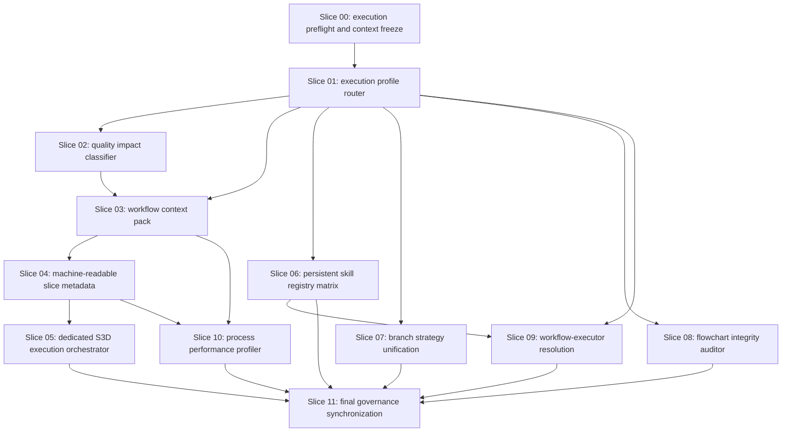

# Slice Dependency Map

## Parallelization Notes

| Group | Slices | Rule |
|---|---|---|
| G00 | S00 | Always first and serial. |
| G01 | S01 | Serial because downstream routing semantics depend on it. |
| G02 | S02 | Serial after S01 because quality impact depends on profile classification. |
| G03 | S03 | Serial after S01 and S02 because context packs summarize profile and quality authority. |
| G04 | S04 | Serial after S03 because metadata rules reference context-pack fields. |
| G05 | S05 | Serial after S04 because S3D consumes slice metadata. |
| G06 | S06 | May run after S01 when file locks do not overlap with active slices. |
| G07 | S07 | May run after S01 but must not overlap with S09 or S11 because branch and executor docs share process files. |
| G08 | S08 | May run after S01 when governance-flowchart files are isolated. |
| G09 | S09 | Waits for S06 and must not overlap with branch or workflow-execute process edits. |
| G10 | S10 | Waits for S03 and S04. |
| G11 | S11 | Always final and serial. |

## Lock Summary

- Routing locks: S01, S05, S08.
- Quality-gate locks: S02.
- Workflow context and metadata locks: S03, S04, S10.
- Skill registry locks: S06, S09.
- Branch-governance locks: S07.
- Final documentation locks: S11.
