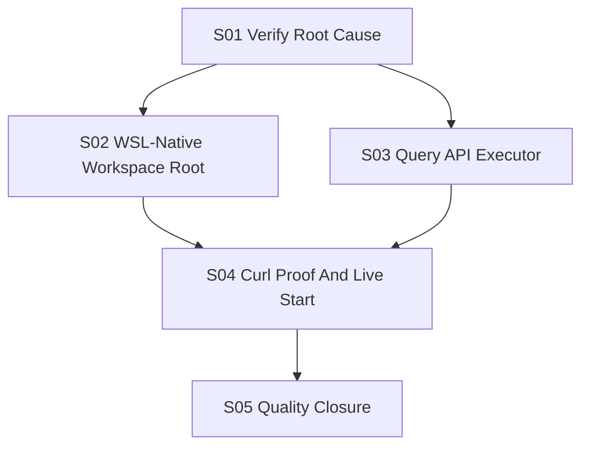

# Slice Dependency Map

## Topological Order

| Order | Slice | Owner | Depends On |
|---|---|---|---|
| 1 | S01 Verify Root Cause And Acceptance | Senior Git/Workspace Specialist | none |
| 2 | S02 Use WSL-Native Default Workspace Root | Senior Java Backend Developer | S01 |
| 2 | S03 Keep Query API Responsive During Long Checkout Work | Senior Java Backend Developer | S01 |
| 3 | S04 Live Runtime Proof With WildFly | Senior DevOps | S02, S03 |
| 4 | S05 Quality Gate And Handoff Closure | Senior Tester | S04 |

## Parallel Groups

| Group | Slices | Rule |
|---|---|---|
| P1 | S01 | Verification only. |
| P2 | S02, S03 | Disjoint service bootstrap files; no shared contract changes. |
| P3 | S04 | Sequential integration proof. |
| P4 | S05 | Sequential closure after proof. |

## Lock Summary

| Slice | File Locks | Architecture Locks |
|---|---|---|
| S01 | `docs/workflow/**` | repository-source workspace ownership; query-report public facade |
| S02 | `repository-source-service/.../bootstrap/**` | domain/application stay environment independent |
| S03 | `query-report-api-service/.../bootstrap/**` | query-report remains facade only |
| S04 | `docs/workflow/execution-report.md` | public API proof only |
| S05 | `docs/workflow/execution-report.md`, `docs/workflow/arc42-check-status.md` | quality gate authority |

## Mermaid

