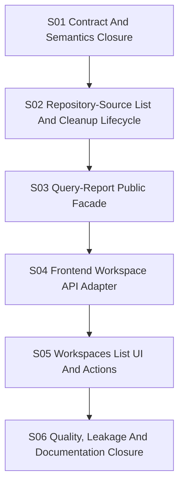

# Slice Dependency Map

## Linear Execution

```text
S01 Contract And Semantics Closure
  -> S02 Repository-Source List And Cleanup Lifecycle
  -> S03 Query-Report Public Facade
  -> S04 Frontend Workspace API Adapter
  -> S05 Workspaces List UI And Actions
  -> S06 Quality, Leakage And Documentation Closure
```

## Mermaid



## Lock Summary

| Slice | Primary Lock | Reason |
|---|---|---|
| S01 | Contracts | REST/gRPC route and field semantics must be stable first. |
| S02 | Repository-source state | Workspace list/delete lifecycle belongs to repository-source. |
| S03 | Query-report facade | Public API delegates through owner APIs only. |
| S04 | Frontend API adapter | UI adapter depends on public DTO shape. |
| S05 | Frontend routes/UI | List rendering depends on adapter behavior. |
| S06 | Docs and gates | Final documentation must match implemented behavior. |

No write-capable parallel slices are approved before S01 completes. Later
read-only reviews may run in parallel when they do not change files.
