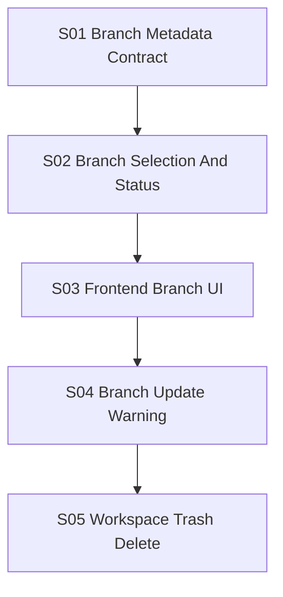

# Slice Dependency Map

```mermaid
flowchart TD
  S01["S01 Branch Metadata Contract"]
  S02["S02 Branch Selection And Status"]
  S03["S03 Frontend Branch UI"]
  S04["S04 Branch Update Warning"]
  S05["S05 Workspace Trash Delete"]

  S01 --> S02
  S02 --> S03
  S03 --> S04
  S04 --> S05
```

## Parallelization

No slices are parallel by default. Contract, state and UI behavior are coupled
and must be executed in order.
