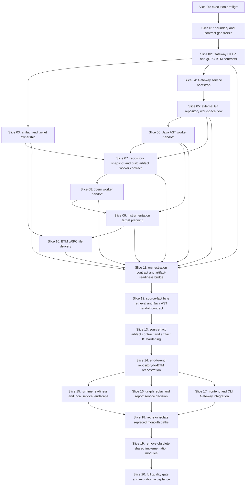

# Slice Dependency Map

## Parallelization Notes

- Slices 00 through 03 are serial because they stabilize contracts and
  ownership.
- Slice 04 can proceed after Slice 02.
- Slice 07 is serial after Slices 03, 05 and 06 because it creates the
  source-package, complete build-output package, byte-access and Joern
  materialization contract required by Joern handoff.
- Slice 08 waits for Slice 07 and must not receive Repository Analysis private
  workspace identifiers.
- Slice 10 waits for artifact ownership and target planning.
- Slice 11 closes the orchestration owner, Gateway public API security,
  Java AST byte-access and deterministic readiness preconditions found during
  the blocked end-to-end review.
- Slice 12 waits for Slice 11 and verifies source-fact byte retrieval,
  Repository Analysis to Java AST handoff closure and deterministic local
  fixture readiness.
- Slice 13 waits for Slice 12 and hardens the source-fact artifact payload
  contract plus artifact IO before end-to-end orchestration consumes produced
  bytes.
- Slice 14 waits for Slice 13 and implements the end-to-end owner-API
  orchestration path.
- Slice 15 waits for Gateway behavior from Slice 14 and proves local runtime
  evidence for the implemented service path.
- Slice 16 waits for Slice 14 and either creates graph/report roots or records
  explicit deferral.
- Slice 17 waits for Slice 14 and verifies frontend/CLI calls through
  Gateway/public APIs only.
- Module retirement and removal are serial and late by design.
- Checkpoint commits and pushes are not a separate terminal slice. They run
  after every successful `workflow execute` slice.
