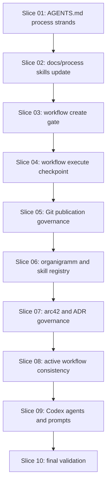

# Slice Dependency Map

## Dependencies



## Execution Rule

Each slice must complete its diff review, checkpoint commit and push before the next slice starts.

The checkpoint push target is:

```text
origin/architecture/workflow-align-agent-workflow-strands-20260517
```

No slice may push to `main`, create or merge a PR, run `push auto`, clean up branches or force-push.
