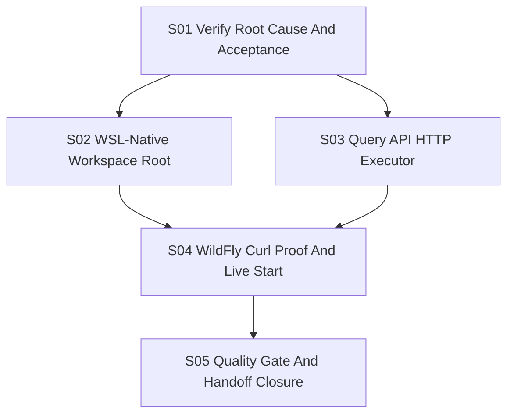

# Workflow: FA-MVP-0002-OPS-01 WildFly Checkout WSL Runtime Fix

## Workflow Version

| Field | Value |
|---|---|
| Workflow version | `fa-mvp-0002-wildfly-wsl-workspace-20260525-v1` |
| Requirement ID | `FA-MVP-0002-OPS-01` |
| Title | Fix WildFly checkout latency and API blocking in local WSL live runtime |
| Workflow branch | `fix/workflow-wildfly-wsl-workspace-20260525` |
| Creation status | Created by `workflow create`; implementation requires `workflow execute`. |
| Process strand | `workflow create` completed; `workflow execute` pending. |
| Execution profile | `FULL_PATH` |
| Repository-source owner | `repository-source-service` |
| Public API owner | `query-report-api-service` |
| Local UI owner | `forensic-ui` |

## Executive Summary

The local live system currently runs repository checkout workspaces below the
Windows-mounted WSL repository path, for example
`/mnt/d/Projects/forensic_analytics/build/repository-source-workspaces`.
WildFly is a large multi-module repository, and a shallow branch clone still
writes many small files. During live verification the `git clone` process was
observed in Linux state `D` with wait channel `p9_client_rpc`, which identifies
blocking WSL DrvFs file I/O rather than a GitHub or tag-fetch bottleneck.

The same live run also showed `query-report-api-service` timing out on
`/api/health` while `repository-source-service` health stayed responsive. The
verified HTTP lifecycle starts `com.sun.net.httpserver.HttpServer` without an
explicit request executor, so a long checkout or checkout-result wait can block
the public API surface.

This workflow fixes the local WSL live runtime by:

- keeping repository checkout workspaces on WSL-native storage for local WSL
  execution;
- preserving explicit operator configuration when a workspace root is supplied;
- ensuring the query-report HTTP server can serve health and status requests
  while another request waits on checkout work;
- proving the fix with `curl` against the public API using
  `https://github.com/wildfly/wildfly.git`;
- starting the full local MVP system for manual trial after the proof succeeds.

## Target Picture

```text
Browser / curl
  -> forensic-ui local proxy
  -> query-report-api-service HTTP executor
  -> repository-source-service gRPC
  -> WSL-native repository checkout workspace root
  -> safe Git shallow checkout of wildfly/wildfly.git main
```

The runtime proof must show:

```text
workspace root     = WSL-native path, not /mnt/<drive>/...
workspace create   = HTTP 200/202-style public workspace response
checkout result    = CHECKED_OUT with resolvedCommit
API health         = responds while or after checkout work is running
UI                 = available for manual trial after verification
```

## Verified Baseline

Read-only workflow creation verification found:

- Repository root: `/mnt/d/Projects/forensic_analytics`.
- WSL is available and repository commands must use the WSL-mounted worktree.
- Working tree was clean before workflow branch creation.
- Dedicated workflow branch is active:
  `fix/workflow-wildfly-wsl-workspace-20260525`.
- Local branch ref is verified:
  `refs/heads/fix/workflow-wildfly-wsl-workspace-20260525`.
- Existing `docs/workflow/**` described the previous workspace branch selector
  workflow and was regenerated for this new workflow after branch verification.
- Quality authority is `QUALITY.md`.
- Minimum quality command:
  `./gradlew test --dependency-verification strict --console=plain --stacktrace`.
- Full local quality gate:
  `./gradlew clean test jacocoTestReport jacocoTestCoverageVerification checkPackageCoverage --dependency-verification strict --console=plain --stacktrace`.
- `RepositorySourceServicePropertiesConfiguration` currently defaults
  `forensics.repository-source.service.workspace.root` to
  `build/repository-source-workspaces`.
- `FileSystemRepositoryWorkspaceAdapter` creates branch workspaces below the
  configured root and verifies cleanup stays inside that root.
- `GitRepositoryCheckoutAdapter` already performs a safe shallow clone for
  branch-only requests with `--quiet --no-tags --depth 1 --branch main
  --single-branch` and disables hooks, credentials, file protocol, ext
  protocol, LFS smudge and submodule recursion through `SafeGitCommandRunner`.
- `QueryReportApiHttpServerLifecycle` creates the public HTTP server without
  setting an explicit executor.
- Current UI DTOs and API client support `workspacePolicy.timeoutSeconds`,
  `allowShallowClone`, `allowPartialClone`, `allowSparseCheckout` and
  `maxWorkspaceBytes`.
- `docs/arc42/06-runtime-view.md` verifies that `query-report-api-service`
  remains a public facade and must not read repository-source private
  workspaces or H2 files.
- `docs/arc42/07-deployment-view.md` verifies that repository-source owns the
  workspace volume and H2 data volume in the Docker-local MVP view.
- ADR-0023 verifies H2 as repository-source service-local MVP persistence only.
- EPIC v0.2 verifies that local machine setup values and local output paths
  are not canonical Analytics evidence. This workflow stays inside local
  runtime infrastructure and does not change source, semantic, runtime, replay,
  graph, report or LLM evidence semantics.

## Requirement Clarification Decision

| Field | Decision |
|---|---|
| Original request | `workflow create: Fixe diesen Fehler und mach einen call mir curl auf die API um zu beweisen, dass der fix jetzt geht. Wenn der Fix geht starte das ganze system damit ich das ausprobieren kann` plus the observed WildFly checkout diagnosis. |
| Interpreted intent | Create an executable workflow that fixes local WSL live WildFly checkout latency/failure and API blocking, proves the fixed behavior with `curl`, and starts the local MVP stack for manual use. |
| Change type | Runtime/backend bug fix with local deployment/startup proof and API verification. |
| Affected process strand | `workflow create` now; later `workflow execute`. |
| Affected architecture area | Repository checkout workspace lifecycle, query-report HTTP lifecycle, local WSL runtime configuration, verification runbook. |
| Explicit requirements | Fix the observed WildFly checkout problem; prove with `curl`; start the whole system after the proof succeeds. |
| Implicit requirements | Preserve safe Git behavior; keep checked-out repositories untrusted; do not execute repository code; keep repository-source as workspace owner; keep query-report as public facade; use WSL for repository commands on Windows. |
| Accepted assumptions | "Whole system" means the local FA-MVP workspace stack: `repository-source-service`, `query-report-api-service`, and `forensic-ui` served through the local proxy. H2 persistence may remain service-owned and separate from the checkout workspace root. |
| EPIC alignment | Matches EPIC v0.2 because it changes local runtime preparation only and does not redefine Analytics evidence semantics or canonical storage. |
| Non-goals | No partial clone support; no sparse checkout support; no remote branch discovery; no Docker, Swarm, Kubernetes or production readiness claim; no JavaParser, Joern, BTM, replay, report, graph, vector or LLM execution. |
| Risks | WildFly network timing varies; timing-only tests would be brittle; WSL detection must be testable without requiring the test JVM to run inside WSL; explicit operator workspace roots must not be silently rewritten. |
| Open questions | None blocking for workflow creation. Execution must record exact ports and live workspace root used for the final manual system. |
| Blocking questions | None. |
| Confidence | 92 percent. |
| Decision | `READY_FOR_WORKFLOW`. |

## Scope

In scope:

- Add a testable repository-source workspace-root resolution rule for local WSL
  defaults so the default live checkout root is WSL-native instead of under
  `/mnt/<drive>/...`.
- Preserve explicit `forensics.repository-source.service.workspace.root`
  configuration exactly.
- Keep repository-source filesystem safety checks and cleanup root containment.
- Add a query-report HTTP executor so health/status/public requests are not
  serialized behind one long checkout or checkout-result request.
- Add deterministic tests for root resolution, explicit-root preservation and
  HTTP concurrency behavior.
- Verify the fixed system with public API `curl` calls against
  `wildfly/wildfly.git`.
- Start the local MVP UI/API stack after successful verification.
- Update workflow-local arc42 check status and execution handoff documents.

Out of scope:

- Changing Git checkout security policy.
- Enabling partial clone or sparse checkout.
- Increasing timeout values as the primary fix.
- Changing OpenAPI, gRPC or protobuf contracts.
- Moving H2 ownership or allowing cross-service H2 access.
- Reading private repository-source checkout paths from query-report or UI.
- Executing WildFly build scripts, Maven, Gradle, tests or hooks.
- Claiming production deployment readiness.

## Architecture Constraints

- `repository-source-service` remains the owner of private checkout workspaces,
  repository-source H2 persistence, branch checkout status and source roots.
- `query-report-api-service` remains a public facade and may only use the
  repository-source owner API. It must not inspect private checkout or H2 paths.
- Workspace-root selection is runtime configuration/bootstrap behavior, not
  domain evidence.
- Explicit operator-provided workspace roots are configuration facts and must
  not be silently rewritten.
- WSL-native defaulting is a local runtime optimization. It must be documented
  as local behavior and not treated as Docker, Swarm, Kubernetes or production
  deployment evidence.
- Checked-out repositories are untrusted input. The fix must not run remote
  hooks, build tools, scripts or submodules.
- API proof must use public REST endpoints and sanitized DTOs only.

## Backend Assessment

Backend work is required in two bounded areas:

- `repository-source-service` bootstrap configuration for local WSL workspace
  root defaulting and tests.
- `query-report-api-service` HTTP lifecycle executor behavior and tests.

The Git adapter already performs the intended shallow branch clone for the
WildFly branch-only scenario. Workflow execution must not weaken existing
`SafeGitCommandRunner` safety options unless a failing test proves a specific
bug and the security role approves the changed command contract.

## Frontend Assessment

Frontend production code is not expected for the fix. The final local system
startup must build or serve the existing `forensic-ui` assets and use the
public query-report API. Frontend changes are allowed only if execution proves
the UI cannot use the verified API after the backend/runtime fix.

## Test Strategy

Targeted checks before broader gates:

```bash
./gradlew :services:repository-source-service:test --tests '*RepositorySourceServiceApplicationTest' --dependency-verification strict --console=plain --stacktrace
./gradlew :services:query-report-api-service:test --tests '*QueryReportApiServiceApplicationTest' --dependency-verification strict --console=plain --stacktrace
```

If query-report HTTP handler behavior is tested separately:

```bash
./gradlew :services:query-report-api-service:test --tests '*QueryReportApiHttpAdapterTest' --dependency-verification strict --console=plain --stacktrace
```

Minimum repository quality gate:

```bash
./gradlew test --dependency-verification strict --console=plain --stacktrace
```

Full local quality gate before commit readiness:

```bash
./gradlew clean test jacocoTestReport jacocoTestCoverageVerification checkPackageCoverage --dependency-verification strict --console=plain --stacktrace
```

Live API proof after tests:

```bash
curl -sS -H 'X-Correlation-Id: wildfly-proof-health' http://127.0.0.1:<query-port>/api/health
curl -sS -X POST \
  -H 'Content-Type: application/json' \
  -H 'X-Correlation-Id: wildfly-proof-create' \
  -H 'Idempotency-Key: wildfly-proof-create-001' \
  --data '{"repositoryUrl":"https://github.com/wildfly/wildfly.git","selectedBranch":"main","workspacePolicy":{"ephemeral":false,"allowShallowClone":true,"allowPartialClone":false,"allowSparseCheckout":false,"timeoutSeconds":900,"maxWorkspaceBytes":1073741824}}' \
  http://127.0.0.1:<query-port>/api/workspaces
curl -sS -H 'X-Correlation-Id: wildfly-proof-result' \
  http://127.0.0.1:<query-port>/api/workspaces/<workspaceId>/checkout-result
curl -sS -H 'X-Correlation-Id: wildfly-proof-list' \
  http://127.0.0.1:<query-port>/api/workspaces
```

The proof passes only when the public API reports a checked-out WildFly branch
with a resolved commit and the repository-source workspace root used by the
live process is WSL-native, not `/mnt/<drive>/...`.

## Ordered Slices

### Slice 01 - Verify Root Cause And Freeze Acceptance

```yaml
slice_id: S01
profile: FULL_PATH
owner: Senior Git/Workspace Specialist
secondary_reviewers:
  - Senior Requirement Engineer
  - Senior Tester
affected_files:
  - docs/workflow/workflow.md
  - services/repository-source-service/src/main/java/de/burger/forensics/analytics/services/repositorysource/bootstrap/RepositorySourceServicePropertiesConfiguration.java
  - services/query-report-api-service/src/main/java/de/burger/forensics/analytics/services/queryreportapi/bootstrap/QueryReportApiHttpServerLifecycle.java
affected_modules:
  - services:repository-source-service
  - services:query-report-api-service
affected_contracts: []
dependencies: []
parallel_group: P1
file_locks:
  - docs/workflow/**
contract_locks: []
architecture_locks:
  - repository-source owns workspace paths
  - query-report remains public facade
quality_gates:
  targeted:
    - git status --short
    - git diff --check
  required: []
documentation:
  arc42: check only
  adr: check ADR-0016 and ADR-0023
stop_conditions:
  - root cause evidence contradicts WSL DrvFs checkout latency
  - public API blocking cannot be reproduced or explained by HTTP lifecycle behavior
```

Purpose:

- Reconfirm the current branch, workspace path, process state and API behavior.
- Confirm the execution acceptance criteria before implementation starts.
- Record that the fix must not be timeout-only.

Done criteria:

- Root cause and acceptance criteria are documented in the execution report.
- Execution proceeds only if S02 and S03 remain the smallest correct changes.

### Slice 02 - Use WSL-Native Default Workspace Root

```yaml
slice_id: S02
profile: FULL_PATH
owner: Senior Java Backend Developer
secondary_reviewers:
  - Senior Git/Workspace Specialist
  - Senior Security/Sandbox Engineer
  - Senior Tester
affected_files:
  - services/repository-source-service/src/main/java/de/burger/forensics/analytics/services/repositorysource/bootstrap/RepositorySourceServicePropertiesConfiguration.java
  - services/repository-source-service/src/main/java/de/burger/forensics/analytics/services/repositorysource/bootstrap/RepositorySourceServiceProperties.java
  - services/repository-source-service/src/test/java/de/burger/forensics/analytics/services/repositorysource/bootstrap/RepositorySourceServiceApplicationTest.java
affected_modules:
  - services:repository-source-service
affected_contracts: []
dependencies:
  - S01
parallel_group: P2
file_locks:
  - services/repository-source-service/src/main/java/de/burger/forensics/analytics/services/repositorysource/bootstrap/**
  - services/repository-source-service/src/test/java/de/burger/forensics/analytics/services/repositorysource/bootstrap/**
contract_locks: []
architecture_locks:
  - bootstrap configuration may depend on environment
  - domain and application remain environment independent
quality_gates:
  targeted:
    - ./gradlew :services:repository-source-service:test --tests '*RepositorySourceServiceApplicationTest' --dependency-verification strict --console=plain --stacktrace
  required:
    - ./gradlew test --dependency-verification strict --console=plain --stacktrace
documentation:
  arc42: deployment/runtime check
  adr: no new ADR expected
stop_conditions:
  - implementation would rewrite an explicit operator workspace root
  - tests require a real WSL host instead of deterministic doubles
  - repository-source domain/application would need environment dependencies
```

Purpose:

- Add a deterministic bootstrap rule that avoids `/mnt/<drive>/...` only when
  the workspace root is the implicit local default and the runtime is WSL.
- Preserve explicit workspace-root configuration.
- Keep cleanup and root containment unchanged.

Done criteria:

- Tests prove implicit WSL defaulting to a native temp root.
- Tests prove explicit roots remain unchanged.
- Tests prove non-WSL defaults remain unchanged unless explicitly configured.

### Slice 03 - Keep Query API Responsive During Long Checkout Work

```yaml
slice_id: S03
profile: FULL_PATH
owner: Senior Java Backend Developer
secondary_reviewers:
  - Senior DevOps
  - Senior Performance Engineer
  - Senior Tester
affected_files:
  - services/query-report-api-service/src/main/java/de/burger/forensics/analytics/services/queryreportapi/bootstrap/QueryReportApiHttpServerLifecycle.java
  - services/query-report-api-service/src/test/java/de/burger/forensics/analytics/services/queryreportapi/bootstrap/QueryReportApiServiceApplicationTest.java
affected_modules:
  - services:query-report-api-service
affected_contracts: []
dependencies:
  - S01
parallel_group: P2
file_locks:
  - services/query-report-api-service/src/main/java/de/burger/forensics/analytics/services/queryreportapi/bootstrap/**
  - services/query-report-api-service/src/test/java/de/burger/forensics/analytics/services/queryreportapi/bootstrap/**
contract_locks: []
architecture_locks:
  - query-report remains facade only
  - HTTP lifecycle remains bootstrap/inbound infrastructure
quality_gates:
  targeted:
    - ./gradlew :services:query-report-api-service:test --tests '*QueryReportApiServiceApplicationTest' --dependency-verification strict --console=plain --stacktrace
  required:
    - ./gradlew test --dependency-verification strict --console=plain --stacktrace
documentation:
  arc42: runtime check
  adr: no new ADR expected
stop_conditions:
  - fix requires changing public REST routes or gRPC contracts
  - health responsiveness can only be achieved by bypassing owner APIs
  - executor lifecycle would leak threads after stop
```

Purpose:

- Configure the public HTTP server with an explicit executor and deterministic
  shutdown.
- Add a regression test proving `/api/health` can respond while another request
  is blocked or slow.

Done criteria:

- Query-report targeted tests pass.
- Thread lifecycle is deterministic on `stop()`.
- No public API contract changes are introduced.

### Slice 04 - Live Runtime Proof With WildFly

```yaml
slice_id: S04
profile: FULL_PATH
owner: Senior DevOps
secondary_reviewers:
  - Senior Git/Workspace Specialist
  - Senior Tester
  - Senior Security/Sandbox Engineer
affected_files:
  - docs/workflow/execution-report.md
affected_modules:
  - services:repository-source-service
  - services:query-report-api-service
  - forensic-ui
affected_contracts: []
dependencies:
  - S02
  - S03
parallel_group: P3
file_locks:
  - docs/workflow/execution-report.md
contract_locks: []
architecture_locks:
  - repository-source private workspace boundary
  - public API proof only through query-report
quality_gates:
  targeted:
    - ./gradlew :services:repository-source-service:bootJar --dependency-verification strict --console=plain --stacktrace
    - ./gradlew :services:query-report-api-service:bootJar --dependency-verification strict --console=plain --stacktrace
    - cd forensic-ui && npm run build
    - curl public API proof commands from this workflow
  required:
    - ./gradlew test --dependency-verification strict --console=plain --stacktrace
documentation:
  arc42: runtime/deployment proof note
  adr: no new ADR expected
stop_conditions:
  - WildFly checkout would require running untrusted repository code
  - workspace root is still under /mnt/<drive>
  - public API cannot prove CHECKED_OUT and resolvedCommit
  - API health blocks during long checkout work
```

Purpose:

- Package and start the local MVP stack with a WSL-native repository-source
  checkout workspace root.
- Prove the fix with public API `curl` calls.
- Start the local UI for manual trial only after the API proof succeeds.

Done criteria:

- Curl proof returns public success responses.
- The checked-out branch has `CHECKED_OUT` status and `resolvedCommit`.
- The live workspace path is WSL-native.
- The final UI URL and ports are recorded.

### Slice 05 - Quality Gate And Handoff Closure

```yaml
slice_id: S05
profile: FULL_PATH
owner: Senior Tester
secondary_reviewers:
  - Senior Documentation Engineer
  - Senior System Architect
affected_files:
  - docs/workflow/execution-report.md
  - docs/workflow/arc42-check-status.md
affected_modules:
  - services:repository-source-service
  - services:query-report-api-service
  - forensic-ui
affected_contracts: []
dependencies:
  - S04
parallel_group: P4
file_locks:
  - docs/workflow/execution-report.md
  - docs/workflow/arc42-check-status.md
contract_locks: []
architecture_locks:
  - quality gate authority from QUALITY.md
  - arc42 runtime/deployment consistency
quality_gates:
  targeted:
    - git diff --check
    - git status --short
  required:
    - ./gradlew clean test jacocoTestReport jacocoTestCoverageVerification checkPackageCoverage --dependency-verification strict --console=plain --stacktrace
documentation:
  arc42: checked or update proposed
  adr: no new ADR expected unless execution changes deployment semantics
stop_conditions:
  - full quality gate fails for current changes
  - curl proof cannot be reproduced after quality gate
  - documentation would claim production readiness
```

Purpose:

- Run the documented quality gate.
- Inspect diffs and ensure workflow reports match implementation evidence.
- Prepare branch for normal commit/push only if the user requests publication.

Done criteria:

- Quality commands and curl proof are recorded exactly.
- Residual risks are documented.
- No production readiness claim is made.

## Slice Dependency Graph



Parallelization:

- S02 and S03 may run in parallel after S01 because their write scopes are
  disjoint and they do not change shared contracts.
- S04 and S05 are sequential because live proof depends on both code fixes and
  closure depends on the live proof.

## Role And Subagent Ownership

Callable subagents are not invoked during `workflow create`. The workflow uses
the mandatory role files as explicit review checklists. During
`workflow execute`, callable subagents may be used only if the runtime exposes
them and the executor verifies the active workflow branch first.

Required roles:

- Senior Requirement Engineer: requirement traceability and acceptance.
- Senior System Architect: service ownership and runtime boundary review.
- Senior Java Backend Developer: repository-source and query-report fixes.
- Senior React Frontend Developer: N/A impact check unless UI startup proves a
  frontend issue.
- Senior Tester: regression and quality gate ownership.

Conditional roles:

- Senior Git/Workspace Specialist for WSL-native workspace root and WildFly
  checkout hardening.
- Senior Security/Sandbox Engineer for untrusted repository handling.
- Senior Performance Engineer for large-repository runtime checks.
- Senior DevOps for local live startup and process management.
- Senior Documentation Engineer for execution report and arc42 check status.

## Commit And Push Plan

Workflow creation does not commit or push by default.

During `workflow execute`, commits and pushes are allowed only after:

- the relevant slice tests pass;
- `git diff --check` passes;
- diff inspection confirms only current-slice files changed;
- the active branch is still `fix/workflow-wildfly-wsl-workspace-20260525`;
- the user explicitly asks for commit or push, or the active workflow executor
  requires a slice checkpoint push.

## Stop Conditions

Stop workflow execution if:

- the active branch is not `fix/workflow-wildfly-wsl-workspace-20260525`;
- implementation would touch `main`, `master`, `develop` or an unrelated branch;
- WildFly checkout requires untrusted build/script execution;
- any service tries to read another service's private H2 or workspace files;
- public API proof cannot be made through query-report REST;
- explicit workspace-root configuration would be silently rewritten;
- tests would require real WSL or real GitHub where a deterministic unit test is
  expected;
- quality commands cannot be verified from `QUALITY.md`;
- production readiness would be claimed without deployment evidence.

## Definition Of Done

- Repository-source uses WSL-native default checkout storage for local WSL
  implicit defaults and preserves explicit operator roots.
- Query-report HTTP health/status remains responsive while checkout work is
  pending.
- Targeted tests and the repository minimum quality gate pass.
- WildFly public API curl proof succeeds.
- The local UI/API stack is started and the URL is recorded.
- Documentation reports exact commands and does not claim production readiness.

## Handoff To Workflow Execute

The next command should be:

```text
workflow execute
```

The executor must read this complete workflow, validate slice metadata, route
the roles, implement S01-S05 in order, run the listed commands, perform the
WildFly curl proof, and start the local live system only after the proof passes.
