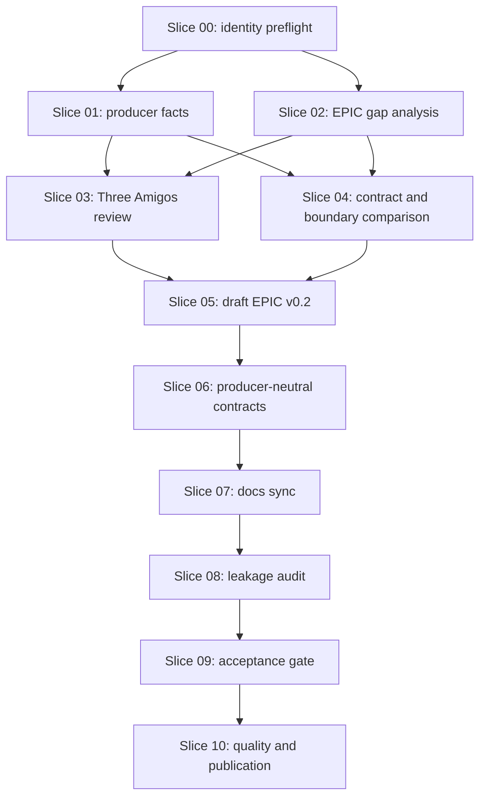

# Workflow: Align Forensics Tracing Description With The Analytics EPIC

## Executive Summary

This workflow updates the active Forensic Analytics requirement baseline by
comparing the current `forensics_tracing` producer description with the
existing Analytics EPIC. The workflow creates a new versioned Analytics EPIC
that strengthens analysis-platform responsibilities without importing
producer-specific implementation details.

The target result is an EPIC v0.2 that states, in producer-neutral language,
that `forensic_analytics` owns normalization, correlation, persistence
boundaries, replay construction, graph projection rules, reporting context and
LLM evidence packaging. Build-tool plugins and other external tools remain
producers, context submitters, runtime binders or adapters.

This workflow is documentation and requirement alignment only. It does not
execute production implementation slices and does not change backend,
frontend, runtime, build, contract or persistence code.

## Requirement Clarification Decision

| Field | Decision |
|---|---|
| Original request | Create a workflow for aligning the `forensics_tracing` description with the `forensic_analytics` EPIC. |
| Interpreted intent | Regenerate the active `docs/workflow/**` package so `workflow execute` can later compare producer documentation with the Analytics EPIC and create an EPIC v0.2 in producer-neutral language. |
| Change type | Requirement, EPIC and architecture-documentation alignment. |
| Affected process strand | `workflow create` now; `workflow execute` later for the checked slices. |
| Affected architecture area | Analysis-platform boundary, producer/adapter boundary, ingestion contracts, data ownership, runtime evidence sensitivity, replay, graph and LLM evidence packaging. |
| EPIC source | `docs/epics/forensics-platform-runtime-replay-llm-analysis-v0.1.md` is the current archived baseline and must remain historical. |
| Target EPIC | `docs/epics/forensics-platform-runtime-replay-llm-analysis-v0.2.md`. |
| Source producer description | Local checkout `/mnt/d/Projects/forensics_tracing/README.md`, repository `MatthiasBurger-Coder/forensics_tracing`. |
| Confidence | 94 percent. |
| Decision | `READY_FOR_WORKFLOW`. |

No blocking requirement question remains for workflow creation. Execution must
still stop if the source producer checkout, Analytics EPIC, contract files, or
classification evidence cannot be inspected.

### Three Amigos Findings

| Perspective | Finding |
|---|---|
| Product / Requirement | Analytics needs a clearer EPIC v0.2 that describes platform-owned analysis capabilities and artifact-package ingestion without treating plugins as the analysis platform. |
| Development / Architecture | ADR-0001, ADR-0002 and arc42 already state the server-owned boundary, but the EPIC v0.1 wording is weaker and still uses phrases that can imply plugin-owned facts. |
| Testing / Quality | Each slice needs executable acceptance criteria, leakage searches, diff checks and planned-vs-implemented wording checks before commit or push. |

Question: Does the implementation still match the EPIC?

Current answer: partially. Existing ADR, README and arc42 documents mostly
state server-owned analysis responsibilities, but EPIC v0.1 is an archived
baseline and does not yet capture the current producer-neutral boundary in
enough detail.

## Verified Baseline

Read-only verification before authoring found:

- Repository root: `/mnt/d/Projects/forensic_analytics`
- Active branch: `docs/workflow-forensics-tracing-analytics-epic-alignment-20260516`
- Working tree before workflow regeneration: clean
- Branch local ref: verified
- Source producer checkout: `/mnt/d/Projects/forensics_tracing`
- Source producer README: present
- Analytics EPIC v0.1: `docs/epics/forensics-platform-runtime-replay-llm-analysis-v0.1.md`
- Quality contract: `QUALITY.md`
- Architecture docs: `docs/arc42/**`
- ADRs: `docs/adr/**`
- Contract reference: `contracts/grpc/forensic-ingestion.proto`
- Current module list: `settings.gradle.kts`
- Current service baseline: `services/README.md`

The previous active `docs/workflow/**` package described Governance Flowchart
V2 and referenced branch `architecture/workflow-governance-flowchart-v2-20260517`.
This workflow replaces that active plan for the current branch.

## Target Picture

After `workflow execute` completes this workflow:

- EPIC v0.2 exists as the current Analytics EPIC.
- EPIC v0.1 remains a historical baseline.
- Analytics accepts two equivalent input paths:
  - server-side repository analysis,
  - producer-supplied artifact package ingestion.
- Both input paths normalize into the same canonical analysis model.
- Downstream graph, replay, reporting and LLM components do not depend on
  whether evidence came from a server-side scanner, uploaded artifact package,
  build-tool producer, runtime import or semantic analysis adapter.
- Producer metadata is stored as provenance only.
- Plugin task names, Maven goals, helper class names, local paths, local stores
  and producer-specific schemas are explicitly excluded from Analytics core.
- Related docs point to v0.2 only where they describe the current requirement
  baseline.
- Historical ADRs remain recognizable as historical records.

## Scope

Allowed write scope during `workflow execute`:

- `docs/workflow/**`
- `docs/epics/**`
- `docs/README.md`
- `docs/arc42/**`
- `docs/adr/**`
- `docs/architecture/**` only for stale documentation claims discovered during
  this workflow

Read-only comparison scope:

- `/mnt/d/Projects/forensics_tracing/README.md`
- Optional `/mnt/d/Projects/forensics_tracing/docs/**`
- Optional `/mnt/d/Projects/forensics_tracing/examples/**`
- Optional `/mnt/d/Projects/forensics_tracing/src/main/**`
- Optional `/mnt/d/Projects/forensics_tracing/src/test/**`
- `contracts/grpc/forensic-ingestion.proto`
- `settings.gradle.kts`
- `services/README.md`

## Non-Goals

This workflow must not:

- change Java, TypeScript, protobuf, Gradle, Maven, Docker, CI or runtime code,
- change REST, gRPC, protobuf or event contracts,
- change plugin behavior,
- select a database, graph database, vector database, runtime collector or LLM provider,
- adopt producer-local H2 schemas, local paths, cleanup behavior or cache behavior,
- introduce compatibility wrappers or aliases,
- claim planned replay, graph, report or LLM behavior as implemented unless
  verified from source and tests,
- modify `forensic-ui/**`, `frontend/**`, `services/**`, `forensic-analytics-*`,
  `contracts/**`, `deployment/**`, `examples/**`, `data/**`, build logic or source code.

## Architecture Constraints

- Hexagonal direction remains adapters and infrastructure toward application,
  application toward domain.
- Analytics owns canonical analysis semantics; producers submit requests,
  context, facts, artifacts or runtime evidence through explicit contracts.
- Joern, JavaParser, Byteman/BTM, graph stores, vector stores, LLM providers and
  persistence technologies remain replaceable adapters or projections.
- Runtime values are sensitive by default.
- Missing, ambiguous or incomplete evidence must be represented explicitly.
- LLM output remains a hypothesis, explanation or recommendation, never
  verified evidence.
- Any contract wording must remain compatible with ADR-0010 and
  `contracts/grpc/forensic-ingestion.proto`.
- Any data ownership wording must preserve one owner for canonical evidence,
  artifact metadata and projections.

## Backend Assessment

Backend source changes are out of scope. Backend review is required only to
ensure the EPIC does not authorize product implementation work, plugin class
adoption, producer-local storage adoption or concrete technology selection.

If a future slice discovers that implementation code contradicts the planned
EPIC wording, the slice must stop and report the mismatch instead of editing
code in this workflow.

## Frontend Assessment

Frontend source changes are out of scope. Frontend review is impact-only.
The current `forensic-ui` app must not be changed by this workflow.

EPIC and arc42 wording must avoid claiming graph UI, replay UI, LLM diagnosis
UI, graph/replay runtime readiness or provider-backed LLM integration as
implemented unless the implementation is verified from source, tests and
quality evidence.

## Test Strategy

Documentation and requirement changes must run the narrowest meaningful checks
first:

```bash
git status --short --branch
git diff --check
git diff --cached --check
```

Documentation-specific checks:

```bash
rg -n "GenerateBtmTask|BtmGenMojo|btmGen|generateBtmRules|forensics:btmgen|forensics:analyze|RtTraceHelper|RtTrace|MethodLoggingAspect|AspectJ|cleanupPolicy|analysisStoreDirectory|joernExecutable|joernParseExecutable|joernSliceExecutable" docs/epics docs/arc42 docs/adr docs/README.md
rg -n "\b(TO""DO|T""BD|FIX""ME|X""XX|PLACE""HOLDER|pend""ing)\b" docs/epics docs/README.md docs/arc42 docs/adr docs/architecture
rg -n "secret|credential|token|password|raw runtime|raw trace|stack trace|LLM prompt|source payload" docs/epics docs/README.md docs/arc42 docs/adr docs/architecture
```

Minimum quality command from `QUALITY.md`:

```bash
./gradlew test --dependency-verification strict --console=plain --stacktrace
```

Full local quality gate from `QUALITY.md`, when feasible:

```bash
./gradlew clean test jacocoTestReport jacocoTestCoverageVerification checkPackageCoverage --dependency-verification strict --console=plain --stacktrace
```

Run `validatePlugins` only if Gradle plugin metadata, task inputs, task outputs
or plugin implementation classes are changed. That is not expected for this
workflow:

```bash
./gradlew validatePlugins --dependency-verification strict --no-daemon --console=plain --stacktrace
```

Optional Sonar/SonarCloud checks must be reported as skipped unless documented
credentials and repository commands are available.

## Role Ownership

| Responsibility | Owner |
|---|---|
| Workflow orchestration | Agent Workflow Orchestrator / Senior Workflow Architect |
| Requirement gap analysis | Three Amigos Requirement Gatekeeper / Senior Requirement Engineer |
| EPIC wording | Senior Requirement Engineer |
| Platform boundaries | Senior System Architect |
| Contract neutrality | Contract-First API Steward |
| Data ownership | Data Ownership & Persistence Steward |
| Runtime data sensitivity | Security & Threat Modeling |
| Testability and quality | Senior Tester |
| Documentation sync | Senior Documentation Engineer |
| Backend boundary impact | Senior Java Backend Developer |
| Frontend boundary impact | Senior React Frontend Developer |
| Skill/governance conflicts | Skill Registry & Conflict Auditor |

Callable subagents were available during workflow creation for read-only role
reviews. During `workflow execute`, every write-capable role or subagent must
verify the active branch before edits and must not switch branches.

## Slice Structure

| Slice | Purpose | Owner | Dependencies | Parallelization |
|---|---|---|---|---|
| 00 | Repository, branch and workflow identity preflight | Senior Workflow Architect | none | serial |
| 01 | Extract producer analysis-relevant facts | Senior Requirement Engineer | 00 | serial |
| 02 | Analyze Analytics EPIC and related docs | Senior Requirement Engineer / Senior Documentation Engineer | 00 | can run after 00; joins 01 before 03 |
| 03 | Three Amigos requirement review | Three Amigos Requirement Gatekeeper | 01, 02 | serial |
| 04 | Contract and producer boundary comparison | Contract-First API Steward / Senior System Architect | 01, 02 | serial |
| 05 | Draft EPIC v0.2 | Senior Requirement Engineer | 03, 04 | serial |
| 06 | Define producer-neutral analysis contracts in EPIC | Senior System Architect / Data Ownership & Persistence Steward | 05 | serial |
| 07 | Synchronize related documentation | Senior Documentation Engineer / arc42 governance | 05, 06 | serial |
| 08 | Producer leakage and sensitive-data audit | Senior Tester / Security & Threat Modeling | 05, 06, 07 | serial |
| 09 | Requirement acceptance and planned-vs-implemented gate | Senior Tester / Senior System Architect | 08 | serial |
| 10 | Quality gate, diff review, commit and optional push | Workflow Executor / git commit preparation | 09 | serial |

## Slices

### Slice 00 - Repository, Branch And Workflow Identity Preflight

Purpose: prove that execution is running the checked EPIC-alignment workflow on
the dedicated workflow branch.

Affected files: read-only at first; later `docs/workflow/**` may be updated
only with execution evidence.

Allowed write scope: `docs/workflow/**` evidence files only.

Verification commands:

```bash
git rev-parse --show-toplevel
git status --short --branch
git branch --show-current
git show-ref --verify --quiet refs/heads/docs/workflow-forensics-tracing-analytics-epic-alignment-20260516
rg -n "Align Forensics Tracing Description With The Analytics EPIC|forensics-tracing-analytics-epic-alignment-20260516" docs/workflow
```

Acceptance criteria:

- Repository root is `/mnt/d/Projects/forensic_analytics`.
- Active branch is `docs/workflow-forensics-tracing-analytics-epic-alignment-20260516`.
- `docs/workflow/workflow.md` describes this EPIC-alignment workflow.
- Working tree has no unrelated changes.

Stop conditions:

- Active branch is not the dedicated workflow branch.
- Workflow identity, version, source EPIC or branch evidence does not match.
- `git diff --name-only origin/main...HEAD` is empty after workflow creation.
- Unrelated changes exist.

### Slice 01 - Extract Analysis-Relevant Facts From forensics_tracing

Purpose: build a classified fact matrix from the producer description.

Affected files:

- `docs/workflow/forensics-tracing-fact-matrix.md`

Allowed write scope:

- `docs/workflow/forensics-tracing-fact-matrix.md`

Read sources:

- `/mnt/d/Projects/forensics_tracing/README.md`
- Optional producer docs, examples and implementation files only when needed to
  understand concepts.

Classifications:

- `Platform requirement`
- `Producer implementation`
- `Example only`
- `Open decision`

Facts to classify include static source scanning, source files, classes,
methods, entry/exit observations, return observations, throw observations,
branch and switch observations, call-site information, generated rule artifacts,
manifest metadata, checksums, analysis package metadata, local analysis-store
facts, Joern artifacts, call graph facts, control-flow facts, data-flow facts,
semantic slices, JSON/JSONL runtime events, timestamp, event type, thread
identity, correlation ID, trace ID, span ID, parent span ID, runtime details,
exception metadata and error metadata.

Explicit exclusions from Analytics core:

- Gradle task names,
- Maven goal names,
- plugin extension names,
- plugin class names,
- runner, renderer, writer and helper class names,
- local output paths,
- local target paths,
- cleanup policies,
- producer cache behavior,
- AspectJ logging details,
- producer-specific H2 schema as canonical Analytics schema,
- producer default server port or Java baseline as Analytics domain requirements.

Verification commands:

```bash
test -f /mnt/d/Projects/forensics_tracing/README.md
rg -n "Current Boundary|server owns|StartAnalysisSession|UploadAnalysisData|CompleteAnalysisSession|AbortAnalysisSession|6565|forensics:btmgen|RtTraceHelper|MethodLoggingAspect|analysisStoreDirectory" /mnt/d/Projects/forensics_tracing/README.md /mnt/d/Projects/forensics_tracing/src/main /mnt/d/Projects/forensics_tracing/src/test
```

Acceptance criteria:

- A fact matrix exists.
- Every finding has one classification.
- Analytics EPIC wording is proposed only for accepted platform requirements.
- Rejected producer implementation details are documented.

Stop conditions:

- The producer README cannot be inspected.
- A proposed fact cannot be classified.
- A producer implementation detail would become Analytics core behavior.

### Slice 02 - Analyze Current Analytics EPIC And Related Docs

Purpose: identify what EPIC v0.1 already covers, what is missing and which
related docs must be synchronized after EPIC v0.2.

Affected files:

- `docs/workflow/analytics-epic-gap-analysis.md`

Allowed write scope:

- `docs/workflow/analytics-epic-gap-analysis.md`

Read sources:

- `docs/epics/forensics-platform-runtime-replay-llm-analysis-v0.1.md`
- `docs/README.md`
- `docs/arc42/**`
- `docs/adr/**`
- `docs/architecture/**`
- `contracts/grpc/forensic-ingestion.proto`
- `settings.gradle.kts`
- `services/README.md`

Coverage to mark:

- static fact import,
- canonical model persistence,
- Joern import or attachment,
- rule generation,
- runtime event import,
- exception incident creation,
- replay,
- graph projection,
- LLM root-cause explanation,
- runtime data sensitivity,
- canonical IDs.

Gaps to evaluate:

- artifact package ingestion,
- manifest and checksum verification,
- analysis input contract,
- producer-neutral static fact model,
- producer-neutral semantic fact model,
- producer-neutral runtime event model,
- runtime event families,
- instrumentation planning,
- rule-set artifact model,
- provenance model,
- correlation between static, semantic and runtime facts,
- partial and invalid package handling,
- producer metadata as provenance only,
- explicit exclusion of plugin implementation details,
- stale service/module baseline claims.

Verification commands:

```bash
rg -n "Version: 0.1|Source Note|Plugins|canonical|Runtime data|Joern|Byteman|BTM|LLM|Graph|artifact|manifest|checksum" docs/epics/forensics-platform-runtime-replay-llm-analysis-v0.1.md docs/README.md docs/arc42 docs/adr docs/architecture
rg -n "include\\(|services:" settings.gradle.kts services/README.md docs/architecture/current-build-and-test-map.md
```

Acceptance criteria:

- A gap list exists.
- Each gap maps to producer facts, Analytics docs or an open decision.
- The analysis records whether v0.2 should add, reject or defer the topic.

Stop conditions:

- EPIC v0.1 cannot be inspected.
- EPIC source authority is unclear after review.
- Architecture docs conflict with implementation and cannot be safely classified.

### Slice 03 - Three Amigos Requirement Review

Purpose: approve or reject candidate EPIC changes before editing the EPIC.

Affected files:

- `docs/workflow/three-amigos-decision-record.md`

Allowed write scope:

- `docs/workflow/three-amigos-decision-record.md`

Decision values:

- `ACCEPTED_FOR_EPIC`
- `REJECTED_AS_PLUGIN_SPECIFIC`
- `DEFERRED_AS_OPEN_DECISION`
- `MOVE_TO_ADR_OR_ARC42`

Review questions:

- Is this a platform responsibility?
- Is this producer-neutral?
- Does this improve analysis, replay, graph, reporting or LLM evidence quality?
- Can this be tested or reviewed?
- Does this require a new ADR instead of an EPIC addition?
- Does this introduce a concrete tool choice that should remain open?

Verification commands:

```bash
rg -n "ACCEPTED_FOR_EPIC|REJECTED_AS_PLUGIN_SPECIFIC|DEFERRED_AS_OPEN_DECISION|MOVE_TO_ADR_OR_ARC42" docs/workflow/three-amigos-decision-record.md
```

Acceptance criteria:

- Every candidate has a decision.
- Rejected plugin-specific details are documented.
- Open decisions remain explicit.
- The decision record says whether v0.2 can be drafted.

Stop conditions:

- Any candidate lacks a decision.
- Product, architecture or quality perspectives disagree in a way that changes scope.
- A candidate would require a concrete database, graph DB, vector DB, runtime
  collector or LLM provider decision.

### Slice 04 - Contract And Producer Boundary Comparison

Purpose: compare the producer README/proto shape against Analytics contract and
boundary docs without changing contracts.

Affected files:

- `docs/workflow/producer-boundary-comparison.md`

Allowed write scope:

- `docs/workflow/producer-boundary-comparison.md`

Read sources:

- `/mnt/d/Projects/forensics_tracing/README.md`
- `/mnt/d/Projects/forensics_tracing/src/main/proto/forensic_ingestion.proto`
- `contracts/grpc/forensic-ingestion.proto`
- `docs/adr/ADR-0001-plugins-are-producers.md`
- `docs/adr/ADR-0010-contract-first-rest-and-grpc.md`
- `docs/arc42/**`

Known comparison risks to classify:

- producer default port `6565` versus Analytics documentation default `9090`,
- producer session upload RPC set versus Analytics contract including
  `AnalyzeRepository`,
- producer-local legacy packages retained as migration-audit inventory,
- plugin quickstart identifiers that must not become Analytics core wording.

Verification commands:

```bash
rg -n "6565|9090|AnalyzeRepository|StartAnalysisSession|UploadAnalysisData|CompleteAnalysisSession|AbortAnalysisSession" /mnt/d/Projects/forensics_tracing/README.md /mnt/d/Projects/forensics_tracing/src/main/proto/forensic_ingestion.proto contracts/grpc/forensic-ingestion.proto docs/README.md
```

Acceptance criteria:

- Contract differences are documented as comparison findings, not silently resolved.
- EPIC v0.2 does not encode port defaults, RPC defaults, deadlines, retry
  policies or compatibility claims unless verified.
- Contract changes, if needed, are deferred to a future contract workflow.

Stop conditions:

- Producer README and Analytics contract cannot be reconciled at requirement level.
- EPIC wording would imply an unverified RPC, field, port, timeout, retry or
  compatibility behavior.
- Generated DTOs or transport classes would leak into domain/application wording.

### Slice 05 - Draft EPIC v0.2

Purpose: create the versioned Analytics EPIC update.

Affected files:

- `docs/epics/forensics-platform-runtime-replay-llm-analysis-v0.2.md`

Allowed write scope:

- `docs/epics/forensics-platform-runtime-replay-llm-analysis-v0.2.md`
- Minimal v0.1 supersession note only if needed and explicitly justified.

Required sections:

- Non-Negotiable Platform Boundary
- Analysis Input Contract
- Artifact Package Ingestion
- Artifact Integrity And Provenance
- Static Analysis Fact Model
- Semantic Analysis Fact Model
- Runtime Observation And Event Model
- Instrumentation Planning Model
- Rule-Set Artifact Model
- Correlation And Replay Responsibilities
- Explicitly Excluded From Analytics Core
- Open Decisions
- Risks
- Acceptance Criteria

Required producer-neutral capabilities:

- repository analysis registration,
- source acquisition,
- static fact extraction,
- static fact ingestion,
- semantic fact analysis,
- semantic fact ingestion,
- artifact package ingestion,
- manifest verification,
- checksum verification,
- canonical model normalization,
- instrumentation planning,
- rule-set generation through adapters,
- runtime event collection/import,
- runtime event normalization,
- exception-centered incident creation,
- replay timeline construction,
- graph projection,
- LLM incident context packaging.

Verification commands:

```bash
test -f docs/epics/forensics-platform-runtime-replay-llm-analysis-v0.2.md
rg -n "Non-Negotiable Platform Boundary|Analysis Input Contract|Artifact Package Ingestion|Artifact Integrity And Provenance|Static Analysis Fact Model|Semantic Analysis Fact Model|Runtime Observation And Event Model|Instrumentation Planning Model|Rule-Set Artifact Model|Correlation And Replay Responsibilities|Explicitly Excluded From Analytics Core|Open Decisions|Risks|Acceptance Criteria" docs/epics/forensics-platform-runtime-replay-llm-analysis-v0.2.md
```

Acceptance criteria:

- EPIC v0.2 exists.
- Every accepted Slice 03 gap is represented.
- v0.1 remains historical.
- No producer implementation detail appears as Analytics core behavior.

Stop conditions:

- Drafting requires guessing a canonical schema field, graph label, event type,
  port, RPC, storage table or provider choice.
- The EPIC would claim implementation readiness that cannot be verified.

### Slice 06 - Define Producer-Neutral Analysis Contracts

Purpose: ensure EPIC v0.2 describes stable requirement-level contracts, not
producer internals.

Affected files:

- `docs/epics/forensics-platform-runtime-replay-llm-analysis-v0.2.md`

Allowed write scope:

- `docs/epics/forensics-platform-runtime-replay-llm-analysis-v0.2.md`

Contract concepts to include:

- Analysis Request
- Artifact Package
- Static Fact Payload
- Semantic Fact Payload
- Runtime Event Payload
- Instrumentation Plan

Required concept coverage:

- project identity, repository identity, branch, commit, module scope,
  analysis profile and requested capabilities,
- package identity, analysis run identity, producer provenance, schema version,
  payload list, payload kinds, payload checksums, content types, source metadata
  and optional runtime evidence,
- source files, packages, classes, methods, constructors, method signatures,
  entry/exit points, returns, throws, branches, switch/case structures, call
  sites and module/source-root ownership,
- semantic analysis run, call graph nodes and edges, static call relations,
  control-flow relations, data-flow paths, slices, semantic anchors, mapping
  confidence and ambiguity markers,
- timestamp, event type, thread identity, correlation ID, trace ID, span ID,
  parent span ID, rule ID or observation point ID, class/method/branch/call-site
  key, details object, redacted values, exception metadata and error metadata,
- selected observation points, selected classes/methods/branches/exception
  points, rule IDs, rule-set version, sampling profile, redaction policy,
  expected event families and runtime overhead expectation.

Verification commands:

```bash
rg -n "Analysis Request|Artifact Package|Static Fact Payload|Semantic Fact Payload|Runtime Event Payload|Instrumentation Plan" docs/epics/forensics-platform-runtime-replay-llm-analysis-v0.2.md
```

Acceptance criteria:

- Contracts are producer-neutral.
- Contracts are stable for Gradle, Maven, CLI, REST, gRPC and future producers.
- Contracts support replay and LLM evidence packaging.

Stop conditions:

- The EPIC would mention plugin class names, task names, goal names or local paths
  as contract requirements.
- Contract wording would imply a transport schema change without contract review.

### Slice 07 - Synchronize Related Documentation

Purpose: update only documentation that must remain consistent with EPIC v0.2.

Affected files:

- `docs/README.md`
- `docs/arc42/**`
- `docs/adr/**`
- `docs/architecture/**` only when stale current-state claims are verified

Allowed write scope:

- Minimal reference updates and consistency notes in the affected docs.
- New ADR only if EPIC v0.2 creates a real architecture decision.

Required checks:

- `docs/README.md` current EPIC reference.
- `docs/arc42/README.md` current EPIC reference.
- `docs/arc42/09-architecture-decisions.md` if an ADR is added.
- `docs/architecture/current-build-and-test-map.md` service-module baseline
  against `settings.gradle.kts` and `services/README.md`.

Verification commands:

```bash
rg -n "v0.1|v0.2|EPIC|No service-specific Gradle projects|services:" docs/README.md docs/arc42 docs/adr docs/architecture/current-build-and-test-map.md settings.gradle.kts services/README.md
```

Acceptance criteria:

- Documentation points to the current EPIC version where needed.
- arc42 and ADR content remain consistent.
- Historical ADRs are not rewritten.
- Stale baseline claims are either fixed or documented as deferred with a reason.

Stop conditions:

- A new architecture decision is needed but ADR scope is unclear.
- Historical ADRs would need rewriting.
- Related docs contradict source and cannot be safely updated in this workflow.

### Slice 08 - Producer Leakage And Sensitive-Data Audit

Purpose: verify that Analytics documentation did not absorb plugin-specific
implementation details or sensitive-data handling mistakes.

Affected files:

- `docs/workflow/producer-leakage-audit.md`

Allowed write scope:

- `docs/workflow/producer-leakage-audit.md`
- Fixes to docs changed by earlier slices.

Required searches:

```bash
rg -n "GenerateBtmTask|BtmGenMojo|btmGen|generateBtmRules|forensics:btmgen|forensics:analyze|RtTraceHelper|RtTrace|MethodLoggingAspect|AspectJ|cleanupPolicy|analysisStoreDirectory|joernExecutable|joernParseExecutable|joernSliceExecutable" docs/epics docs/arc42 docs/adr docs/README.md
rg -n "forensic-ui/|frontend/|services/|forensic-analytics-|contracts/|deployment/|examples/|data/" docs/epics docs/README.md docs/arc42 docs/adr docs/architecture
rg -n "secret|credential|token|password|raw runtime|raw trace|stack trace|LLM prompt|source payload" docs/epics docs/README.md docs/arc42 docs/adr docs/architecture
```

Allowed producer-specific matches:

- historical reference,
- external producer example,
- explicit exclusion,
- source comparison notes.

Not allowed:

- Analytics core behavior,
- Analytics domain model,
- Analytics application service,
- Analytics canonical schema,
- Analytics mandatory runtime implementation.

Acceptance criteria:

- No producer implementation detail is described as Analytics core behavior.
- Any unavoidable reference is marked external, historical or excluded.
- Sensitive data wording says runtime values are sensitive by default.

Stop conditions:

- Leakage hits cannot be classified.
- Sensitive runtime/source/LLM data is normalized as safe by default.
- A changed doc introduces secrets, credentials or raw payload examples.

### Slice 09 - Requirement Acceptance And Planned-Vs-Implemented Gate

Purpose: add and verify final EPIC acceptance criteria and implementation-status
discipline.

Affected files:

- `docs/epics/forensics-platform-runtime-replay-llm-analysis-v0.2.md`
- `docs/workflow/requirement-acceptance-review.md`

Allowed write scope:

- `docs/epics/**`
- `docs/workflow/requirement-acceptance-review.md`

Required EPIC acceptance criteria:

1. Analytics owns the canonical analysis model.
2. Analytics owns normalization of static, semantic and runtime facts.
3. Analytics owns correlation between source facts, semantic facts, rule sets
   and runtime events.
4. Analytics owns replay construction.
5. Analytics owns graph projection rules.
6. Analytics owns LLM evidence package construction.
7. Producer packages are verified before import.
8. Manifest and checksum verification are required for artifact package ingestion.
9. Producer metadata is stored as provenance only.
10. Plugin-specific classes, tasks, goals and helper names are excluded from
    Analytics core.
11. Semantic facts are imported through a semantic analysis port.
12. Rule generation is described through instrumentation plans and rule-set
    adapters.
13. Runtime values are sensitive by default.
14. Missing or ambiguous evidence is represented explicitly instead of invented.

Verification commands:

```bash
rg -n "Analytics owns the canonical analysis model|producer metadata|sensitive by default|ambiguous evidence|instrumentation plans|semantic analysis port" docs/epics/forensics-platform-runtime-replay-llm-analysis-v0.2.md
rg -n "implemented|current|planned|conceptual|future|target" docs/epics/forensics-platform-runtime-replay-llm-analysis-v0.2.md docs/README.md docs/arc42
```

Acceptance criteria:

- Required EPIC acceptance criteria are present.
- Planned behavior is labeled as planned, target or conceptual unless verified.
- Implemented claims cite source, tests or accepted docs.

Stop conditions:

- The EPIC claims runtime replay, graph/replay service, report generation,
  durable persistence or LLM provider integration is implemented without
  evidence.

### Slice 10 - Quality Gate, Diff Review, Commit And Optional Push

Purpose: verify and publish the completed workflow result only if allowed.

Affected files:

- All changed docs from previous slices.

Allowed write scope:

- Commit metadata only after review.

Verification commands:

```bash
git status --short --branch
git diff --stat
git diff --check
git diff --cached --check
git diff --name-only origin/main...HEAD
rg -n "GenerateBtmTask|BtmGenMojo|btmGen|generateBtmRules|forensics:btmgen|forensics:analyze|RtTraceHelper|RtTrace|MethodLoggingAspect|AspectJ|cleanupPolicy|analysisStoreDirectory|joernExecutable|joernParseExecutable|joernSliceExecutable" docs/epics docs/arc42 docs/adr docs/README.md
rg -n "\b(TO""DO|T""BD|FIX""ME|X""XX|PLACE""HOLDER|pend""ing)\b" docs/epics docs/README.md docs/arc42 docs/adr docs/architecture
./gradlew test --dependency-verification strict --console=plain --stacktrace
```

Full gate if feasible:

```bash
./gradlew clean test jacocoTestReport jacocoTestCoverageVerification checkPackageCoverage --dependency-verification strict --console=plain --stacktrace
```

Commit message:

```text
docs(epic): align analytics analysis boundary with tracing producer description
```

Commit body must include Why, What, How, Verification and Limitations sections
from the user-provided template, adjusted only for commands actually executed.

Acceptance criteria:

- Diff checks pass.
- Leakage audit passes.
- Marker scan passes or documented historical matches are justified.
- Minimum Gradle test passes or a concrete environment blocker is documented.
- Commit contains only relevant documentation/workflow changes.
- Push happens only if repository workflow allows it and the user explicitly
  requests it or the active workflow authorizes it.

Stop conditions:

- Quality checks fail due to unrelated issues.
- Product code, contract, runtime, frontend, build or source files changed.
- A command is claimed as passed without execution.

## Dependency Graph



## Parallelization Opportunities

Only read-only exploration may run in parallel:

- Slice 01 producer fact extraction and Slice 02 Analytics EPIC gap analysis may
  run in parallel after Slice 00.
- Contract boundary read-only checks may begin during Slice 02, but Slice 04
  cannot decide until Slice 01 and Slice 02 are complete.
- No write-capable slices may run in parallel because EPIC v0.2, docs sync and
  leakage fixes share documentation files.

## Documentation Synchronization Points

- EPIC v0.2 creation: Slice 05.
- EPIC v0.2 contract sharpening: Slice 06.
- `docs/README.md` and arc42 current-baseline references: Slice 07.
- ADR update or new ADR decision: Slice 07 only if a real architecture decision
  is introduced.
- Service/module stale-baseline docs: Slice 07.
- Workflow execution evidence: `docs/workflow/**` after each slice.

## Stop Conditions

Stop immediately if:

- the active branch is not `docs/workflow-forensics-tracing-analytics-epic-alignment-20260516`,
- unrelated uncommitted changes exist,
- `docs/workflow/workflow.md` does not describe this workflow,
- the target EPIC cannot be inspected,
- `forensics_tracing` cannot be inspected,
- a proposed requirement cannot be classified,
- a plugin implementation detail would become Analytics core behavior,
- a contract difference would require changing REST, gRPC, protobuf or event
  contracts in this workflow,
- an architecture decision would require choosing a concrete database, graph DB,
  vector DB, LLM provider or runtime collector,
- a changed doc claims planned behavior as implemented without source evidence,
- quality checks fail for unrelated reasons,
- sensitive data, secrets, raw runtime traces, source payloads or LLM prompt
  content would be exposed.

## Uncertainty Escalation

Governance loops are capped at `maxRetries = 3`. After the third unresolved
attempt, stop and escalate to the Root Architect with:

- attempted loop,
- unresolved blocker,
- files and decisions involved,
- why continuing automatically would be unsafe.

## Commit And Push Plan

Workflow execution may commit only after Slice 10 quality and diff review.
Normal `push` requires explicit user approval unless the active workflow is
later updated to authorize it. `push auto` is not part of this workflow.

Slice checkpoint pushes are not required by this workflow unless `workflow
execute` explicitly records successful per-slice quality gates and the
repository governance permits checkpoint publication.

## Definition Of Done

This workflow is complete when:

- `forensics_tracing` has been reviewed as producer/source description,
- the Analytics EPIC has been compared against it,
- all missing analysis-related requirements have been identified,
- accepted requirements have been added in producer-neutral language,
- plugin-specific implementation details have been excluded from Analytics core,
- related documentation has been synchronized only where necessary,
- quality checks have been run and documented,
- the result is committed on the dedicated workflow branch.

## Handoff To workflow execute

`workflow execute` may start only after:

- this workflow file exists on the dedicated branch,
- `git diff --check` passes for workflow creation,
- role reviews are recorded,
- no unrelated changes exist.

Execution must start at Slice 00 and proceed in dependency order. Direct EPIC
editing before Slice 03 and Slice 04 have completed is forbidden.

## arc42 Check Status

Relevant arc42 files were inspected during workflow creation. No arc42 file is
changed by workflow creation itself because the EPIC v0.2 content does not exist
yet. Slice 07 owns any required arc42 synchronization after the EPIC v0.2 draft
is available.
