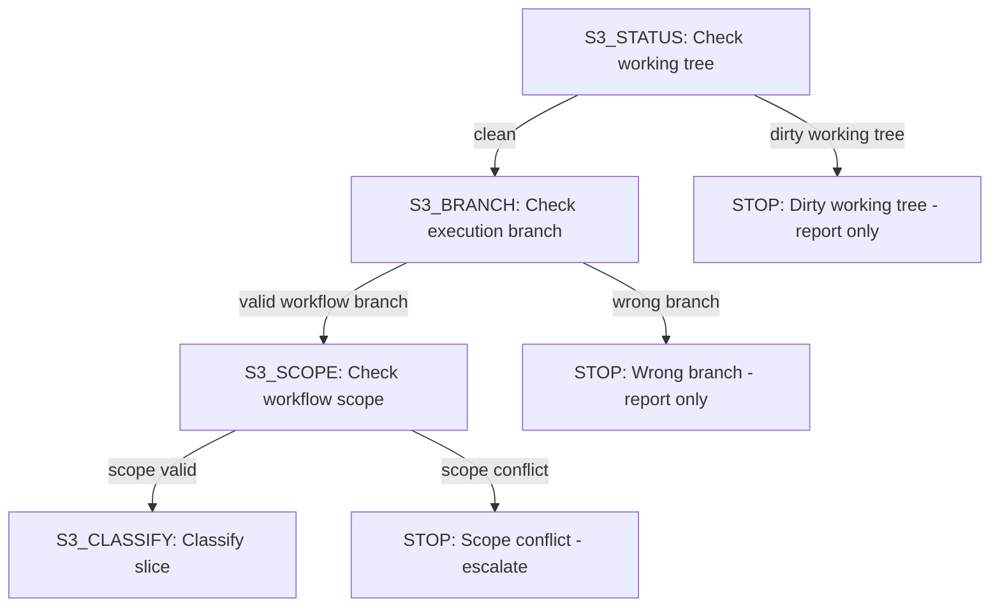
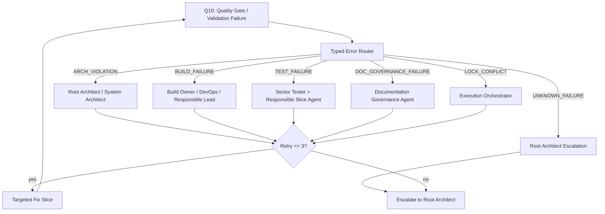
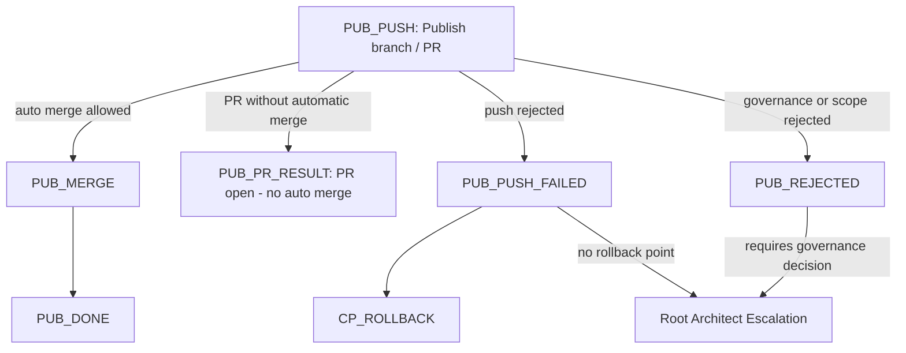
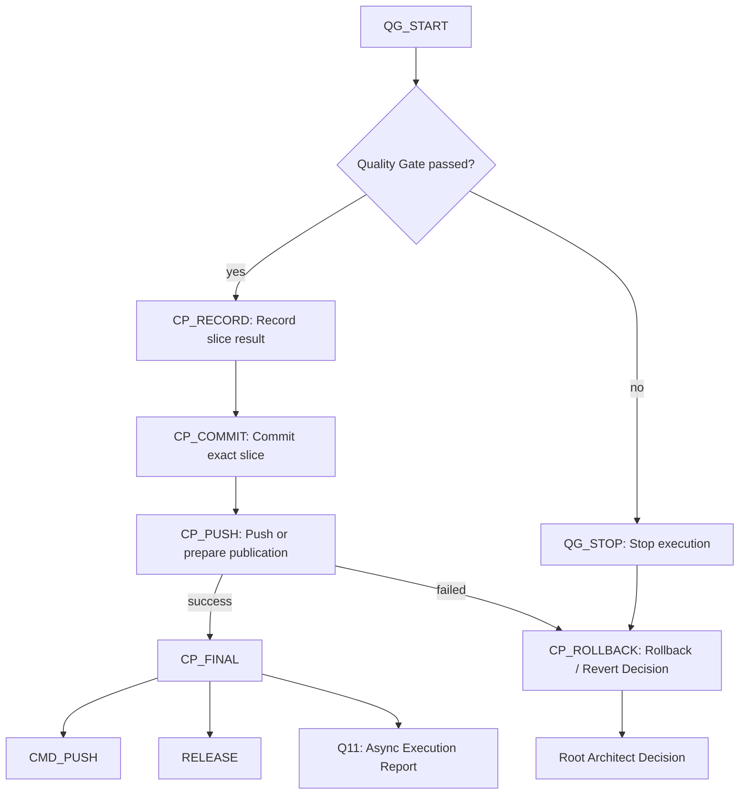
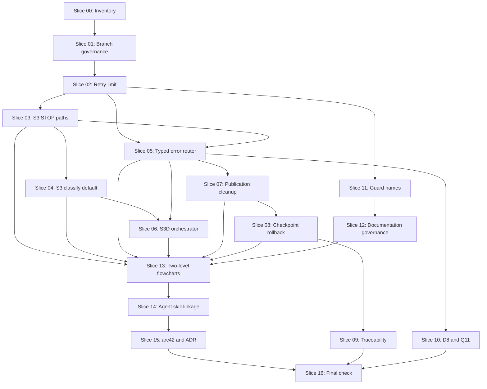

# Workflow: Governance Flowchart V2

## Executive Summary

This workflow sharpens the existing Forensic Analytics agent and workflow governance model. It extends the current three-strand process model with deterministic execution-control, typed error routing, bounded feedback loops, explicit rollback paths, S3 safety nodes, commit traceability, conflict locks and a two-level flowchart structure.

The workflow changes only process, governance, agent, skill and documentation artifacts. It does not implement analyzer behavior, plugin-specific analytics logic, backend runtime behavior, frontend behavior, contracts, persistence or build-tool implementation.

## Requirement Clarification Decision

| Field | Decision |
|---|---|
| Original request | Create a Governance Flowchart V2 workflow for `forensic_analytics`. |
| Interpreted intent | Replace the active workflow plan with a checked governance workflow that can later be executed slice by slice. |
| Change type | Governance, architecture documentation, workflow documentation and agent orchestration. |
| Affected process strand | `workflow create` now; `workflow execute` later for the approved slices. |
| Affected architecture area | Agent governance, process control, documentation governance, rollback and publication governance. |
| Confidence | 95 percent. |
| Decision | `READY_FOR_WORKFLOW`. |

No blocking requirement questions remain. The request is detailed, has a clear implementation boundary and explicitly forbids product implementation changes.

Role review note: the V2 node names are not pre-existing repository terms. They are introduced by the user request and by this workflow as planned governance labels. `workflow execute` must not assume they already exist in active governance documents; the slices below create or map them explicitly.

## Verified Baseline

Read-only verification before authoring found:

- Repository root: `/mnt/d/Projects/forensic_analytics`
- Workflow branch: `architecture/workflow-governance-flowchart-v2-20260517`
- Root governance: `AGENTS.md`
- Quality contract: `QUALITY.md`
- Existing active workflow package: `docs/workflow/**`
- Process docs: `docs/process/**`
- Agent docs: `docs/agents/**`
- Architecture docs: `docs/arc42/**`
- ADRs: `docs/adr/**`
- Project roles and skills: `.agents/roles/**`, `.agents/skills/**`
- Reusable Codex workflow docs: `.codex/**`

The previous active workflow documented three-strand agent governance. This workflow replaces that active plan with the Governance Flowchart V2 plan and keeps the same repository process model.

## Target Picture

After `workflow execute` completes this workflow:

- `workflow execute` has explicit STOP-and-report paths before slice execution.
- Quality failures are routed through a typed error router.
- Automatic correction and clarification loops stop after `maxRetries = 3`.
- Unclassifiable slices stop and escalate instead of silently executing.
- S3D is documented as an execution orchestrator with dependency graph, topological sort, parallelization groups and conflict locks.
- Publication modes have explicit terminal nodes and no `PUB_PUSH -> PUB_PUSH` self-reference.
- Commit, checkpoint and rollback governance includes `CP_ROLLBACK`.
- `CP_FINAL` has explicit outgoing paths.
- `workflow execute` never jumps back to `workflow create`.
- Every workflow-execute commit maps to exactly one slice.
- Global `DOCROOT` governance is separated from local `S1_DOC`, `S2_DOC` and `S3_DOC` documentation steps.
- Flowcharts are split into a readable Level 1 overview and Level 2 detail diagrams.
- arc42 and ADRs describe the governance decision and consequences.

## Scope

Allowed target areas:

- `AGENTS.md`
- `.agents/**`
- `.codex/**`
- `docs/agents/**`
- `docs/process/**`
- `docs/workflow/**`
- `docs/architecture/**`
- `docs/arc42/**`
- `docs/adr/**`
- `docs/governance/**`
- `docs/skill-audit/**`

## Publication Compatibility

This workflow is a `workflow create` artifact because it creates and updates
`docs/workflow/**`. It is therefore intentionally outside the `push auto`
publication path.

Publishing this workflow branch must use the normal `push` PR path. Automatic
PR merge through `push auto` is reserved for `skills-agents` changes that stay
inside the allowlist in `docs/process/push-auto.md`.

If a future change needs `push auto`, it must be split into a separate
`skills-agents` branch that contains only allowed files. Workflow artifacts
under `docs/workflow/**` must remain on the `workflow create` or
`workflow execute` publication paths.

## Non-Goals

This workflow must not change:

- analyzer implementation
- plugin-specific analytics behavior
- backend runtime behavior
- frontend UI behavior
- gRPC, REST or event contract implementation
- persistence or graph implementation
- Docker/runtime implementation
- Gradle build logic
- microservice source code

Planned governance behavior must not be presented as implemented runtime behavior.

## Architecture Boundaries

The repository keeps exactly three process strands:

1. `skills-agents`
2. `workflow create`
3. `workflow execute`

The strands must not be mixed. Documentation Governance runs inside the active strand and is not a fourth strand.

V2 shorthand labels map to the existing strands:

| V2 label | Existing process strand |
|---|---|
| S1 | `skills-agents` |
| S2 | `workflow create` |
| S3 | `workflow execute` |
| S3D | Execution-orchestration node inside S3, not a fourth strand |
| CP | Commit, checkpoint and rollback subgraph inside S3 |
| PUB | Publication-mode subgraph shared by governed push paths |
| DOCROOT | Global documentation-governance check, not a local docs step |

### R10: No Backward Jump From workflow execute To workflow create

`workflow execute` must never automatically call, recreate or rewrite `workflow create` output.

Allowed outcomes are:

- STOP
- report
- Root Architect escalation
- recommendation for a manual `workflow create` refinement

Forbidden outcomes are:

- automatic S3 to S2 jump
- automatic scope expansion during execution
- automatic regeneration of `docs/workflow/workflow.md` from S3

### R11: One Slice, One Commit

Every commit produced by `workflow execute` must represent exactly one slice.

Forbidden commit shapes:

- multi-slice commits
- opportunistic side changes
- mixed backend, frontend and documentation changes without slice assignment
- aggregate commits across multiple quality gates

Traceability target:

```text
Workflow-Version -> Slice -> Agent -> Files -> Tests -> Commit -> Quality Gate -> Report
```

## Governance Flowchart V2 Requirements

The implementation slices must add or verify these rules:

- Bounded loops: every automatic feedback loop has `maxRetries = 3` and then escalates to Root Architect.
- S3 safety: `S3_STATUS`, `S3_BRANCH` and `S3_SCOPE` have explicit STOP paths.
- Slice classification: `S3_CLASSIFY` includes `none of the above -> S3_UNCLASSIFIED -> Root Architect`.
- Typed error routing: `ARCH_VIOLATION`, `BUILD_FAILURE`, `TEST_FAILURE`, `DOC_GOVERNANCE_FAILURE`, `LOCK_CONFLICT`, `UNKNOWN_FAILURE`.
- Execution orchestration: S3D builds a dependency graph, runs topological sort, forms conflict-free parallelization groups and applies file, contract and module locks.
- Publication cleanup: `PUB_DONE`, `PUB_PR_RESULT`, `PUB_PUSH_FAILED` and `PUB_REJECTED` are explicit terminals or controlled outcomes.
- Rollback: `CP_ROLLBACK` decides between file revert, slice-commit revert, fix slice, branch discard, workflow recut or Root Architect escalation.
- D8 and Q11 separation: D8 is blocking; Q11 is non-blocking by default unless a regulatory reporting gate is explicitly declared.
- Guard naming: `S1_GUARD` becomes or maps to `S1_PUSH_ELIGIBILITY_GUARD`; `PUB_GUARD` becomes or maps to `PUB_PR_MERGE_GUARD`.
- Documentation governance: `DOCROOT` is global governance; `S1_DOC`, `S2_DOC` and `S3_DOC` are local strand documentation steps.
- Flowchart structure: Level 1 overview plus Level 2 subgraphs for S1, S2, S3, BE, FE, RT, QG, CP, PUB and DOC.

## Role Ownership

| Role | Responsibility |
|---|---|
| Root Architect | Final governance escalation and architecture boundary decisions. |
| Senior System Architect | S1/S2/S3 consistency, process boundaries and diagram semantics. |
| Senior Requirement Engineer | Requirement sharpness, assumptions and Three Amigos gate. |
| Senior Java Backend Developer | Backend-strand compatibility review without implementation. |
| Senior React Frontend Developer | Frontend-strand compatibility review without implementation. |
| Senior Tester | Quality-gate semantics, testability and validation evidence. |
| Senior Documentation Engineer | arc42, ADR, process docs and role-model consistency. |
| Skill Registry Conflict Auditor | Skill and agent overlap, missing owners and governance contradictions. |
| Senior Swarm Orchestrator | S3D orchestration, dependency graph and conflict-lock semantics. |
| Senior DevOps Engineer | Publication, checkpoint, rollback and push/PR governance. |

## Agent And Skill Linkage Notes

Verified project roles and skills already cover most responsibilities:

- Senior System Architect: `.agents/roles/senior-system-architect.md`
- Senior Java Backend Developer: `.agents/roles/senior-java-backend.md`
- Senior React Frontend Developer: `.agents/roles/senior-react-frontend.md`
- Senior Tester: `.agents/roles/senior-tester.md`
- Senior Documentation Engineer: `.agents/roles/senior-documentation-engineer.md`
- Senior Swarm Orchestrator: `.agents/roles/senior-swarm-orchestrator.md`
- Senior DevOps Engineer: `.agents/roles/senior-devops.md`
- Requirement engineering: `.agents/skills/requirement-engineering/SKILL.md`
- Workflow authoring: `.agents/skills/workflow-authoring/SKILL.md`
- Workflow execution: `.agents/skills/workflow-executor/SKILL.md`
- Skill registry conflict audit: `.agents/skills/skill-registry-conflict-auditor/SKILL.md`

Governance gaps to review in Slice 14:

- No dedicated `.agents/roles/root-architect.md` was found; Root Architect escalation is currently represented by Senior System Architect authority unless a dedicated role is added.
- No dedicated flowchart-integrity skill was found; current coverage is distributed across documentation, workflow, quality and architecture skills.
- Execution orchestration and conflict locking are covered by swarm/workflow skills, but the V2 workflow should make the responsibility explicit.

## Backend Assessment

No backend source change is in scope. Backend roles participate only to verify that governance changes do not authorize backend implementation work, weaken hexagonal boundaries or misclassify backend execution slices.

## Frontend Assessment

No frontend source change is in scope. Frontend roles participate only to verify that governance changes do not authorize UI implementation work or mix frontend work into governance-only slices.

## Runtime And DevOps Assessment

No Docker, deployment, runtime, gRPC or REST implementation change is in scope. DevOps review is limited to checkpoint, rollback, push, PR and publication-mode governance.

## Slice Structure

| Slice | Purpose | Owner | Dependencies |
|---|---|---|---|
| 00 | Repository and governance inventory | Senior Workflow Architect | none |
| 01 | Branch governance confirmation for this workflow | Senior Git Workspace Specialist | 00 |
| 02 | Limit feedback loops to `maxRetries = 3` | Senior System Architect | 00, 01 |
| 03 | Add S3 STOP-and-report paths | Workflow Executor / Senior System Architect | 02 |
| 04 | Complete `S3_CLASSIFY` default path | Senior Swarm Orchestrator | 03 |
| 05 | Introduce typed error router | Senior Tester / Senior System Architect | 02, 03 |
| 06 | Specify S3D execution orchestration | Senior Swarm Orchestrator | 04, 05 |
| 07 | Clean publication modes | Senior DevOps Engineer | 05 |
| 08 | Extend commit, checkpoint and rollback subgraph | Senior DevOps Engineer | 05, 07 |
| 09 | Add commit traceability and workflow versioning | Senior Documentation Engineer | 08 |
| 10 | Decouple D8 and Q11 | Senior Tester | 05, 08 |
| 11 | Sharpen guard node names | Senior Documentation Engineer | 02, 07 |
| 12 | Separate global and local documentation governance | Senior Documentation Engineer | 11 |
| 13 | Introduce two-level flowchart structure | Senior Documentation Engineer / Senior System Architect | 03, 04, 05, 06, 07, 08, 12 |
| 14 | Check agent and skill linkage | Skill Registry Conflict Auditor | 13 |
| 15 | Update arc42, ADR and governance documentation | Senior System Architect / Senior Documentation Engineer | 02, 03, 04, 05, 06, 07, 08, 09, 10, 11, 12, 13, 14 |
| 16 | Final integrity check | Senior Tester / Senior System Architect | 15 |

## S3D Execution Metadata

S3D is the execution-orchestration node inside `workflow execute`, not a fourth
process strand. It uses the following metadata as the deterministic source of
truth for dependency ordering, parallelization and lock decisions. Mermaid
diagrams are visual projections and must not override this metadata.

The default documentation gate for governance-only slices is:

```text
git status --short --branch
git diff --check
required-label search for the active slice
forbidden product-path scope check
git diff --cached --check
staged diff review
```

| Slice | Files / locks | Modules | Contracts | Roles | Dependencies | Quality gates | Documentation duties |
|---|---|---|---|---|---|---|---|
| 00 | `docs/workflow/governance-inventory.md`, `docs/workflow/execution-summary.md` | not applicable | none | Senior Workflow Architect | none | documentation gate | inventory and execution summary |
| 01 | `docs/workflow/execution-summary.md` | not applicable | none | Senior Git Workspace Specialist | 00 | documentation gate | branch evidence |
| 02 | `AGENTS.md`, `.agents/prompts/**`, `.agents/skills/workflow-authoring/**`, `.agents/skills/three-amigos-requirement-gatekeeper/**`, `docs/process/**`, `docs/agents/**`, `docs/arc42/**`, `docs/workflow/execution-summary.md` | governance documentation | none | Senior System Architect | 00, 01 | documentation gate | retry governance and arc42 consistency |
| 03 | `docs/process/workflow-execute.md`, `docs/agents/**`, `.agents/skills/workflow-executor/**`, `.codex/skills/workflow-executor/**`, `docs/arc42/**`, `docs/workflow/execution-summary.md` | workflow execute governance | none | Workflow Executor, Senior System Architect | 02 | documentation gate | S3 STOP paths |
| 04 | `docs/process/workflow-execute.md`, `docs/agents/**`, `.agents/skills/workflow-executor/**`, `.codex/skills/workflow-executor/**`, `docs/arc42/**`, `docs/workflow/execution-summary.md` | workflow execute governance | none | Senior Swarm Orchestrator | 03 | documentation gate | S3 classification default |
| 05 | `docs/process/workflow-execute.md`, `.agents/orchestrator/routing-rules.md`, `.agents/skills/workflow-executor/**`, `.agents/skills/quality-gate-orchestrator/**`, `docs/agents/**`, `docs/arc42/**`, `docs/workflow/**` | workflow execute governance | none | Senior Tester, Senior System Architect | 02, 03 | documentation gate | typed error routing |
| 06 | `docs/workflow/workflow.md`, `docs/workflow/slice-dependency-map.md`, `docs/process/workflow-execute.md`, `.agents/orchestrator/**`, `.agents/roles/senior-swarm-orchestrator.md`, `.agents/skills/workflow-executor/**`, `docs/agents/**`, `docs/workflow/execution-summary.md` | workflow execute orchestration | none | Senior Swarm Orchestrator | 04, 05 | documentation gate | S3D metadata, dependency graph and locks |
| 07 | publication-mode docs under `docs/process/**`, `docs/agents/**`, `docs/workflow/**` | publication governance | none | Senior DevOps Engineer | 05 | documentation gate | publication terminals |
| 08 | checkpoint and rollback docs under `docs/process/**`, `docs/agents/**`, `docs/workflow/**` | checkpoint governance | none | Senior DevOps Engineer | 05, 07 | documentation gate | rollback decisions |
| 09 | `docs/workflow/execution-summary.md`, `workflow.history.md` or verified history artifact, commit-message governance docs | traceability governance | none | Senior Documentation Engineer | 08 | documentation gate | slice records and versioning |
| 10 | workflow-execute and quality/reporting docs under `docs/process/**`, `.agents/skills/**`, `docs/workflow/**` | quality reporting governance | none | Senior Tester | 05, 08 | documentation gate | D8 and Q11 separation |
| 11 | guard-name references under `AGENTS.md`, `.agents/**`, `docs/**` | governance naming | none | Senior Documentation Engineer | 02, 07 | documentation gate | guard rename or mapping |
| 12 | `DOCROOT`, `S1_DOC`, `S2_DOC`, `S3_DOC` references under `docs/**`, `.agents/**` | documentation governance | none | Senior Documentation Engineer | 11 | documentation gate | global/local docs separation |
| 13 | Level-1 and Level-2 diagram artifacts under `docs/**` | flowchart governance | none | Senior Documentation Engineer, Senior System Architect | 03, 04, 05, 06, 07, 08, 12 | documentation gate | two-level flowcharts |
| 14 | `.agents/**`, `.codex/agents/**`, `docs/agents/**`, skill-audit docs | agent and skill governance | none | Skill Registry Conflict Auditor | 13 | documentation gate | skill linkage and gaps |
| 15 | `docs/arc42/**`, `docs/adr/**`, governance docs | architecture documentation | none | Senior System Architect, Senior Documentation Engineer | 02, 03, 04, 05, 06, 07, 08, 09, 10, 11, 12, 13, 14 | documentation gate | arc42 and ADR synchronization |
| 16 | all changed governance artifacts for read-only review; `docs/workflow/execution-summary.md` for results | final governance integrity | none | Senior Tester, Senior System Architect | 15 | full workflow integrity commands from this workflow | final evidence and blockers |

Every row must keep all fields explicit. If a future workflow cannot provide a
field, it must write `none` or `not applicable`; missing fields are S3D STOP
conditions.

## Slice Details

### Slice 00: Repository And Governance Inventory

Allowed write scope:

- `docs/workflow/governance-inventory.md`
- `docs/workflow/execution-summary.md`

Tasks:

- Identify governance, workflow, flowchart, AGENTS, skill, role, process, arc42 and ADR artifacts.
- Extract executable quality-gate commands from `QUALITY.md`.
- Record risks and governance gaps.

Done criteria:

- Inventory names actual repository paths.
- No product implementation files are touched.
- No rule is added without a target artifact.

### Slice 01: Branch Governance Confirmation

Allowed write scope:

- `docs/workflow/execution-summary.md`

Tasks:

- Confirm active branch `architecture/workflow-governance-flowchart-v2-20260517`.
- Confirm clean status before workflow artifact mutation.
- Record branch collision check and branch verification.

Stop conditions:

- dirty working tree before workflow work
- branch mismatch
- branch naming conflict that cannot be resolved

### Slice 02: Feedback Loop Limits

Allowed write scope:

- `AGENTS.md`
- `.agents/**`
- `.codex/**`
- `docs/process/**`
- `docs/agents/**`
- `docs/workflow/**`
- `docs/arc42/**`
- `docs/adr/**`

Tasks:

- Find automatic feedback loops such as S1 and S2 correction loops.
- Add `maxRetries = 3`.
- Add Root Architect escalation after retry exhaustion.
- Keep text and diagrams synchronized.

### Slice 03: S3 STOP-And-Report Paths

Allowed write scope:

- workflow-execute process docs
- agent governance diagrams
- workflow-executor skill docs
- arc42 governance views

Required flow:



### Slice 04: S3_CLASSIFY Default Path

Tasks:

- Verify BE, FE, RT and documentation classification diamonds.
- Add `none of the above -> S3_UNCLASSIFIED -> Root Architect`.
- Document exceptions for explicitly declared governance, metadata and documentation-only slices.

Rule:

```text
An unclassifiable slice must not execute automatically.
```

### Slice 05: Typed Error Router

Required error types:

| Error type | Target role |
|---|---|
| `ARCH_VIOLATION` | Root Architect, Senior System Architect, Hexagonal Architecture Expert |
| `BUILD_FAILURE` | Responsible Backend or Frontend Agent, DevOps, Build Owner |
| `TEST_FAILURE` | Senior Tester, Responsible Slice Agent |
| `DOC_GOVERNANCE_FAILURE` | Documentation Governance Agent, Requirement Engineer |
| `LOCK_CONFLICT` | Execution Orchestrator Specialist, Root Architect |
| `UNKNOWN_FAILURE` | Root Architect |

Required flow:



### Slice 06: S3D Execution Orchestrator

S3D must extract from `docs/workflow/workflow.md`:

- slice ID
- slice goal
- affected files
- affected modules
- affected contracts
- responsible subagents or roles
- dependencies
- quality gates
- documentation duties

S3D then:

1. builds a directed dependency graph
2. runs topological sort
3. forms independent parallelization groups
4. checks file, contract and module locks
5. starts only conflict-free slices

S3D stops and reports before write-capable execution when metadata fields are
missing, dependency references are unknown, ranges are not expanded to concrete
slice IDs, the graph contains a cycle, or a file, contract, module or
architecture-boundary lock overlaps with another active slice. Lock conflicts
route as `LOCK_CONFLICT` through the Typed Error Router.

S3D may stop, report, escalate or recommend manual workflow refinement, but it
must not call `workflow create`, rewrite `docs/workflow/workflow.md` during
execution, or jump from S3 back to S2 automatically.

Conflict-lock rule:

```text
Two agents must never modify the same file, contract or architecture boundary at the same time.
```

### Slice 07: Publication Modes Cleanup

Required flow:



Required terminals or controlled outcomes:

- `PUB_DONE`
- `PUB_PR_RESULT`
- `PUB_PUSH_FAILED`
- `PUB_REJECTED`

`PUB_PUSH` must not contain a self-reference. `PUB_PR_RESULT` is the normal
`push` outcome when a PR is open or updated without automatic merge.
`PUB_DONE` is reserved for a verified automatic merge or explicitly completed
publication path. `PUB_PUSH_FAILED` hands off to `CP_ROLLBACK` when a rollback
point exists; otherwise it escalates. `PUB_REJECTED` stops and reports a
governance, scope, branch or guard rejection.

### Slice 08: Commit, Checkpoint And Rollback

Required flow:



`CP_ROLLBACK` may decide:

- revert individual files
- revert one slice commit
- create a new fix slice
- discard the branch
- recut the workflow through a manual new workflow-create request
- escalate to Root Architect

Rollback must not be documented as blind `git reset --hard`.

### Slice 09: Commit Traceability And Workflow Versioning

Minimum `CP_RECORD` fields:

```text
workflowVersion
sliceId
sliceTitle
responsibleAgent
changedFiles
qualityGateCommands
qualityGateResult
commitHash
rollbackReference
arc42Updated
adrUpdated
```

Commit rule:

```text
One slice, one commit.
No multi-slice commits.
No unrelated changes.
```

### Slice 10: D8 And Q11 Separation

Rule:

```text
D8 is blocking.
Q11 is non-blocking by default.
```

D8 blocks commit or release for failed build, failed tests, architecture violation, missing required documentation, missing workflow version or failed required quality gate.

Q11 does not block commit, push, PR creation or release preparation by default. Regulatory or compliance reporting gates must be explicitly documented as exceptions.

### Slice 11: Guard Name Sharpening

Required names:

- `S1_PUSH_ELIGIBILITY_GUARD`
- `PUB_PR_MERGE_GUARD`

Old names may remain only as explicitly documented historical aliases in non-active history material.

### Slice 12: Documentation Governance Separation

Global:

- `DOCROOT`: process documentation, role model, organigramm, arc42 structure, governance rules, workflow conventions and hard boundaries.

Local:

- `S1_DOC`: skills and agents changes
- `S2_DOC`: workflow create, requirement gate and workflow.md
- `S3_DOC`: workflow execute, slice execution, quality gates, rollback and commit result

Rule:

```text
Local documentation nodes update concrete artifacts.
DOCROOT verifies global documentation consistency.
```

### Slice 13: Two-Level Flowchart Structure

Level 1 must show:

- ROOT
- commands
- S1, S2 and S3
- hard boundaries
- publication modes
- global governance nodes

Level 2 must contain separate diagrams for:

- S1: Skills and Agents
- S2: workflow create
- S3: workflow execute
- BE: Backend Execution
- FE: Frontend Execution
- RT: Runtime / DevOps / Docker / gRPC
- QG: Quality Gates
- CP: Commit / Checkpoint / Rollback
- PUB: Publication Modes
- DOC: Documentation Governance

Every subgraph must be checked for dead nodes, missing no paths, unbounded loops, missing STOP paths, circular references, missing terminals, wrong backward jumps and missing escalation paths.

### Slice 14: Agent And Skill Linkage

Check for these capabilities:

- Root Architect Escalation
- Typed Error Routing
- Execution Orchestration
- Conflict Locking
- Rollback Governance
- Documentation Governance
- Quality Gate Classification
- Flowchart Integrity Audit

If a skill or role is missing, document the gap. Correct contradictions only when verified with at least 95 percent confidence; otherwise stop and report.

### Slice 15: arc42, ADR And Governance Documentation

Update:

- arc42 architecture constraints
- arc42 building-block view
- arc42 runtime view
- arc42 crosscutting concepts
- arc42 quality requirements
- arc42 risks and technical debt
- ADR index
- one new ADR for Governance Flowchart V2
- process, agent and governance docs as needed

The ADR must explain:

- why S3 STOP paths are needed
- why typed error routing is needed
- why retry loops are bounded
- why `workflow execute` cannot call `workflow create` backwards
- why one-slice-one-commit is mandatory
- why flowcharts are split into two levels

### Slice 16: Final Integrity Check

Required checklist:

```text
[ ] S3_STATUS has STOP path
[ ] S3_BRANCH has STOP path
[ ] S3_SCOPE has STOP path
[ ] S3_CLASSIFY has default path
[ ] Typed Error Router exists
[ ] maxRetries <= 3 documented
[ ] CP_ROLLBACK exists
[ ] CP_FINAL has outgoing edges
[ ] PUB_PUSH self-reference removed
[ ] PUB_PR_RESULT exists
[ ] R10 documented
[ ] R11 documented
[ ] S1_GUARD renamed or mapped
[ ] PUB_GUARD renamed or mapped
[ ] DOCROOT separated from S1_DOC/S2_DOC/S3_DOC
[ ] Level-1 diagram exists or is updated
[ ] Level-2 diagram structure exists or is updated
[ ] arc42 updated
[ ] ADR updated
[ ] AGENTS/skills checked
[ ] QUALITY.md commands executed or limitation documented
```

## Dependency Graph



## Parallelization Rules

Parallel work is allowed only after S3D has proven:

- write scopes are disjoint
- no shared contract is changed by more than one active slice
- no shared architecture boundary is changed by more than one active slice
- quality gates can be run and attributed independently
- documentation ownership is explicit

Candidate non-overlapping groups after prerequisite slices:

- Slice 07 and Slice 11 may run in parallel after Slice 05 if their file locks are disjoint.
- Slice 09 and Slice 10 may run in parallel after Slice 08 if traceability and reporting files are separated.
- Slice 14 may begin read-only inventory while Slice 13 is being finalized, but must not write until Slice 13 is complete.

## Quality Gates

The workflow must use `QUALITY.md` as the authoritative quality contract.

For governance and documentation slices, the narrow verification gate is:

```bash
git status --short
git diff --check
git diff --cached --check
```

For final workflow validation:

```bash
git status --short --branch
git diff --check
git diff --name-only main...HEAD
rg -n "S3D|S3_STATUS|S3_BRANCH|S3_SCOPE|S3_CLASSIFY|S3_UNCLASSIFIED|Typed Error Router|ARCH_VIOLATION|BUILD_FAILURE|TEST_FAILURE|DOC_GOVERNANCE_FAILURE|LOCK_CONFLICT|UNKNOWN_FAILURE|maxRetries|CP_ROLLBACK|CP_FINAL|PUB_PR_RESULT|R10|R11|S1_PUSH_ELIGIBILITY_GUARD|PUB_PR_MERGE_GUARD|DOCROOT|S1_DOC|S2_DOC|S3_DOC|Level 1|Level 2" AGENTS.md .agents .codex docs
git diff --name-only main...HEAD | rg "^(src/|services/|contracts/|docker/|gradle/|proto/|forensic-ui/|build.gradle|settings.gradle)"
```

When product code, build logic, plugin metadata, tests, contracts, runtime behavior or implementation files are changed, run the minimum quality command:

```bash
./gradlew test --dependency-verification strict --console=plain --stacktrace
```

When a final full local gate is required and practical:

```bash
./gradlew clean test jacocoTestReport jacocoTestCoverageVerification checkPackageCoverage --dependency-verification strict --console=plain --stacktrace
```

No command may be reported as passed unless it was executed.

## Commit And Push Plan

This workflow-create branch is not eligible for `push auto` because it changes
`docs/workflow/**`. Its final publication path is:

```text
workflow create branch -> normal push -> PR against main -> manual merge decision
```

Do not route this workflow-create branch through the `skills-agents` `push auto`
path. If only `skills-agents` governance files need automatic publication,
split them into a separate branch before requesting `push auto`.

During `workflow execute`, each successful slice must:

1. run the slice quality gate
2. inspect the diff
3. stage only current-slice files
4. run `git diff --cached --check`
5. commit exactly one slice
6. record the commit hash and rollback reference
7. push the current workflow branch only through the slice checkpoint push path when the workflow reaches `CP_PUSH`

Commit messages must include:

- slice ID
- what changed
- why it changed
- affected files
- quality gates executed
- documentation updated
- rollback notes

No PR creation, merge, branch cleanup, force-push or `push auto` is authorized by slice checkpoint push.

## Stop Conditions

Stop and report if:

- a required file, role, skill, diagram node or governance rule cannot be verified
- branch context is not the workflow branch
- local changes are unclear or unrelated
- a slice would touch forbidden product implementation scope
- S3D cannot classify a slice
- dependency graph contains an unresolved cycle
- two write-capable agents need the same file, contract or architecture boundary
- a quality gate fails
- error type cannot be classified except as `UNKNOWN_FAILURE`
- rollback would require destructive Git commands without explicit approval
- arc42 or ADR updates would describe planned behavior as implemented behavior

## Definition Of Done

The workflow is complete when:

1. Governance Flowchart V2 is documented.
2. S3 STOP-and-report paths exist.
3. Typed Error Router is documented and linked.
4. `maxRetries = 3` is documented.
5. S3D is described as Execution Orchestrator.
6. `S3_CLASSIFY` has a default path.
7. Publication modes have no self-reference.
8. `CP_ROLLBACK` exists.
9. `CP_FINAL` has outgoing paths.
10. R10 and R11 are documented.
11. Guard names are sharpened.
12. `DOCROOT` is separated from local documentation steps.
13. Level 1 and Level 2 diagram structures are documented.
14. Agent and skill linkage is checked.
15. arc42 and ADR are updated.
16. Quality gates are executed or limitations are documented.
17. Every commit maps to exactly one slice.

## Handoff To workflow execute

This workflow is ready for `workflow execute` after the workflow-create validation passes. Execution must start with Slice 00 and proceed in dependency order. No implementation work is authorized outside the slice boundaries above.

## arc42 Check Status

arc42 was inspected during workflow creation. Slice 15 is responsible for updating arc42 and ADR material during workflow execution because Governance Flowchart V2 is planned behavior until the workflow slices are executed.
