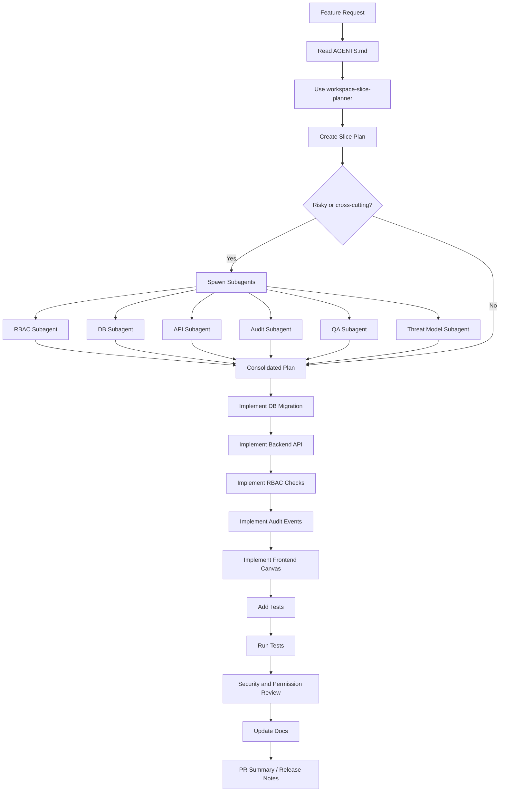

# Codex Workflow Canvas — Workspace-System

Dieses Dokument beschreibt einen wiederverwendbaren Codex-Workflow für ein forensisches Workspace-System mit mehreren Projekten, Rollen, Assets, Audit-Logs, Storage-Isolation, Skills und Subagents.

## Ziel

Codex soll nicht einfach direkt Code erzeugen, sondern jedes neue Feature als klaren Slice planen, prüfen, implementieren, testen und dokumentieren.

Der Workflow stellt sicher, dass bei jedem Workspace-Feature folgende Bereiche betrachtet werden:

- Domain-Regeln
- Datenbank
- API
- RBAC / Berechtigungen
- Storage-Isolation
- Audit / Chain of Custody
- Frontend Canvas
- Tests
- Dokumentation
- Deployment-Auswirkungen

## Grundregeln

```text
Kein Workspace-Feature ohne Rechteprüfung.
Kein Projekt-Feature ohne Workspace-Kontext.
Kein Datei-Feature ohne Storage-Isolation.
Keine kritische Aktion ohne Audit-Event.
Kein Slice ohne negative Permission-Tests.
```

## Kernmodell

```text
Server-System
└── Workspace
    ├── Projekte
    ├── Mitglieder & Rollen
    ├── Gemeinsame Ressourcen
    ├── Projektdateien
    ├── Audit-Log
    ├── Speicher / Isolation
    └── Einstellungen
```

## Fachliche Regeln

- Ein Workspace ist die oberste organisatorische und sicherheitstechnische Einheit.
- Ein Projekt gehört immer genau zu einem Workspace.
- Ein Benutzer muss Mitglied eines Workspace sein, bevor er Workspace-Ressourcen sehen darf.
- Projektzugriff wird zusätzlich zur Workspace-Mitgliedschaft geprüft.
- Assets gehören entweder zu einem Projekt oder zum Shared-Bereich eines Workspace.
- Originale forensische Daten dürfen nicht direkt verändert werden.
- Archivierung und Soft Delete sind gegenüber Hard Delete zu bevorzugen.
- Kritische Aktionen müssen Audit-Events erzeugen.
- Cross-Workspace- und Cross-Project-Zugriffe müssen verhindert werden.

---

# 1. Workflow Canvas

```text
┌────────────────────┬────────────────────┬────────────────────┬────────────────────┬────────────────────┬────────────────────┐
│ 1. Intake           │ 2. Plan             │ 3. Skill Routing    │ 4. Subagents        │ 5. Implementation   │ 6. Review / Ship    │
├────────────────────┼────────────────────┼────────────────────┼────────────────────┼────────────────────┼────────────────────┤
│ Feature-Idee        │ Slice definieren    │ passende Skills     │ parallele Agenten   │ Code ändern         │ Tests laufen lassen │
│ Ziel klären         │ Datenmodell         │ aktivieren          │ starten             │ Migrationen         │ Security Review     │
│ Scope begrenzen     │ API                 │ Regeln laden        │ Ergebnisse sammeln  │ UI                  │ Audit Review        │
│ Risiken notieren    │ UI                  │ Checks erzwingen    │ zusammenführen      │ Tests               │ Merge vorbereiten   │
│                     │ Security            │                     │                     │ Doku                │ Release Notes       │
└────────────────────┴────────────────────┴────────────────────┴────────────────────┴────────────────────┴────────────────────┘
```

## Ablauf als Mermaid Flow



---

# 2. Empfohlene Repo-Struktur

```text
repo/
├── AGENTS.md
├── workflow.md
├── .agents/
│   └── skills/
│       ├── workspace-slice-planner/
│       │   └── SKILL.md
│       ├── workspace-domain-model/
│       │   └── SKILL.md
│       ├── workspace-rbac-matrix/
│       │   └── SKILL.md
│       ├── workspace-api-builder/
│       │   └── SKILL.md
│       ├── workspace-db-migrations/
│       │   └── SKILL.md
│       ├── workspace-storage-isolation/
│       │   └── SKILL.md
│       ├── workspace-audit-chain-of-custody/
│       │   └── SKILL.md
│       ├── workspace-threat-model/
│       │   └── SKILL.md
│       ├── workspace-permission-tests/
│       │   └── SKILL.md
│       ├── workspace-frontend-canvas/
│       │   └── SKILL.md
│       └── workspace-docs-release/
│           └── SKILL.md
├── backend/
├── frontend/
├── database/
│   └── migrations/
├── docs/
├── tests/
└── scripts/
```

## Rolle der Dateien

```text
AGENTS.md   = dauerhafte Projektregeln für Codex
workflow.md = operativer Workflow für Slices, Skills und Subagents
SKILL.md    = wiederverwendbarer Codex Skill für eine konkrete Aufgabe
```

---

# 3. Board-Ansicht

```text
┌────────────────────────────────────────────────────────────────────────────────────────────────────┐
│                                      CODEX WORKFLOW CANVAS                                         │
├─────────────────────┬─────────────────────┬─────────────────────┬─────────────────────┬────────────┤
│ INTAKE              │ PLAN                │ EXECUTE             │ VERIFY              │ SHIP       │
├─────────────────────┼─────────────────────┼─────────────────────┼─────────────────────┼────────────┤
│ Feature Request     │ Slice Plan          │ DB Migration        │ Unit Tests          │ PR Summary │
│ Workspace-Regel     │ Domain Check        │ Backend API         │ Integration Tests   │ Docs       │
│ Projekt-Regel       │ RBAC Matrix         │ Frontend Canvas     │ Permission Tests    │ Release    │
│ Asset-Regel         │ Audit Events        │ Audit Hooks         │ Threat Review       │ Changelog  │
│ Risiko              │ Storage Rules       │ Storage Layer       │ Chain-of-Custody    │ Merge      │
└─────────────────────┴─────────────────────┴─────────────────────┴─────────────────────┴────────────┘
```

---

# 4. Standard-Ablauf pro Feature

## Phase 1 — Intake

Ein Feature kommt rein, zum Beispiel:

```text
Baue Projektrollen innerhalb eines Workspace.
```

Codex soll zuerst nicht implementieren, sondern den Slice klären.

### Codex Prompt

```text
Read AGENTS.md.

Use $workspace-slice-planner.

Plan the implementation slice for project roles inside a workspace.

Do not write code yet.

Return:
- goal
- affected entities
- database changes
- API endpoints
- frontend changes
- permission rules
- audit events
- tests
- subagents to spawn
- risks
- done criteria
```

---

## Phase 2 — Slice Planning

Codex erzeugt daraus einen strukturierten Slice.

### Slice Template

```yaml
slice:
  id: S04
  name: Project Access Control
  goal: Manage project-specific access inside a workspace.

  user_story:
    as: Workspace Admin
    i_want: to manage project-specific members and roles
    so_that: not every workspace member can access every project

  entities:
    - workspaces
    - projects
    - workspace_members
    - project_members

  database:
    tables:
      - project_members
    constraints:
      - project_id references projects.id
      - user_id references users.id
      - unique(project_id, user_id)
      - project must belong to the same workspace as the membership context

  api:
    - POST /workspaces/{workspace_id}/projects/{project_id}/members
    - GET /workspaces/{workspace_id}/projects/{project_id}/members
    - PATCH /workspaces/{workspace_id}/projects/{project_id}/members/{user_id}
    - DELETE /workspaces/{workspace_id}/projects/{project_id}/members/{user_id}

  permissions:
    owner:
      - manage_project_members
    admin:
      - manage_project_members
    analyst:
      - read_assigned_project
    reviewer:
      - read_assigned_project
    viewer:
      - read_assigned_project
    auditor:
      - read_project_audit

  audit_events:
    - project.member.added
    - project.member.role_changed
    - project.member.removed

  storage:
    affected: false
    notes:
      - no direct file access in this slice

  tests:
    - admin_can_add_project_member
    - viewer_cannot_add_project_member
    - analyst_cannot_access_unassigned_project
    - user_from_other_workspace_cannot_be_added
    - member_change_creates_audit_event

  subagents:
    - RBAC Security Subagent
    - Database Migration Subagent
    - Backend API Subagent
    - Audit Chain-of-Custody Subagent
    - QA Permission Test Subagent
    - Threat Model Subagent

  risks:
    - Cross-workspace user assignment
    - IDOR through guessed project_id
    - Inconsistent workspace/project role behavior
    - Missing audit event on role changes

  done_when:
    - API implemented
    - DB migration added
    - UI updated if required
    - RBAC enforced server-side
    - Audit events written
    - Permission tests pass
    - Documentation updated
```

---

# 5. Skill Routing Canvas

```text
Feature-Typ                         Codex Skill
────────────────────────────────────────────────────────────────────
Neues Workspace-/Projekt-Feature    $workspace-slice-planner
Begriffe oder Statusmodell          $workspace-domain-model
Rollen oder Rechte                  $workspace-rbac-matrix
API-Endpunkte                       $workspace-api-builder
Tabellen / Migrationen              $workspace-db-migrations
Dateien / Uploads / Downloads       $workspace-storage-isolation
Audit / Forensik                    $workspace-audit-chain-of-custody
Security Review                     $workspace-threat-model
Tests für Rechte                    $workspace-permission-tests
Frontend / Canvas UI                $workspace-frontend-canvas
Doku / Release                      $workspace-docs-release
```

## Start-Skills

Für den Anfang reichen diese vier Skills:

```text
1. workspace-slice-planner
2. workspace-rbac-matrix
3. workspace-audit-chain-of-custody
4. workspace-permission-tests
```

Danach ergänzen:

```text
5. workspace-db-migrations
6. workspace-api-builder
7. workspace-storage-isolation
8. workspace-threat-model
9. workspace-frontend-canvas
10. workspace-docs-release
```

---

# 6. Subagent Canvas

Subagents werden nur für größere oder riskantere Slices gestartet.

```text
┌──────────────────────────────┬─────────────────────────────────────┬──────────────────────────────┐
│ Subagent                     │ Aufgabe                             │ Rückgabe                      │
├──────────────────────────────┼─────────────────────────────────────┼──────────────────────────────┤
│ Domain Subagent              │ Prüft Workspace-/Projektregeln       │ Domain Issues                 │
│ DB Subagent                  │ Prüft Tabellen, Constraints, Indexes │ Migration Plan                │
│ API Subagent                 │ Prüft Endpunkte und Validierung      │ API Checklist                 │
│ RBAC Subagent                │ Prüft Rollen und Zugriff             │ Permission Matrix             │
│ Audit Subagent               │ Prüft Audit-Events                   │ Audit Event List              │
│ Storage Subagent             │ Prüft Dateipfade und Isolation       │ Storage Risk Report           │
│ Frontend Subagent            │ Prüft Canvas UI                      │ UI Tasks                      │
│ QA Subagent                  │ Prüft Tests und Edge Cases           │ Test Plan                     │
│ Threat Model Subagent        │ Prüft Angriffswege                   │ Security Findings             │
└──────────────────────────────┴─────────────────────────────────────┴──────────────────────────────┘
```

## Standard Subagent Prompt

```text
Use parallel subagents for this workspace slice.

Spawn these subagents:
1. Domain Subagent
2. RBAC Security Subagent
3. Database Migration Subagent
4. Backend API Subagent
5. Audit Chain-of-Custody Subagent
6. QA Permission Test Subagent
7. Threat Model Subagent

Each subagent must return:
- findings
- required changes
- risks
- files likely affected
- tests required
- open questions

Wait for all subagents.
Then consolidate their results into one implementation plan.
Do not modify code until the consolidated plan is complete.
```

---

# 7. Implementation Canvas pro Slice

```text
┌────────────────────────────────────────────────────────────────────┐
│ Slice: Workspace / Project / Asset / RBAC / Audit Feature           │
├────────────────────┬───────────────────────────────────────────────┤
│ Step 1             │ Read AGENTS.md                                │
│ Step 2             │ Activate matching Codex Skill                 │
│ Step 3             │ Produce Slice Plan                            │
│ Step 4             │ Spawn Subagents if risky or cross-cutting     │
│ Step 5             │ Consolidate Plan                              │
│ Step 6             │ Implement DB Migration                        │
│ Step 7             │ Implement Backend API                         │
│ Step 8             │ Implement RBAC Checks                         │
│ Step 9             │ Implement Audit Events                        │
│ Step 10            │ Implement Frontend Canvas                     │
│ Step 11            │ Add Unit + Integration + Permission Tests      │
│ Step 12            │ Run Tests                                     │
│ Step 13            │ Run Threat Review                             │
│ Step 14            │ Update Docs                                   │
│ Step 15            │ Produce PR Summary                            │
└────────────────────┴───────────────────────────────────────────────┘
```

---

# 8. Workspace-Slices

```text
┌──────┬──────────────────────────────┬───────────────────────────────┬──────────────────────────────┐
│ ID   │ Slice                        │ Haupt-Skills                  │ Review-Fokus                 │
├──────┼──────────────────────────────┼───────────────────────────────┼──────────────────────────────┤
│ S00  │ Domain Foundation             │ domain-model, slice-planner   │ Begriffe, Grenzen, Status    │
│ S01  │ Workspace CRUD                │ api, db, rbac, audit          │ Owner, Admin, Archivierung   │
│ S02  │ Workspace Members             │ rbac, api, db, tests          │ Rollenwechsel, Einladung     │
│ S03  │ Project CRUD                  │ api, db, rbac, audit          │ Workspace-Kontext            │
│ S04  │ Project Access                │ rbac, tests, threat-model     │ Cross-Project-Leaks          │
│ S05  │ Shared Assets                 │ storage, audit, rbac          │ Shared vs. Project Assets    │
│ S06  │ Project Storage Isolation     │ storage, threat-model, tests  │ Path Traversal, Isolation    │
│ S07  │ Audit Log                     │ audit, db, api                │ Vollständigkeit, Leserechte  │
│ S08  │ Archive / Retention           │ audit, rbac, db               │ Soft Delete, Read-only       │
│ S09  │ Frontend Workspace Canvas     │ frontend, rbac, tests         │ Rollenabhängige UI           │
│ S10  │ Security Middleware           │ rbac, threat-model, api       │ IDOR, Auth, Object Scope     │
│ S11  │ Docs / Release                │ docs-release                  │ Betrieb, Admin-Doku          │
└──────┴──────────────────────────────┴───────────────────────────────┴──────────────────────────────┘
```

## Empfohlene Reihenfolge

```text
Phase 1 — Fundament
1. S00 Domain Foundation
2. S01 Workspace CRUD
3. S02 Workspace Members

Phase 2 — Projektfähigkeit
4. S03 Project CRUD
5. S04 Project Access
6. S06 Project Storage Isolation

Phase 3 — Forensische Anforderungen
7. S07 Audit Log
8. S05 Shared Assets
9. S08 Archive / Retention

Phase 4 — Bedienung und Betrieb
10. S09 Frontend Workspace Canvas
11. S10 Security Middleware
12. S11 Docs / Release
```

---

# 9. AGENTS.md Vorlage

Diese Vorlage gehört in die Repo-Wurzel als `AGENTS.md`.

```md
# AGENTS.md

## Project

This repository implements a forensic analytics server system with workspaces, projects, members, roles, assets, audit logs, and storage isolation.

## Core domain rules

- Workspace is the top-level organizational and security boundary.
- A project always belongs to exactly one workspace.
- A user must be a workspace member before accessing workspace resources.
- Project access must be checked separately when a feature is project-scoped.
- Assets belong either to a project or to the workspace shared area.
- Original forensic data must not be modified directly.
- Prefer archive and soft delete over hard delete.
- Critical actions must create audit events.
- Cross-workspace and cross-project data access must be prevented.

## Required checks for every feature

Before implementation, create a slice plan containing:

- Goal
- Domain entities
- Database changes
- API endpoints
- Frontend changes
- Permission rules
- Audit events
- Storage implications
- Tests
- Risks
- Done criteria

## Required authorization checks

For every API endpoint:

1. Verify authentication.
2. Verify workspace membership.
3. Verify required workspace role.
4. For project-scoped actions, verify project access.
5. Verify that target objects belong to the same workspace.
6. Verify archived/read-only behavior.
7. Verify whether the action requires an audit event.

## Roles

- Owner: full control, including dangerous lifecycle actions.
- Admin: manages workspace, projects, and members.
- Analyst: works on assigned projects.
- Reviewer: reviews project outputs.
- Viewer: read-only access.
- Auditor: reads audit logs and history, cannot modify project data.

## Audit requirements

Audit these actions:

- Workspace created, updated, archived, deleted
- Member invited, removed, role changed
- Project created, updated, archived, deleted
- Project member added, removed, role changed
- Asset uploaded, downloaded, deleted, linked, unlinked
- Analysis started, completed, failed
- Report exported
- Permission denied for sensitive actions

## Storage rules

- Never trust client-provided file paths.
- Generate workspace and project paths server-side.
- Prevent path traversal.
- Keep project data isolated.
- Keep shared workspace resources separate.
- Store checksums for forensic files.
- Separate original evidence from processed data and reports.

## Testing requirements

Every slice must include:

- Unit tests
- Integration tests
- Permission tests
- Negative authorization tests
- Audit-event tests
- Storage-isolation tests when files are involved

## Done means

A slice is done only when:

- Code is implemented.
- RBAC checks are enforced.
- Audit events are written.
- Tests pass.
- Documentation is updated.
- Security risks are reviewed.
```

---

# 10. Codex Skill Karten

## Skill: `workspace-slice-planner`

Pfad:

```text
.agents/skills/workspace-slice-planner/SKILL.md
```

Inhalt:

```md
---
name: workspace-slice-planner
description: Use when planning any workspace, project, member, role, asset, storage, audit, or permission feature as a vertical implementation slice.
---

# Workspace Slice Planner

## Goal

Turn a feature request into a complete implementation slice.

## Output

Return this structure:

```yaml
slice:
  id:
  name:
  goal:
  user_story:
  entities:
  database:
  api:
  frontend:
  permissions:
  audit_events:
  storage:
  tests:
  subagents:
  risks:
  done_when:
```

## Rules

- Never plan backend without permission checks.
- Never plan project features without workspace context.
- Never plan file access without storage isolation.
- Never plan critical actions without audit events.
- Prefer archive over hard delete.
```

---

## Skill: `workspace-rbac-matrix`

Pfad:

```text
.agents/skills/workspace-rbac-matrix/SKILL.md
```

Inhalt:

```md
---
name: workspace-rbac-matrix
description: Use when designing, implementing, or reviewing workspace/project permissions, roles, access checks, RBAC matrices, or authorization tests.
---

# Workspace RBAC Matrix

## Goal

Ensure every action has an explicit authorization rule.

## Roles

- Owner
- Admin
- Analyst
- Reviewer
- Viewer
- Auditor

## Required checks

For every endpoint or UI action:

1. Is the user authenticated?
2. Is the user a workspace member?
3. Does the user have the required workspace role?
4. Is this action project-scoped?
5. If project-scoped, does the user have project access?
6. Does the target object belong to the same workspace?
7. Is the target archived or read-only?
8. Is an audit event required?

## Output

Return:

- action
- endpoint
- allowed roles
- denied roles
- workspace check
- project check
- archived-state behavior
- audit event
- tests
- risks
```

---

## Skill: `workspace-audit-chain-of-custody`

Pfad:

```text
.agents/skills/workspace-audit-chain-of-custody/SKILL.md
```

Inhalt:

```md
---
name: workspace-audit-chain-of-custody
description: Use when implementing or reviewing audit logs, asset handling, forensic evidence flows, reports, exports, analysis jobs, or chain-of-custody behavior.
---

# Workspace Audit and Chain of Custody

## Goal

Ensure actions are traceable and forensic data integrity is preserved.

## Required audit fields

- workspace_id
- project_id
- user_id
- action
- target_type
- target_id
- timestamp
- ip_address
- user_agent
- metadata

## Forensic rules

- Original evidence must not be modified directly.
- Store checksums for uploaded evidence.
- Separate original, processed, result, and report files.
- Exports must be audited.
- Failed sensitive operations should be auditable when useful.

## Output

Return:

- required events
- event payloads
- chain-of-custody risks
- missing audit hooks
- required tests
```

---

## Skill: `workspace-storage-isolation`

Pfad:

```text
.agents/skills/workspace-storage-isolation/SKILL.md
```

Inhalt:

```md
---
name: workspace-storage-isolation
description: Use when implementing or reviewing file uploads, downloads, assets, workspace shared resources, project storage, checksums, or storage paths.
---

# Workspace Storage Isolation

## Goal

Prevent cross-workspace and cross-project file access.

## Rules

- Never use raw client-provided paths.
- Resolve all paths server-side.
- Every asset must belong to a workspace.
- Project assets must belong to a project inside the same workspace.
- Shared assets must have project_id = null or an explicit shared scope.
- Prevent path traversal.
- Store file checksum and size.
- Keep original evidence separate from analysis outputs.

## Output

Return:

- storage paths
- asset ownership rules
- upload rules
- download rules
- checksum rules
- risks
- tests
```

---

## Skill: `workspace-permission-tests`

Pfad:

```text
.agents/skills/workspace-permission-tests/SKILL.md
```

Inhalt:

```md
---
name: workspace-permission-tests
description: Use when creating or reviewing permission tests, negative authorization tests, RBAC tests, workspace isolation tests, or project access tests.
---

# Workspace Permission Tests

## Goal

Ensure workspace and project permissions are tested with positive and negative cases.

## Required test categories

- Workspace membership tests
- Workspace role tests
- Project access tests
- Cross-workspace access denial tests
- Cross-project access denial tests
- Archived/read-only state tests
- Audit-event tests

## Example tests

- viewer_cannot_create_project
- analyst_cannot_access_unassigned_project
- admin_can_invite_workspace_member
- auditor_can_read_audit_but_not_modify_project
- project_a_cannot_read_project_b_asset
- archived_project_is_read_only
- delete_creates_audit_event

## Output

Return:

- test file suggestions
- required fixtures
- positive test cases
- negative test cases
- audit expectations
- edge cases
```

---

## Skill: `workspace-threat-model`

Pfad:

```text
.agents/skills/workspace-threat-model/SKILL.md
```

Inhalt:

```md
---
name: workspace-threat-model
description: Use when reviewing security risks, IDOR risks, cross-workspace access, cross-project access, unsafe uploads, role escalation, or dangerous lifecycle actions.
---

# Workspace Threat Model

## Goal

Find security risks before implementation or before merge.

## Threat questions

- Can a user guess a workspace_id or project_id and access foreign data?
- Can a Viewer perform write actions through the API?
- Can an Analyst access an unassigned project?
- Can a user from another workspace be added to a project incorrectly?
- Can archived projects still be modified?
- Can client-provided paths escape the project directory?
- Can audit logs be modified or deleted by normal users?
- Can a user escalate role through an update request?

## Output

Return:

- findings
- severity
- affected endpoints
- affected files
- required mitigations
- required tests
```

---

# 11. Standard-Prompt für neue Slices

Diesen Prompt bei neuen Workspace-Features verwenden:

```text
Read AGENTS.md.

Use these skills:
- $workspace-slice-planner
- $workspace-domain-model
- $workspace-rbac-matrix
- $workspace-audit-chain-of-custody
- $workspace-permission-tests

Task:
Plan and implement the next workspace slice: <SLICE NAME>.

First produce a slice plan.
Then spawn subagents for:
- RBAC review
- DB migration review
- API review
- Audit review
- QA permission tests
- Threat model review

Wait for all subagents and consolidate their findings.

After the consolidated plan:
- implement the database changes
- implement the backend API
- implement RBAC checks
- implement audit events
- implement frontend changes if required
- add tests
- run the relevant tests
- update documentation
- return a final summary with changed files, risks, and remaining TODOs
```

---

# 12. Review Canvas vor jedem Merge

```text
┌──────────────────────────────┬───────────────────────────────────────────────┐
│ Check                        │ Frage                                         │
├──────────────────────────────┼───────────────────────────────────────────────┤
│ Workspace Boundary           │ Gehört jedes Objekt zum Workspace?            │
│ Project Boundary             │ Wird project_id korrekt geprüft?              │
│ RBAC                         │ Sind Rollen serverseitig geprüft?             │
│ UI Permissions               │ Ist die UI rollenabhängig korrekt?            │
│ Audit                        │ Gibt es Events für kritische Aktionen?        │
│ Storage                      │ Sind Dateipfade serverseitig sicher?          │
│ Archive Behavior             │ Sind archivierte Projekte read-only?          │
│ Negative Tests               │ Gibt es Tests für verbotene Aktionen?         │
│ Cross-Workspace Leakage      │ Können fremde IDs missbraucht werden?         │
│ Chain of Custody             │ Sind Originaldaten geschützt und nachvollziehbar? │
│ Docs                         │ Ist die Änderung dokumentiert?                │
└──────────────────────────────┴───────────────────────────────────────────────┘
```

## Merge-Gate

Ein Slice darf erst gemerged werden, wenn folgende Punkte erfüllt sind:

```text
[ ] Slice Plan erstellt
[ ] Datenmodell geprüft
[ ] API-Endpunkte implementiert
[ ] RBAC serverseitig erzwungen
[ ] Audit-Events implementiert
[ ] Storage-Regeln geprüft, falls Dateien betroffen sind
[ ] Negative Permission-Tests vorhanden
[ ] Cross-Workspace-Zugriff getestet
[ ] Cross-Project-Zugriff getestet
[ ] Archivierungsverhalten geprüft
[ ] Dokumentation aktualisiert
[ ] Tests laufen erfolgreich
[ ] PR Summary vorhanden
```

---

# 13. PR Summary Template

Codex soll nach jedem Slice eine Zusammenfassung in diesem Format liefern:

```md
# PR Summary

## Slice

- ID:
- Name:
- Goal:

## Changed files

-

## Implemented

-

## Database changes

-

## API changes

-

## Permission changes

-

## Audit events

-

## Tests added

-

## Security review

-

## Risks

-

## Remaining TODOs

- 
```

---

# 14. Beispiel: Slice S01 Workspace CRUD

```yaml
slice:
  id: S01
  name: Workspace CRUD
  goal: Create, read, update, archive, and delete workspaces.

  entities:
    - workspaces
    - workspace_members
    - audit_events

  database:
    tables:
      workspaces:
        fields:
          - id
          - name
          - description
          - owner_user_id
          - status
          - created_at
          - updated_at
          - archived_at
      workspace_members:
        fields:
          - workspace_id
          - user_id
          - role
          - status
          - created_at

  api:
    - POST /workspaces
    - GET /workspaces
    - GET /workspaces/{workspace_id}
    - PATCH /workspaces/{workspace_id}
    - DELETE /workspaces/{workspace_id}

  permissions:
    owner:
      - create_workspace
      - read_workspace
      - update_workspace
      - archive_workspace
      - delete_workspace
    admin:
      - read_workspace
      - update_workspace
      - archive_workspace
    viewer:
      - read_workspace

  audit_events:
    - workspace.created
    - workspace.updated
    - workspace.archived
    - workspace.deleted

  tests:
    - owner_can_create_workspace
    - owner_is_automatically_member
    - viewer_cannot_update_workspace
    - archived_workspace_is_readonly
    - delete_creates_audit_event

  risks:
    - deleting workspace with active projects
    - owner not added as workspace member
    - archived workspace still writable

  done_when:
    - workspace API works
    - owner assignment works
    - RBAC checks exist
    - audit events are written
    - tests pass
```

---

# 15. Beispiel: Slice S06 Project Storage Isolation

```yaml
slice:
  id: S06
  name: Project Storage Isolation
  goal: Ensure each project has isolated storage and cannot access files from other projects.

  entities:
    - workspaces
    - projects
    - assets

  storage:
    layout:
      - /workspaces/{workspace_id}/shared/
      - /workspaces/{workspace_id}/projects/{project_id}/evidence_original/
      - /workspaces/{workspace_id}/projects/{project_id}/evidence_processed/
      - /workspaces/{workspace_id}/projects/{project_id}/analysis_results/
      - /workspaces/{workspace_id}/projects/{project_id}/reports/
      - /workspaces/{workspace_id}/projects/{project_id}/logs/

  rules:
    - never accept raw file paths from clients
    - resolve paths server-side
    - check workspace_id and project_id before file access
    - store checksum for uploaded files
    - separate original evidence from processed outputs

  api:
    - POST /workspaces/{workspace_id}/projects/{project_id}/assets
    - GET /workspaces/{workspace_id}/projects/{project_id}/assets
    - GET /workspaces/{workspace_id}/projects/{project_id}/assets/{asset_id}
    - DELETE /workspaces/{workspace_id}/projects/{project_id}/assets/{asset_id}

  audit_events:
    - asset.uploaded
    - asset.downloaded
    - asset.deleted
    - asset.checksum_verified

  tests:
    - project_a_cannot_read_project_b_asset
    - workspace_a_cannot_read_workspace_b_asset
    - path_traversal_is_blocked
    - upload_creates_checksum
    - download_creates_audit_event
```

---

# 16. Arbeitsweise mit Codex

## Wenn ein neues Feature geplant wird

```text
1. Feature in natürlicher Sprache beschreiben.
2. Codex mit workspace-slice-planner starten.
3. Slice Plan prüfen.
4. Bei Risiko Subagents starten.
5. Plan konsolidieren.
6. Erst danach implementieren lassen.
```

## Wenn Codex Code ändern soll

```text
1. Immer AGENTS.md lesen lassen.
2. Passenden Skill nennen.
3. Konkreten Slice nennen.
4. Tests verlangen.
5. Final Summary verlangen.
```

## Wenn Codex reviewed

```text
1. workspace-threat-model nutzen.
2. workspace-rbac-matrix nutzen.
3. workspace-permission-tests nutzen.
4. Audit-Events prüfen.
5. Cross-Workspace- und Cross-Project-Risiken prüfen.
```

---

# 17. Wichtigster Prüfpunkt

Der kritischste Punkt des gesamten Systems ist nicht, ob Workspaces erstellt werden können.

Der kritischste Punkt ist:

```text
Kann das System zuverlässig verhindern,
dass Benutzer oder Projekte Daten sehen,
die nicht zu ihnen gehören?
```

Danach kommen:

```text
Kann man jede wichtige Aktion nachvollziehen?
Sind Originaldaten geschützt?
Kann man nach einem Fehler sauber wiederherstellen?
```

Wenn diese drei Bereiche sauber umgesetzt sind, ist die Basis für ein forensisches Workspace-System stabil.
