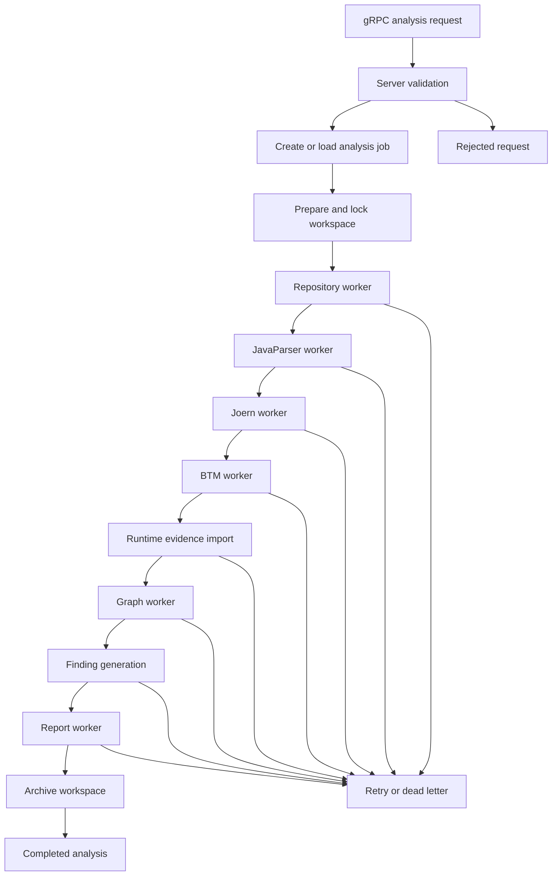

# Forensic Analytics Workflow

This document defines the operational workflow for the Forensic Analytics platform. It translates the target service structure into repository-level execution rules for analysis intake, orchestration, workspace handling, workers, storage, artifacts and eventing.

The workflow is documentation for implementation slices. It does not declare that every named target component already exists as a Gradle module. Current module names must always be verified from `settings.gradle.kts`, `docs/README.md`, source code and tests before implementation.

## Verified Repository Baseline

The current repository baseline contains these verified modules:

- `forensic-analytics-domain`
- `forensic-analytics-application`
- `forensic-analytics-engine`
- `forensic-analytics-adapter-repository-source`
- `forensic-analytics-adapter-javaparser`
- `forensic-analytics-adapter-joern-docker`
- `forensic-analytics-cli`
- `forensic-analytics-testbed`
- `forensic-analytics-persistence`
- `forensic-analytics-ingestion-grpc`
- `forensic-analytics-ingestion-request`
- `forensic-analytics-bootstrap`

Target names such as `server`, `orchestrator`, `workers`, `analysis-store`, `artifact-store` and `eventing` are workflow responsibilities. Do not create packages, modules, tasks, graph labels, storage tables or API fields from these names without a dedicated verification slice.

## Core Rules

```text
No analysis job without explicit input provenance.
No worker output without a stable analysis identity.
No replay claim without runtime evidence or an explicit gap.
No graph edge without evidence category and provenance.
No report finding without evidence references or an explicit unknown state.
No LLM text treated as verified evidence.
No retry that mutates original evidence destructively.
```

The canonical analysis model is the source of truth. Graph databases, vector stores, reports and visualizations are projections derived from canonical evidence and analysis results.

## Target Architecture

```text
forensic_analytics
├── server
│   └── receives analysis jobs over gRPC
│
├── orchestrator
│   └── controls analysis state and pipeline steps
│
├── workspace
│   └── creates, locks, cleans and archives workspaces
│
├── workers
│   ├── repository-worker
│   ├── javaparser-worker
│   ├── joern-worker
│   ├── btm-worker
│   ├── graph-worker
│   └── report-worker
│
├── analysis-store
│   └── stores jobs, status, findings and relationships
│
├── artifact-store
│   └── stores large analysis results
│
└── eventing
    └── handles queues, events, retries and dead letters
```

## Component Responsibilities

| Target component | Responsibility | Verified repository mapping |
|---|---|---|
| `server` | Accept analysis requests, validate transport-level input and delegate to application use cases. It must not contain analysis, persistence, replay, report or LLM decisions. | `forensic-analytics-ingestion-grpc`, `forensic-analytics-bootstrap` |
| `orchestrator` | Own the analysis state machine, decide the next pipeline step from explicit state and route work through ports. | `forensic-analytics-application`, `forensic-analytics-engine` |
| `workspace` | Prepare isolated working areas, lock active jobs, keep originals immutable, clean temporary material and archive retained evidence. | `forensic-analytics-domain`, `forensic-analytics-application`, `forensic-analytics-persistence` |
| `repository-worker` | Resolve repository input and source roots, preserve repository metadata and produce explicit source facts. | `forensic-analytics-adapter-repository-source`, `forensic-analytics-ingestion-request` |
| `javaparser-worker` | Extract Java source facts and unresolved symbol diagnostics. Static facts must not be treated as runtime execution. | `forensic-analytics-adapter-javaparser` |
| `joern-worker` | Produce semantic artifacts from Joern through infrastructure adapters. Joern output remains semantic analysis evidence, not runtime evidence. | `forensic-analytics-adapter-joern-docker`, `docs/workflows/joern-docker-container.workflow.md` |
| `btm-worker` | Plan or render runtime instrumentation artifacts through verified ports. Generated rules are instrumentation plans, not observed execution. | Future adapter responsibility; verify current rule-generation ports before implementation. |
| `graph-worker` | Build deterministic graph projections from canonical facts and runtime evidence. Graph projections are rebuildable and not the primary source of truth. | Future projection responsibility; see ADR-0004. |
| `report-worker` | Render reports that separate confirmed evidence, derived analysis, gaps, hypotheses and verification status. | Future report adapter responsibility. |
| `analysis-store` | Persist canonical job state, statuses, evidence metadata, findings, relationships and limitations. | `forensic-analytics-persistence`, application ports |
| `artifact-store` | Store large artifacts with type, checksum, provenance and retention metadata. | `ArtifactReference`, workspace asset and storage concepts |
| `eventing` | Coordinate asynchronous work, retries and dead-letter handling without hiding failed or incomplete evidence. | Future infrastructure responsibility. |

## End-to-End Flow



Runtime evidence import is shown as a workflow step because replay and findings depend on observed runtime data. If no runtime evidence is available, the result must preserve that gap explicitly.

## Analysis State Model

Use explicit state transitions for analysis jobs. A target implementation should model states comparable to:

| State | Meaning |
|---|---|
| Received | The server accepted the request envelope. |
| Validated | Required transport and command fields were verified. |
| WorkspacePrepared | The workspace exists and is locked for the analysis. |
| RepositoryImported | Repository metadata and source inputs were captured. |
| StaticFactsExtracted | JavaParser or other static facts were stored with source locations and unresolved diagnostics. |
| SemanticArtifactsImported | Joern or equivalent semantic artifacts were stored with provenance and checksums. |
| InstrumentationPlanned | Runtime instrumentation artifacts were generated or declared unavailable. |
| RuntimeEvidenceImported | Runtime events were imported, or the absence of runtime evidence was recorded. |
| GraphProjected | Rebuildable graph projections were created from canonical facts. |
| FindingsGenerated | Findings were generated with evidence references and limitations. |
| ReportGenerated | Human-readable output was rendered from stored analysis results. |
| Completed | The job reached a terminal successful state. |
| Failed | The job failed with a recorded reason and recoverability status. |
| DeadLettered | Retry policy was exhausted and the job needs manual inspection. |

These names are workflow terminology. Before introducing enum constants, database values or event types, inspect the current domain, application ports, persistence adapters and tests.

## Worker Contract

Each worker must follow the same contract:

1. Read only declared inputs from the analysis store, artifact store or workspace.
2. Verify the expected input shape before processing.
3. Produce deterministic output for the same inputs.
4. Store output as canonical facts, artifact references, diagnostics, findings or explicit gaps.
5. Record provenance, checksums and limitations where applicable.
6. Emit a completion or failure event without mutating original evidence.
7. Be idempotent enough for retry, or declare why retry is unsafe.

Workers must not call each other directly. The orchestrator advances the pipeline through explicit state and events.

## Store Boundaries

### Analysis Store

The analysis store persists small, queryable canonical data:

- analysis job identity and status
- ingestion session state
- repository metadata
- source facts
- semantic graph facts
- findings
- relationships
- limitations and unresolved states
- audit-relevant workflow events

It must preserve forensic meaning. Missing or incomplete evidence is stored as missing or incomplete, not repaired silently.

### Artifact Store

The artifact store persists large or binary outputs:

- uploaded payloads
- generated rule files
- Joern CPG files and query results
- runtime trace files
- report exports
- graph export snapshots

Every artifact reference must preserve type, location, checksum where available, origin and retention context. Generated local runtime artifacts must not be committed unless a task explicitly asks for fixture material.

### Graph and Vector Projections

Graph and vector databases are projections. They may accelerate navigation, retrieval or LLM context building, but they must be rebuildable from canonical facts and artifacts.

## Eventing and Retry

Eventing coordinates asynchronous steps. Events should carry stable identifiers and minimal routing metadata, not large evidence payloads.

Retry rules:

- Retry transient infrastructure failures only when the worker contract is idempotent.
- Do not retry validation failures as infrastructure errors.
- Preserve every terminal failure reason.
- Move exhausted work to a dead-letter state with enough context for human inspection.
- Never hide a partial result by converting it into a successful completed state.

## Implementation Slice Template

Use this template for future slices that implement or change this workflow:

```yaml
slice:
  id: SXX
  name: Short workflow slice name
  goal: One concrete workflow behavior.

  verified_inputs:
    modules:
      - verified Gradle module
    source_files:
      - verified source or test file
    docs:
      - verified documentation file

  affected_components:
    - server
    - orchestrator
    - workspace
    - one worker or store responsibility

  evidence_contract:
    input_evidence: explicit source, runtime or artifact inputs
    output_evidence: canonical facts, artifact references, findings or gaps
    uncertainty: how missing or incomplete evidence is represented

  implementation:
    production_changes:
      - smallest verified change
    tests:
      - targeted regression or contract test
    documentation:
      - docs that must stay aligned

  verification:
    targeted_command: ./gradlew :affected-module:test --dependency-verification strict --console=plain --stacktrace
    full_gate: ./gradlew clean test jacocoTestReport jacocoTestCoverageVerification checkPackageCoverage --dependency-verification strict --console=plain --stacktrace

  done:
    - state transition is explicit
    - evidence provenance is preserved
    - missing evidence is visible
    - tests pass
    - documentation is aligned
```

## Slice Order

Prefer small implementation slices in this order:

1. Server intake and request validation.
2. Durable analysis job state in the analysis store.
3. Workspace creation, locking, cleanup and archival.
4. Repository worker contract.
5. JavaParser worker contract.
6. Joern worker artifact import.
7. Instrumentation planning through a verified port.
8. Runtime evidence import and incomplete-event handling.
9. Graph projection from canonical facts.
10. Finding generation with evidence references.
11. Report rendering with explicit gaps and hypotheses.
12. Eventing, retry and dead-letter handling.

Do not skip ahead by adding broad infrastructure before the corresponding evidence contract and tests exist.

## Verification Rules

For documentation-only changes, inspect the relevant documentation and run a text-level verification such as:

```bash
git diff --check
```

For code changes, run the narrowest meaningful test first, then the repository quality gate from `QUALITY.md` when the slice is complete:

```bash
./gradlew clean test jacocoTestReport jacocoTestCoverageVerification checkPackageCoverage --dependency-verification strict --console=plain --stacktrace
```

Do not claim that a workflow command, Gradle task, module, table, queue, graph label, event type or API field exists unless it has been verified from repository source, build files, schemas, fixtures or documentation.
